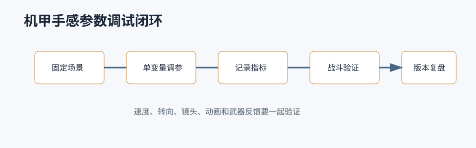

# 机甲手感参数



## 0. 读前地图

这篇文章把“手感”拆成可调、可测、可复盘的参数系统。优秀的手感调参不是凭感觉反复拖滑条，而是把玩家体验拆成输入响应、速度变化、转向半径、镜头反馈、动画匹配和武器节奏，再用固定场景验证。

核心源码入口：

```text
Core/GameLogic/Characters/SGPlayerCharacter.as
Core/GameLogic/Movement/SGCharacterMovementComponent.as
Core/GameLogic/Animation/SGAnimInstance_Locomotion.as
Core/GameLogic/PlayerAction/SGPlayerLookAction.as
Core/Combat/Ability/SGGameplayAbilityBase.as
```

关键变量：

```text
GaitType：Walk、Run、Sprint 等步态状态
MaxWalkSpeed / MaxFlySpeed：移动速度上限
Velocity：当前真实速度
RotationRate / AimRotation：转向和瞄准朝向
FOV / CameraLag：镜头速度感
Montage / AnimState：动画是否匹配当前移动状态
```

调参验证闭环：

```text
固定一张测试地图
→ 固定起点和目标点
→ 分别测试起步、刹停、转向、瞄准、冲刺、飞行
→ 记录到达时间、刹停距离、转向半径、镜头晕动感
→ 调一个参数只验证一个结论
→ 保存手感版本和改动原因
```

常见误区：

```text
只改最高速度，忽略加速度和刹车
只看动画，不看实际位移
只在空地图调参，不在战斗压力下验证
移动、镜头、武器各自舒服，但组合后节奏冲突
```

## 1. 问题背景

机甲手感不是单个速度参数决定的。玩家感受到的是输入响应、加速、减速、转向、瞄准、镜头、动画、武器反馈、受击反馈和网络延迟的综合结果。如果只调 `MaxWalkSpeed`，很容易出现“速度对了但不重”“转向飘”“瞄准割裂”“冲刺没有爆发力”的问题。

## 2. 参数分类

机甲手感可以拆成六类：

```text
移动参数
转向参数
镜头参数
武器参数
动画参数
反馈参数
```

每类参数都要明确影响范围，避免一个参数同时控制多个体验。

## 3. 移动参数

核心参数：

```text
WalkSpeed
RunSpeed
SprintSpeed
Acceleration
BrakingDeceleration
GroundFriction
AirControl
GravityScale
DashDistance
DashDuration
```

调参顺序：

```text
先定最大速度
→ 再定加速时间
→ 再定刹停距离
→ 再定转向半径
→ 最后配动画和镜头
```

机甲通常需要比人形角色更强的重量感，所以加速和刹停不宜过于瞬时。但战斗游戏又需要响应明确，因此可以用“输入响应快、速度变化有惯性”的方式平衡。

## 4. 转向参数

转向不是简单设置 ActorRotation：

```text
YawTurnSpeed
AimTurnSpeed
SprintTurnSpeed
FlightTurnSpeed
DashYawTurnSpeed
RotationInterpSpeed
```

地面普通移动可以允许较快转向；冲刺和飞行要限制转向，体现重量和惯性；瞄准状态通常需要角色朝向跟随准星，但移动速度和转向速度降低。

## 5. 镜头参数

镜头决定玩家对速度和重量的感知：

```text
FOV
CameraLag
CameraRotationLag
SprintFOV
DashShake
FireShake
HitShake
AimOffset
CameraDistance
```

冲刺可以轻微增加 FOV 和镜头后拉；开火可以加小幅 shake；受击可以按方向做 impulse。镜头反馈要可控，不能影响瞄准清晰度。

## 6. 武器反馈参数

```text
FireRate
RecoilPitch
RecoilYaw
Spread
RecoverySpeed
ProjectileSpeed
MuzzleFlashScale
HitStop
HitShake
```

手炮、机枪、导弹、近战武器应该有不同反馈。重武器需要更明显的前摇、后坐、镜头震动和音效低频；轻武器需要更高响应和持续反馈。

## 7. 动画参数

动画影响“看起来是否跟输入一致”：

```text
Start / Stop 动画
Turn In Place
RootYawOffset
AimOffset
UpperBody Slot
Layered Blend per Bone
Flight Pose
Dash Pose
```

如果移动组件已经转向，但动画上半身还停在旧方向，玩家会感觉输入延迟。瞄准、开火、移动要统一角色朝向、控制器朝向和动画 AimOffset。

## 8. 推荐调参方法

不要直接在复杂关卡里调。先做标准测试场：

```text
直线 50m 加速
急停测试
90 度转向测试
冲刺距离测试
瞄准移动测试
开火后坐测试
飞行上升下降测试
网络延迟模拟测试
```

每次只改一类参数，记录改前改后的距离、时间和体感。

## 9. 自动跑测结合

机甲项目可以把手感参数和 AI 自动跑测结合：

```text
跑到目标点耗时
转向平均角速度
卡住次数
冲刺使用次数
瞄准状态移动误差
弹药命中率
受击后恢复时间
撤离点到达率
```

这些数据不能替代人工手感，但能发现明显的参数异常。

## 10. 配置建议

建议把参数按状态分组：

```text
Ground
Sprint
Aim
Dash
Flight
FlightSprint
Weapon
Camera
Animation
```

每个参数要有默认值、最小值、最大值和说明。不要让策划只能看到一堆没有单位的 float。

## 11. 踩坑

只调速度不调加速度，会让角色像滑块。

只调移动不调镜头，会让冲刺缺少速度感。

只调武器后坐不调恢复，会让连续射击难以控制。

动画和移动不同步，会让玩家觉得输入延迟。

网络预测没处理好，会让手感在本地和联机完全不同。

## 12. 结论

机甲手感是移动、转向、镜头、武器、动画和反馈共同作用的结果。调参应该先拆状态，再建立标准测试场，最后结合自动跑测和人工体验迭代。好的参数体系要能解释“为什么这样调”，而不是只保存一组数值。

## 13. 源码和项目入口：移动手感从哪里生效

源码位置：

```text
Script/Core/GameLogic/Characters/SGPlayerCharacter.as
Script/Core/GameLogic/Movement/SGCharacterMovementComponent.as
Script/Core/GameLogic/PlayerAction/SGPlayerMoveAction.as
Engine/Source/Runtime/Engine/Private/Components/CharacterMovementComponent.cpp
```

机甲移动手感最终会落到 CharacterMovement 的速度、加速度、移动模式和朝向上。项目层通常先在 `SGPlayerCharacter` 判断状态，例如跑、冲刺、飞行、瞄准、手炮状态，再把速度或朝向模式传到移动组件。

推荐调用链记录方式：

```text
输入或 AI Action
→ SGPlayerMoveAction 产生移动方向和移动状态
→ SGPlayerCharacter 判断 Sprint / Flight / Aim / Handgun
→ SGCharacterMovementComponent 设置 Gait / OrientType / DesiredRotation
→ CharacterMovement 计算 Velocity 和 ActorRotation
→ AnimInstance 根据速度、朝向和状态更新动画
```

调参时要明确一个参数在哪一层生效。如果速度配置在角色上，但最终 `GetMaxSpeed` 或项目移动组件没有读它，那么调配置不会改变实际速度。

## 14. 源码和项目入口：转向手感怎么拆

源码位置：

```text
Script/Core/GameLogic/Movement/SGCharacterMovementComponent.as
Script/Core/GameLogic/Characters/SGPlayerCharacter.as
Engine/Source/Runtime/Engine/Private/Components/CharacterMovementComponent.cpp
```

转向要拆成三种：

```text
角色 ActorRotation
玩家 ControllerRotation
动画里的 AimOffset / RootYawOffset
```

项目里的 `SGCharacterMovementComponent` 已经有 `OrientType` 概念。不同状态下朝向来源不同：

```text
Acceleration：跟随移动方向或控制器方向
View：跟随视角或瞄准目标
UseDesiredRotation：业务显式指定
Flight：飞行状态使用特殊 yaw/pitch 转向速度
```

调参时不要只看 Actor 转了没有，还要看 Controller 是否同步、动画 AimOffset 是否抵消、网络复制精度是否足够。比如战舰基座旋转、瞄准朝向、移动朝向同时存在时，应该明确最终旋转只在一个出口设置，其他系统只贡献旋转输入或 delta。

## 15. 源码和项目入口：武器反馈怎么进手感

源码位置：

```text
Script/Core/Combat/Ability/PlayerAbility/SGGA_ShootBase.as
Script/Core/Combat/Ability/Monster/SGGA_MonsterWeaponShoot.as
Script/Core/GameLogic/Weapon/SGWeaponInstanceActor.as
Script/Core/GameLogic/Animation/SGAnimInstance_Locomotion.as
```

武器手感不只是伤害数值。一次开火通常包含：

```text
输入触发 Ability
→ 检查弹药、冷却、状态 Tag
→ 生成投射物或射线
→ 播放 Montage / 动画 Notify
→ 生成枪口特效和音效
→ 应用后坐力、镜头震动、准星扩散
→ 命中后播放受击和反馈
```

如果玩家觉得武器“轻”，可能不是伤害低，而是缺少前摇、后坐、音效低频、命中特效、镜头反馈或动画冲击。调武器要把这些拆成可配置参数，而不是把所有反馈写死在 Ability 里。

## 16. 调参表建议

源码位置：

```text
Script/Core/GameLogic/Characters/SGPlayerCharacter.as
Script/Core/GameLogic/Animation/SGAnimInstance_Locomotion.as
Script/Core/GameLogic/Camera
```

建议每个参数记录单位和验证方式：

```text
RunSpeed：cm/s，直线 50m 耗时验证
Acceleration：cm/s^2，从静止到最大速度耗时验证
BrakingDeceleration：cm/s^2，松手刹停距离验证
YawTurnSpeed：deg/s，90 度转向耗时验证
SprintFOV：degree，冲刺速度感验证
RecoilPitch：degree，连续射击压枪验证
CameraLag：second/alpha，急转镜头拖拽验证
```

有了单位和测试方法，参数才可讨论。否则“重一点”“快一点”“爽一点”很难稳定复现。
