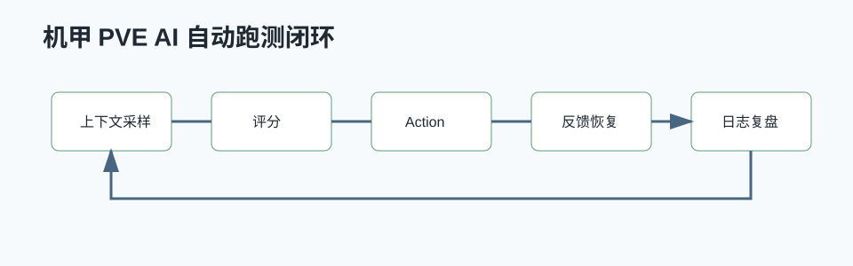

# 机甲 PVE AI 自动跑测设计



## 0. 读前地图

这篇复盘关注的不是“做一个 AI 代替玩家”，而是“做一个能长期、稳定、可复现地跑完整 PVE 闭环的测试执行器”。判断方案好坏的标准不是 AI 像不像真人，而是它能不能暴露地图、战斗、补给、撤离和交互链路里的问题。

最小闭环：

```text
采样世界状态
→ 评估当前目标
→ 选择 PlayerAction
→ 执行动作
→ 观察结果
→ 失败恢复或记录现场
```

核心源码入口：

```text
Core/GameLogic/GameManager/SGPlayerContextManager.as
Core/GameLogic/PlayerAction/SGUtilityEvaluatorComponent.as
Core/GameLogic/PlayerAction/SGPlayerActionBase.as
Core/GameLogic/PlayerAction/SGPlayerMoveAction.as
Core/GameLogic/PlayerAction/SGPlayerLookAction.as
Core/Combat/Ability/PassiveAbility/SGGA_Passive_LockOnTarget.as
```

关键变量：

```text
玩家状态：位置、血量、弹药、是否存活、是否在交互
目标状态：敌人、虫穴、POI、撤离点、补给点
评分状态：距离、危险度、收益、失败次数、冷却时间
动作状态：当前 Action、执行时间、完成条件、失败原因
```

可验证指标：

```text
单 Seed 是否能完成完整流程
多 Seed 完成率和平均耗时
失败原因是否可分类
卡死后是否能恢复
日志是否能定位到具体目标和动作
改动后是否能对比成功率变化
```

## 1. 项目背景

项目目标是让 AI 像玩家一样在 PCG 地图中完成一局 PVE 流程：

```text
出生
→ 寻找 POI
→ 移动到目标区域
→ 清理敌人和虫穴
→ 弹药不足时补给
→ POI 全完成后撤离
→ 开启撤离、守圈、登机
```

这套系统不是为了做最终玩家可见的机器人队友，而是为了自动跑测 Gameplay 闭环。它要能在大量 Seed、地图组合和战斗配置里跑起来，暴露卡点、资源不足、目标丢失、撤离失败等问题。

## 2. 问题本质

第一性原理拆开看，自动跑测 AI 需要解决四件事：

```text
1. 知道当前世界发生了什么。
2. 判断当前最应该做什么。
3. 把判断转成玩家可执行的输入或 Action。
4. 失败时能恢复，并留下可复现信息。
```

所以系统不能只写一个 Behavior Tree 节点，也不能只写一个“自动寻路”。它需要一个闭环：

```text
上下文采样
→ Utility 评分
→ PlayerAction 执行
→ 执行反馈
→ 重新采样和修正
```

## 2. 核心模块

```text
PlayerContextManager
UtilityEvaluatorComponent
Action 注入系统
MoveAction / ShootAction / InteractAction / SkillAction / ReloadAction / LookAction
```

## 3. 架构设计

### 3.1 PlayerContextManager：低频战场快照

`PlayerContextManager` 负责把场景信息整理成每个玩家的战术上下文：

```text
玩家状态：
    位置、血量、耐力、是否存活、是否换弹

武器状态：
    当前弹匣、备弹、弹药类型、是否激活

技能状态：
    技能槽是否装备、是否可用、是否能打虫穴

POI 状态：
    当前锁定 POI、是否到达、POI 半径、虫穴目标

敌人状态：
    相关敌人、最近敌人、最佳攻击目标、飞行怪威胁

撤离状态：
    撤离点、交互点、登机点、是否进入撤离圈
```

它不直接执行行为，只提供稳定输入。这样 Utility 层可以专注“选行为”，而不是每个候选都重新扫一遍世界。

### 3.2 UtilityEvaluatorComponent：行为评分和通道选择

`UtilityEvaluatorComponent` 根据上下文生成候选：

```text
MoveToTarget
MoveToExtraction
SupplyAmmo
ShootTarget
Skill1 / Skill2
Reload
KeepDistance
FollowLeader
BoardExtraction
InteractExtraction
```

候选有分数、原因、目标 Actor、目标位置、移动完成半径和移动风格。最终按通道选择：

```text
移动通道：
    移动、补给、撤离、后退、跟随

攻击通道：
    射击、技能、换弹、交互、登机
```

这样 AI 可以一边移动一边射击，但不会同时提交多个互相覆盖输入的移动 Action。

### 3.3 PlayerAction：复用玩家输入语义

底层不直接调用“怪物 AI 移动”，而是复用玩家 Action：

```text
MoveAction：
    模拟移动输入，支持 NavMesh 路径、飞行、冲刺、动态超时和卡住恢复。

ShootAction：
    按当前武器和目标执行持续射击。

SkillAction：
    触发技能槽输入。

ReloadAction：
    触发换弹输入。

LookAction：
    控制视角朝向目标。
```

这让自动跑测更接近真实玩家路径：它测到的问题更可能是玩家也会遇到的问题，而不是 AI 专用接口绕过后的假结果。

## 4. 核心流程

```text
Tick
→ UtilityEvaluator 定时刷新
→ 从 PlayerContextManager 读取当前玩家 Context
→ GenerateCandidates
→ SelectExecutableCandidates
→ CreateActionForCandidate
→ ActionExecutor 执行
→ UpdateCurrentActionFeedback
→ 失败时刷新 Context 并重新评估
```

普通推进阶段：

```text
未到 POI：
    MoveToLockedPOI

到达 POI：
    有近身威胁 → KeepDistance / ShootTarget
    有虫穴目标 → ShootTarget / Skill
    无直接目标 → POICombatSlot 站位
```

撤离阶段：

```text
POI 全完成或弹药无法支撑
→ MoveToExtraction
→ InteractExtraction
→ ExtractDefend
→ ExtractionDefenseSlot
→ BoardExtraction
```

补给阶段：

```text
无弹：
    高分补给，优先找弹药箱或补给 POI

低总弹药且不在强战斗：
    主动补给，但分数低于关键战斗和撤离行为

撤离防守：
    只有临界低弹且补给点在撤离圈内才允许补给
```

## 5. 稳定性设计

### 5.1 移动超时

移动 Action 按目标距离估算动态超时：

```text
Timeout = Distance / ExpectedSpeed + Buffer
```

并限制在最小和最大时间之间。这样近距离目标不会一启动就超时，远距离目标也不会无限占用执行通道。

### 5.2 卡住检测

移动过程中定期检查“到目标距离是否减少”：

```text
SoftStuck：
    短时间无进展，先尝试内部恢复。

HardStuck：
    长时间无进展，向 Utility 反馈失败。
```

Utility 收到 HardStuck 后会记录目标失败次数，必要时临时黑名单非关键目标。撤离点是硬目标，不允许真正放弃。

### 5.3 硬卡住后的飞行脱困

如果同一目标刚发生 HardStuck，下一次候选可以生成短促 `HardStuckFlyEscape`：

```text
进入飞行
→ 朝目标方向移动一小段时间
→ 重新评估普通移动路径
```

这对 PCG 地图里局部障碍、坡度、窄通道非常有用。

### 5.4 目标失败和黑名单

非撤离目标连续失败多次后进入临时黑名单：

```text
MoveTargetFailCountMap
MoveTargetBlacklistExpireTimeMap
```

黑名单是临时降级，不是永久删除。过期后目标重新参与候选，避免一次导航失败导致任务永远不做。

## 6. 人味行为设计

自动跑测不是只要“能跑完”，还要尽量模拟玩家行为，否则测试覆盖会偏。

### 6.1 移动风格

候选会根据距离、耐力和周围敌人决定移动风格：

```text
Run：
    普通距离或战斗压力下移动。

Sprint：
    长距离、耐力充足、周围没有近身敌人。

Fly：
    超远距离、耐力充足，或硬卡住后尝试绕障。
```

### 6.2 队伍站位

撤离防守和 POI 战斗会按队伍下标分配槽位：

```text
TeamIndex
TeamAliveCount
```

每个玩家落在同一圆周的不同角度，避免所有 AI 挤到同一个点。

### 6.3 技能使用

技能不只是“CD 好了就放”。评分会考虑：

```text
虫穴目标
撤离防守压力
当前是否无弹
是否已经穿插过足够射击
```

这样技能更像玩家在关键目标或压力场景下使用，而不是机械轮转。

## 7. 调试和输出

跑测最重要的是复现。需要记录：

```text
地图 Seed
当前任务阶段
当前 POI / 撤离点
玩家位置
当前候选列表
最终选中候选
Action 成功/失败
失败原因
目标 Actor
目标坐标
移动卡住时间
黑名单状态
```

典型日志形态：

```text
[Utility] Select MoveToTarget Reason=MoveToLockedPOI Score=65 Target=POI_A
[MoveStability] Reason=HardStuckNoProgress Target=POI_A FailCount=1
[Utility] Select MoveToExtraction Reason=ReturnToExtractionArea Score=160
```

## 8. 项目收益

这套自动跑测能覆盖人工测试很难稳定覆盖的问题：

```text
PCG 地图某个 Seed 导航卡死
某个 POI 半径配置错误
补给点没有有效弹药箱
撤离交互点不可达
登机 Actor 没有正确刷新
飞行怪导致 AI 长时间不攻击
虫穴目标和敌人威胁优先级冲突
```

它不是替代 QA，而是把大量重复、长流程、容易遗漏的测试变成可批量执行的基础设施。

## 9. 踩坑

### 9.1 不能只靠 Behavior Tree

Behavior Tree 适合表达明确状态机，但自动跑测会遇到大量动态权衡：

```text
战斗 vs 补给
补给 vs 撤离
射击 vs 技能
后退 vs 继续赶路
```

这些更适合 Utility 评分，而不是在树上堆大量 Selector。

### 9.2 Context 刷新不能太频繁

全量扫场景很贵。ContextManager 用低频刷新，Action 反馈和近身距离则用实时坐标补充。这样既能减少开销，又能保证近身威胁反应不滞后。

### 9.3 撤离目标不能被普通黑名单处理

普通 POI 或敌人可以临时放弃，但撤离点不能。否则 AI 在最终阶段可能因为一次导航失败永远不撤离。

### 9.4 补给不能在所有阶段都抢占

无弹补给很重要，但撤离登机阶段更重要。补给逻辑必须按任务阶段限制，否则 AI 会在该登机时转头找弹药箱。

## 10. 后续计划

- 把候选列表和 Action 反馈输出成结构化 JSON。
- 给每次失败保存地图 Seed、位置和目标 Actor 名称。
- 增加跑测批处理入口，支持连续执行多个 PCG Seed。
- 增加可视化回放，把移动路径、失败点和目标选择画在地图上。

## 11. 项目源码入口：上下文如何生成

源码位置：

```text
Script/Core/GameLogic/GameManager/SGPlayerContextManager.as
Script/Core/GameLogic/PlayerAction/SGUtilityEvaluatorComponent.as
Script/Core/GameLogic/PlayerAction/SGPlayerActionBase.as
```

自动跑测的核心不是“随机按键”，而是先把玩家和世界状态整理成上下文，再由 Utility 选择动作。`SGPlayerContextManager` 负责采集世界状态，`SGUtilityEvaluatorComponent` 负责把状态转成候选行为和评分。

主链路：

```text
Tick / 定时刷新
→ SGPlayerContextManager 采集玩家状态
→ 采集敌人、补给、撤离点、POI、弹药、血量
→ 生成 SGPlayerContext
→ SGUtilityEvaluatorComponent 读取 Context
→ 生成 Move / Combat / Supply / Extraction 候选
→ 计算 Score
→ 选择最高优先级 Action
→ SGPlayerActionBase 派生类执行
```

这条链路的关键是“上下文要稳定”。如果敌人、补给、撤离点每帧抖动，Utility 评分就会抖动，AI 会频繁切换目标。

## 12. 项目源码入口：候选行为怎么产生

源码位置：

```text
Script/Core/GameLogic/PlayerAction/SGUtilityEvaluatorComponent.as
Script/Core/GameLogic/PlayerAction/SGPlayerMoveAction.as
Script/Core/GameLogic/PlayerAction/SGPlayerLookAction.as
```

Utility 不是直接执行动作，而是先生成候选。每个候选至少应该包含：

```text
行为类型
目标 Actor 或位置
接受半径
移动模式
期望朝向
风险评分
收益评分
失败原因
```

典型流程：

```text
评估战斗候选
→ 评估补给候选
→ 评估撤离候选
→ 评估 POI 探索候选
→ 过滤不可执行项
→ 按 Score 排序
→ 保留当前 Action 的稳定性权重
→ 切换或继续当前 Action
```

这里要避免每帧贪心切换。比如血量略低就去补给，看到敌人又马上回头，会导致 AI 在两个目标之间来回震荡。解决方式是加滞回、冷却、当前目标粘性和失败黑名单。

## 13. 项目源码入口：移动稳定性怎么判断

源码位置：

```text
Script/Core/GameLogic/PlayerAction/SGPlayerMoveAction.as
Script/Core/GameLogic/Movement/SGCharacterMovementComponent.as
Script/Core/GameLogic/Characters/SGPlayerCharacter.as
```

移动 Action 需要持续判断“是否真的在靠近目标”。不能只看 MoveTo 指令是否发出。

建议记录：

```text
当前位置
上一次位置
目标位置
距离变化
速度大小
卡住时间
路径点或直线方向
是否在飞行、冲刺、瞄准、换弹
```

判断链路：

```text
每隔固定时间采样位置
→ 计算到目标距离是否减少
→ 如果速度很低且距离没变，累计卡住时间
→ 超过阈值，尝试跳跃/冲刺/飞行/重新选点
→ 多次失败，把目标加入短期黑名单
```

这比“超时就失败”更好，因为它能区分目标远、移动慢和真正卡住。

## 14. 项目源码入口：跑测日志应该记录什么

源码位置：

```text
Script/Core/GameLogic/PlayerAction/SGUtilityEvaluatorComponent.as
Script/Core/GameLogic/GameManager/SGPlayerContextManager.as
```

跑测日志不能只记录最终成功或失败。要能回答“为什么 AI 做了这个决定”。

建议每次 Action 切换记录：

```text
时间戳
当前血量、弹药、耐力
最近敌人距离
当前目标类型
候选列表和分数
被过滤候选的原因
最终选择的 Action
Action 结束原因
卡住次数
死亡原因
```

有这些数据，跑测失败后才能定位是配置问题、寻路问题、战斗策略问题，还是具体动作实现问题。
