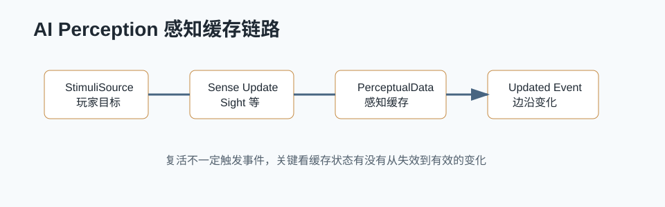

# UE AI Perception：死亡复活后感知为什么不刷新



## 0. 读前地图

这篇文章不是泛讲 AI Perception，而是用“死亡复活后不重新触发感知”这个具体问题带读源码。核心结论是：Perception 不是每帧看见目标就广播，它维护的是刺激状态和感知缓存。复活如果没有制造“状态边沿变化”，外层逻辑就可能收不到新的感知事件。

优先阅读源码：

```text
UAIPerceptionComponent：AI 身上的感知组件
UAIPerceptionSystem：全局感知更新调度
UAISense_Sight：视觉感知逻辑
UAIPerceptionStimuliSourceComponent：目标注册刺激源
FActorPerceptionInfo：某个 Actor 的感知缓存
FAIStimulus：一次刺激数据
```

建议断点：

```text
UAIPerceptionComponent::OnRegister
UAIPerceptionSystem::Tick
UAISense_Sight::Update
UAIPerceptionComponent::ProcessStimuli
UAIPerceptionComponent::HandleExpiredStimulus
UAIPerceptionComponent::ForgetActor
```

关键变量：

```text
PerceptualData：Actor 到感知信息的缓存表
LastSensedStimuli：各 Sense 的最近刺激
bSuccessfullySensed：当前刺激是否有效感知
ExpirationAge：刺激过期时间
StimuliSource：目标是否仍注册为可感知源
OnTargetPerceptionUpdated：外部最常用事件，但不是每帧广播
```

最小调试闭环：

```text
AI 第一次看见玩家
→ 玩家死亡但 Actor 不销毁
→ 查看 PerceptualData 是否仍有玩家
→ 玩家复活
→ 断到 ProcessStimuli 看有没有新 Stimulus
→ 如果没有边沿变化，测试 ForgetActor 或重新注册 StimuliSource
```

## 1. 问题背景

在项目里经常会遇到这样的现象：

```text
AI 已经感知过玩家
玩家死亡
玩家复活
AI 没有重新触发预期的感知逻辑
```

直觉上会认为“玩家复活后重新进入视野，AI Perception 应该重新 OnTargetPerceptionUpdated”。但 UE 的 AI Perception 并不是简单地每帧发现目标就广播一次，它内部维护感知数据、刺激队列和状态变化。只有刺激状态发生变化，或感知数据被刷新到需要更新的状态，才会触发外部回调。

这篇文章关注的问题是：

```text
为什么死亡复活后，AI Perception 有时不会重新刷新？
需要 ForgetActor、重新注册 StimuliSource，还是手动触发感知更新？
```

## 2. 项目场景

项目里 AI 依赖感知系统维护仇恨和战斗状态：

```text
AI Perception
→ 感知玩家
→ EnmityTracker / MonsterState
→ Warning / Combat / Search 状态切换
```

死亡复活会带来几个容易被忽略的问题：

```text
1. 玩家 Actor 可能没有换，只是状态从 Dead 变回 Alive。
2. AI Perception 里仍然保存着这个 Actor 的 PerceptualData。
3. Sight 只看到“仍然可见”，没有产生从不可见到可见的边沿变化。
4. 项目战斗状态可能已经清了，但 Perception 缓存没有清。
```

最终表现就是：游戏逻辑认为玩家已经是一轮新的目标，但 Perception 认为这个 Actor 仍然是旧感知数据的一部分。

## 2. 源码入口

```text
Engine/Source/Runtime/AIModule/Private/Perception/
```

重点函数：

```text
UAIPerceptionComponent::ProcessStimuli
UAIPerceptionComponent::HandleExpiredStimulus
UAIPerceptionComponent::OnListenerUpdateImpl
UAIPerceptionSystem::Tick
UAISense_Sight::Update
UAISense_Sight::RegisterTarget
UAISense_Sight::OnNewListenerImpl
```

## 4. 调用链

典型感知刷新链路可以理解成：

```text
UAIPerceptionSystem::Tick
→ 各个 UAISense::Update
→ UAISense_Sight::Update
→ 生成 FAIStimulus
→ Listener.RegisterStimulus
→ UAIPerceptionComponent::ProcessStimuli
→ 更新 PerceptualData
→ 条件满足时广播 OnTargetPerceptionUpdated
```

其中最关键的是 `ProcessStimuli`。外部收到的感知回调不是 Sight 直接发的，而是 PerceptionComponent 在处理刺激队列后，根据感知数据变化决定是否广播。

## 5. 核心结论

### 5.1 Perception 不是“每帧看见就通知”

AI Perception 会缓存 Actor 的感知数据。对于同一个 Actor，如果系统认为它的感知状态没有发生关键变化，就不会一直重复广播。

因此死亡复活这种玩法状态变化，如果没有同步到 Perception 层，就可能不会触发新的感知事件。

### 5.2 死亡不是 Perception 的天然失效条件

玩家死亡通常是 Gameplay 状态：

```text
Health <= 0
Dead Tag
Disable Input
Play Death Montage
Collision / Visibility 变化
```

但 AI Perception 并不知道“死亡后这个目标应该被忘记”，除非项目主动做了这些事：

```text
ForgetActor
ForgetAll
Unregister StimuliSource
切换 Team / Affiliation
隐藏或禁用被感知组件
让 Sight 产生失败刺激
```

如果 Actor 仍然存在，仍然可见，Perception 可能继续保留旧数据。

### 5.3 复活要么重置感知缓存，要么让状态机不依赖边沿事件

解决方向有两类：

```text
方案 A：复活时重置 Perception 缓存
    适合希望 AI 把复活目标当成新目标处理。

方案 B：AI 状态机主动轮询当前目标有效性
    适合 Perception 只负责发现目标，战斗状态由项目系统维护。
```

项目里更稳的做法通常是两者结合：

```text
死亡时：
    清理仇恨 / 战斗目标
    必要时让感知组件 ForgetActor

复活时：
    重新注册或刷新 StimuliSource
    让 AI 状态机允许重新选择该玩家
```

## 6. 调试过程

调试 AI Perception 时，我会重点看这些数据：

```text
AIController 上的 UAIPerceptionComponent
PerceptualData 中是否还有玩家 Actor
玩家是否仍注册为 Sight Target / StimuliSource
OnTargetPerceptionUpdated 是否触发
Stimulus.WasSuccessfullySensed()
Stimulus.GetAge()
```

常用断点：

```text
UAISense_Sight::Update
UAIPerceptionComponent::ProcessStimuli
UAIPerceptionComponent::HandleExpiredStimulus
UAIPerceptionSystem::Tick
```

项目层断点：

```text
EnmityTrackerComponent 接收感知结果的位置
MonsterState_Combat / Warning / Search 的切换点
玩家死亡和复活逻辑
StimuliSource 注册和注销逻辑
```

## 7. 项目应用

### 7.1 死亡时清掉战斗语义

如果玩家死亡后，AI 还保留这个玩家作为战斗目标，会导致状态机误以为仍有有效敌人。项目层需要明确处理：

```text
玩家死亡
→ 清理 AI 仇恨目标
→ 清理黑板 TargetActor
→ 必要时 ForgetActor
```

### 7.2 复活时重新建立可感知关系

复活后如果希望 AI 重新发现玩家，不能只恢复血量。还要确认：

```text
Actor 没有被隐藏
Collision / Team / Affiliation 正确
StimuliSource 仍然注册
AI 的 PerceptionComponent 没有保留错误缓存
```

如果使用 `ForgetActor`，复活后下一次 Sight 成功刺激就更容易形成新的感知边沿。

### 7.3 自动跑测中的意义

自动跑测要求 AI 能稳定推进、战斗、补给、撤离。如果感知缓存没有清理，AI 可能出现：

```text
目标已经复活，但 AI 不重新进入战斗
目标已经死亡，但 AI 仍然追旧目标
黑板目标和感知数据不一致
```

因此跑测框架不能只看行为树是否在运行，还要记录感知目标、仇恨目标和黑板目标是否一致。

## 8. 踩坑

### 8.1 OnTargetPerceptionUpdated 不是完整状态源

它适合处理“边沿事件”，但不适合作为唯一真相。AI 当前是否应该攻击目标，还要结合：

```text
目标是否存活
是否可伤害
是否在任务阶段允许攻击
是否仍在仇恨系统里有效
```

### 8.2 ForgetActor 不是万能修复

`ForgetActor` 可以清掉缓存，但如果复活后 StimuliSource 没注册，或者目标被 Team/Affiliation 过滤了，AI 仍然不会重新感知。

### 8.3 死亡复活最好有明确事件

不要让 Perception 被动猜测玩法状态。更稳定的设计是：

```text
OnPlayerDeath
OnPlayerRevive
```

在这两个事件里同步处理仇恨、黑板和感知缓存。

## 9. 后续问题

- 多 AI 同时感知同一个复活玩家时，ForgetActor 应该由谁触发。
- 感知缓存清理是否要做成统一 GameplayState 事件。
- Perception 和团队阵营变化的刷新顺序如何保证。

## 10. 源码精读补充：Perception 更新从哪里开始

源码位置：

```text
Engine/Source/Runtime/AIModule/Classes/Perception/AIPerceptionSystem.h
Engine/Source/Runtime/AIModule/Private/Perception/AIPerceptionSystem.cpp
Engine/Source/Runtime/AIModule/Classes/Perception/AIPerceptionComponent.h
Engine/Source/Runtime/AIModule/Private/Perception/AIPerceptionComponent.cpp
```

AI Perception 的更新不是每个 AI 自己随便 Trace。`UAIPerceptionSystem` 是全局系统，负责管理 Sense 和 Listener。`UAIPerceptionComponent` 是 AI 身上的监听组件，保存该 AI 感知到的目标和刺激。

主链路：

```text
UAIPerceptionSystem::Tick
→ 遍历 UAISense
→ UAISense_Sight::Update
→ 生成或更新 FAIStimulus
→ UAIPerceptionComponent::ProcessStimuli
→ 更新 PerceptualData
→ 触发 OnTargetPerceptionUpdated / OnPerceptionUpdated
```

如果目标死亡后仍被感知，问题通常不是“Sight 没 Trace”，而是组件里缓存的 `PerceptualData` 还没有被清理或更新成失效刺激。

## 11. 源码精读补充：Sight 如何判断看见目标

源码位置：

```text
Engine/Source/Runtime/AIModule/Classes/Perception/AISense_Sight.h
Engine/Source/Runtime/AIModule/Private/Perception/AISense_Sight.cpp
```

Sight 会维护 Listener 和 Target 的查询队列。它会按距离、重要性和时间预算分批处理，而不是一帧把所有 AI 对所有目标的视线检测全做完。

简化流程：

```text
注册 Listener
→ 注册 Target 或 StimuliSource
→ 生成 Sight Query
→ UAISense_Sight::Update 按预算取 Query
→ 检查距离、视野角、遮挡 Trace
→ 生成 SuccessfullySensed 或失效 Stimulus
→ Listener 的 PerceptionComponent 处理 Stimulus
```

这解释了为什么感知有时不是立刻刷新：Sight 有预算和更新间隔，大量 AI 时感知变化可能延迟到后续 Tick。

## 12. 源码精读补充：ForgetActor 为什么能解决复活问题

源码位置：

```text
Engine/Source/Runtime/AIModule/Private/Perception/AIPerceptionComponent.cpp
Engine/Source/Runtime/AIModule/Classes/Perception/AIPerceptionTypes.h
```

`UAIPerceptionComponent` 内部会按 Actor 保存感知数据。死亡、复活、换 Pawn、隐藏显示、阵营变化，都可能让旧缓存不再符合当前业务状态。

缓存结构可以理解为：

```text
PerceptualData[Actor]
→ 不同 Sense 的 FAIStimulus
→ LastSensedStimuli
→ 是否 SuccessfullySensed
→ LastSensedTime / ExpirationAge
```

`ForgetActor` 会删除指定 Actor 的感知缓存，让后续感知重新从当前状态建立。复活时如果不清缓存，AI 可能继续使用死亡前的刺激状态，导致状态机以为目标仍然不可见或仍然已感知。

## 13. 项目源码对应：死亡复活刷新策略

源码位置：

```text
Script/Core/Combat/AI/Components/SGAISensingPerceptionComponent.as
Script/Core/Combat/AI/Components/EnmityTrackerComponent.as
Script/Core/GameLogic/Characters/Monsters/SGMonsterCharacter.as
```

项目里更稳的策略是把感知刷新和仇恨刷新拆开：

```text
玩家死亡
→ AI 感知可以 ForgetActor 或标记目标无效
→ 仇恨系统清理或降低目标权重
→ 玩家复活
→ 重新注册可被感知状态
→ 主动通知附近 AI 刷新目标
→ 下一轮 Perception 重新建立刺激
```

不要只依赖 Sight 自己过期。死亡复活是 Gameplay 状态强变化，应该主动刷新感知缓存和仇恨缓存。
