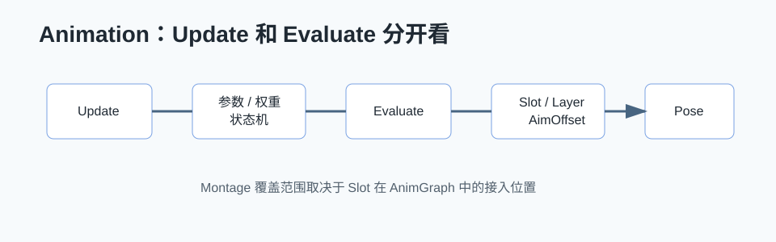

# Animation 详解



## 0. 读前地图

这篇文章先建立动画源码的主线：`Update` 计算参数和权重，`Evaluate` 生成最终 Pose，Slot 把 Montage 插进 AnimGraph，Layered Blend per Bone 做局部叠加，AimOffset 本质是 Additive BlendSpace。

源码入口：

```text
SkeletalMeshComponent：动画 Tick 和骨骼刷新入口
AnimInstance：动画蓝图实例
AnimInstanceProxy：多线程动画计算代理
AnimNode_Slot：Montage Slot 接入点
AnimNode_LayeredBoneBlend：局部骨骼混合
BlendSpace / AimOffsetBlendSpace：BlendSpace 和 AimOffset
```

建议断点：

```text
USkeletalMeshComponent::TickAnimation
UAnimInstance::UpdateAnimation
FAnimInstanceProxy::UpdateAnimation
FAnimInstanceProxy::Evaluate
FAnimNode_Slot::Evaluate_AnyThread
FAnimNode_LayeredBoneBlend::Evaluate_AnyThread
```

关键变量：

```text
FCompactPose：骨骼姿态
FBlendedCurve：动画曲线
SlotName：Montage 插入位置
BranchFilters：局部混合骨骼配置
RootMotionParams：RootMotion 输出
```

## 1. UE 动画包含哪些方面

UE 动画系统不只是 Animation Blueprint。完整动画链路包括：

```text
Skeleton / SkeletalMesh
Animation Sequence
BlendSpace
Animation Blueprint
AnimGraph
State Machine
Montage
Slot
Layered Blend per Bone
AimOffset
Control Rig
IK
Root Motion
Motion Warping
Animation Notify
Linked Anim Graph / Anim Layer
```

学习动画要同时理解数据、图节点、运行时更新、姿态求值和 Gameplay 驱动。

## 2. 源码入口

```text
Engine/Source/Runtime/Engine/Classes/Animation/AnimInstance.h
Engine/Source/Runtime/Engine/Private/Animation/AnimInstance.cpp
Engine/Source/Runtime/Engine/Public/Animation/AnimNodeBase.h
Engine/Source/Runtime/Engine/Private/Animation/AnimNodeBase.cpp
Engine/Source/Runtime/AnimGraphRuntime/Public
Engine/Source/Runtime/AnimGraphRuntime/Private
Engine/Source/Runtime/Engine/Classes/Animation/AnimMontage.h
Engine/Source/Runtime/Engine/Private/Animation/AnimMontage.cpp
```

## 3. AnimGraph Update / Evaluate 流程

动画运行大体分为 Update 和 Evaluate。

```text
USkeletalMeshComponent::TickComponent
→ TickAnimation
→ UAnimInstance::UpdateAnimation
→ NativeUpdateAnimation / BlueprintUpdateAnimation
→ AnimGraph Update
→ Parallel Animation Evaluation
→ AnimGraph Evaluate
→ 输出最终 Pose
→ 骨骼矩阵刷新
```

Update 阶段更新权重、时间、状态机转换、BlendSpace 参数。Evaluate 阶段真正计算姿态。这个分离是为了并行评估和性能优化。

## 4. State Machine

State Machine 负责基础状态切换，比如 Idle、Walk、Run、Jump、Fall。它本质是根据条件选择当前状态，并更新状态内部动画时间。

状态机适合连续状态，不适合所有一次性动作。攻击、换弹、受击通常更适合 Montage。

## 5. Montage Slot 怎么覆盖基础姿态

Montage 不是直接替换整个 AnimGraph，而是通过 Slot 节点插入到 AnimGraph 某个位置。

调用链：

```text
UAnimInstance::Montage_Play
→ 创建或更新 FAnimMontageInstance
→ Montage Tick 更新播放时间和权重
→ AnimGraph 运行到 Slot 节点
→ Slot 节点读取该 Slot 上的 Montage 姿态
→ 按权重覆盖或混合基础姿态
```

如果 AnimGraph 里没有对应 Slot 节点，Montage 播放了也不会影响最终姿态。

## 6. Layered Blend per Bone 如何实现局部叠加

`Layered Blend per Bone` 用骨骼分支过滤实现局部姿态混合。它先计算 Base Pose，再计算 Blend Pose，然后根据骨骼权重表决定每根骨骼用哪个姿态或混合多少。

典型用途：

```text
下半身跑步
上半身开枪
头部 AimOffset
受击局部动画
手臂换弹叠加
```

关键点是骨骼层级。比如从 `spine_01` 开始叠加，会影响它的所有子骨骼。配置错骨骼会导致全身被覆盖或局部不生效。

## 7. AimOffset 本质是什么

AimOffset 本质是一个按 Pitch / Yaw 参数采样的姿态 BlendSpace。它不是魔法瞄准系统，而是把多个方向的瞄准姿态按输入角度混合。

流程：

```text
计算角色朝向和控制器朝向差值
→ 得到 AimYaw / AimPitch
→ AimOffset 根据二维参数采样姿态
→ 通常通过 Layered Blend per Bone 叠到上半身
```

如果角色 ActorRotation、ControlRotation、Mesh 空间关系不清楚，AimOffset 很容易抖或反向。

## 8. Root Motion

Root Motion 是动画驱动位移。常见流程：

```text
AnimSequence 提取 Root Motion
→ AnimInstance 累积 RootMotion
→ CharacterMovement 消费 RootMotion
→ 转成移动组件位移
```

Root Motion 的优势是动作位移和动画一致；问题是网络同步、自定义移动和碰撞处理更复杂。

## 9. 如何深入学习

建议按这个顺序：

1. 先理解 Skeleton、SkeletalMesh、AnimSequence。
2. 再理解 AnimInstance Tick、Update、Evaluate。
3. 学 StateMachine 和 BlendSpace。
4. 学 Montage、Slot、Notify。
5. 学 Layered Blend per Bone、AimOffset。
6. 学 Root Motion、Motion Warping、IK。
7. 最后看并行动画、线程安全、性能分析。

## 10. 性能优化

```text
减少复杂 AnimGraph 节点数量
使用 Update Rate Optimization
远距离角色降低动画 Tick
避免每帧 Blueprint 做重逻辑
使用 Linked Anim Graph 拆分复杂图
减少高频曲线和 Notify 成本
LOD 下关闭 IK、物理、修正节点
```

## 11. 项目应用

机甲项目里常见动画需求：

```text
移动基础姿态
瞄准上半身叠加
武器开火 Montage
飞行姿态和地面姿态切换
受击和硬直
手炮/枪械不同持姿
RootYawOffset 或 TurnInPlace
```

这些不要全部塞进一个状态机。基础移动用状态机，一次性动作用 Montage，上半身覆盖用 Slot 和 Layered Blend per Bone，瞄准用 AimOffset。

## 12. 结论

UE 动画系统的核心是“Update 计算状态，Evaluate 计算姿态”。Montage 通过 Slot 接入 AnimGraph，Layered Blend per Bone 通过骨骼权重做局部叠加，AimOffset 本质是姿态 BlendSpace。深入学习时要把 Gameplay 状态、控制器朝向、角色朝向和最终姿态放在同一条链路里理解。

## 13. 源码精读：SkeletalMeshComponent 如何驱动 AnimInstance

源码位置：

```text
Engine/Source/Runtime/Engine/Private/Components/SkeletalMeshComponent.cpp
Engine/Source/Runtime/Engine/Private/Animation/AnimInstance.cpp
Engine/Source/Runtime/Engine/Public/Animation/AnimInstanceProxy.h
```

动画不是 Actor Tick 里直接算每根骨骼。`USkeletalMeshComponent` 负责调度动画更新和姿态求值，`UAnimInstance` 保存动画逻辑，`FAnimInstanceProxy` 用于跨线程评估。

简化链路：

```text
USkeletalMeshComponent::TickComponent
→ TickAnimation
→ UAnimInstance::UpdateAnimation
→ NativeUpdateAnimation / BlueprintUpdateAnimation
→ AnimGraph Update
→ DispatchParallelEvaluationTasks
→ ParallelAnimationEvaluation
→ AnimGraph Evaluate
→ Final Pose 写回组件
→ RefreshBoneTransforms
```

Update 阶段运行在逻辑更新语义里，Evaluate 阶段更关注姿态计算并可能并行执行。复杂 AnimGraph 性能问题通常要看 Evaluate，而不是只看蓝图 EventGraph。

## 14. 源码精读：AnimNode 的 Update 和 Evaluate

源码位置：

```text
Engine/Source/Runtime/Engine/Public/Animation/AnimNodeBase.h
Engine/Source/Runtime/Engine/Private/Animation/AnimNodeBase.cpp
Engine/Source/Runtime/AnimGraphRuntime/Public/AnimNodes
Engine/Source/Runtime/AnimGraphRuntime/Private/AnimNodes
```

每个 AnimGraph 节点本质是一个 `FAnimNode_Base` 子类。它通常会实现：

```text
Initialize_AnyThread
CacheBones_AnyThread
Update_AnyThread
Evaluate_AnyThread
```

Update 主要做权重、时间、状态推进；Evaluate 输出 Pose。比如 Blend 节点在 Update 里计算每个输入 Pose 的权重，在 Evaluate 里真正把多个 Pose 混合成输出姿态。

## 15. 源码精读：Montage 和 Slot

源码位置：

```text
Engine/Source/Runtime/Engine/Private/Animation/AnimInstance.cpp
Engine/Source/Runtime/Engine/Private/Animation/AnimMontage.cpp
Engine/Source/Runtime/AnimGraphRuntime/Private/AnimNodes/AnimNode_Slot.cpp
```

`Montage_Play` 只是创建或更新 `FAnimMontageInstance`。它不会凭空覆盖最终姿态，必须等 AnimGraph 走到对应 Slot 节点。

调用链：

```text
UAnimInstance::Montage_Play
→ 创建 FAnimMontageInstance
→ TickMontage 更新播放时间、Section、Blend
→ AnimGraph Evaluate 到 FAnimNode_Slot
→ Slot 节点查找当前 Slot 的 Montage Pose
→ 按权重混合 Source Pose 和 Montage Pose
→ 输出给后续节点
```

如果 Montage 播放成功但角色没动作，优先检查 AnimGraph 里是否有同名 Slot，Slot 是否在正确的骨骼层级前后，Montage 的 Slot 名是否匹配。

## 16. 源码精读：Layered Blend per Bone

源码位置：

```text
Engine/Source/Runtime/AnimGraphRuntime/Public/AnimNodes/AnimNode_LayeredBoneBlend.h
Engine/Source/Runtime/AnimGraphRuntime/Private/AnimNodes/AnimNode_LayeredBoneBlend.cpp
```

Layered Blend per Bone 会先根据 Branch Filter 或 Blend Mask 构建每根骨骼的权重表。Evaluate 时，节点会对每个输入 Pose 按骨骼权重混合。

流程：

```text
Update 阶段计算 BlendWeights
→ CacheBones 建立骨骼层级权重
→ Evaluate Base Pose
→ Evaluate Blend Poses
→ 对每根骨骼按权重混合 Transform
→ 曲线和 RootMotion 按规则混合
```

局部叠加不生效时，优先查骨骼名、Mesh Skeleton、Branch Depth、节点顺序。比如 AimOffset 应该叠在上半身，不能放在会被后续全身状态机覆盖的位置。

## 17. 源码精读：AimOffset 的本质

源码位置：

```text
Engine/Source/Runtime/Engine/Classes/Animation/AimOffsetBlendSpace.h
Engine/Source/Runtime/Engine/Private/Animation/BlendSpace.cpp
Engine/Source/Runtime/AnimGraphRuntime/Private/AnimNodes/AnimNode_BlendSpacePlayer.cpp
```

AimOffset 本质是 Mesh Space Additive 的 BlendSpace。输入通常是 `AimYaw` 和 `AimPitch`，输出是按角度混合后的瞄准姿态差值。

实际链路：

```text
Gameplay 计算 ControlRotation - ActorRotation
→ AnimInstance 保存 AimYaw / AimPitch
→ BlendSpacePlayer 根据二维参数采样
→ 输出 additive pose
→ Layered Blend per Bone 叠到上半身
→ 最终 Pose 输出
```

AimOffset 抖动通常不是 AimOffset 资源本身的问题，而是 ControlRotation、ActorRotation、Mesh Rotation、网络平滑之间的参考空间不一致。

## 源码精读补充：从 AnimInstance 到最终 Pose

读前目标：这篇文章要让读者分清 `Update` 和 `Evaluate`，理解 Montage Slot 为什么能覆盖基础姿态，以及局部叠加、AimOffset、RootMotion 分别在哪个阶段生效。

源码位置：

```text
Engine/Source/Runtime/Engine/Private/Animation/AnimInstance.cpp
Engine/Source/Runtime/Engine/Private/Animation/AnimInstanceProxy.cpp
Engine/Source/Runtime/Engine/Private/Components/SkeletalMeshComponent.cpp
Engine/Source/Runtime/AnimGraphRuntime/Private/AnimNodes/AnimNode_Slot.cpp
Engine/Source/Runtime/AnimGraphRuntime/Private/AnimNodes/AnimNode_LayeredBoneBlend.cpp
```

建议断点：

```text
USkeletalMeshComponent::TickAnimation
UAnimInstance::UpdateAnimation
FAnimInstanceProxy::UpdateAnimation
FAnimInstanceProxy::Evaluate
FAnimNode_Slot::Evaluate_AnyThread
FAnimNode_LayeredBoneBlend::Evaluate_AnyThread
```

关键变量：

```text
DeltaSeconds：动画更新使用的时间步长
FAnimInstanceProxy：多线程动画计算使用的代理数据
FCompactPose：当前骨骼姿态
FBlendedCurve：曲线结果，驱动表情、材质或 Gameplay 参数
SlotName：Montage 插入到 AnimGraph 的位置
BranchFilters：Layered Blend per Bone 的骨骼过滤配置
RootMotionParams：Montage 或动画产生的根运动结果
```

数据流：

```text
SkeletalMeshComponent Tick
→ AnimInstance Update 计算状态机参数和节点权重
→ AnimGraph Evaluate 递归生成 Pose
→ Slot 节点把 Montage 姿态混入图
→ Layered Blend 按骨骼权重覆盖局部身体
→ 后处理、曲线、RootMotion 输出
→ SkeletalMeshComponent 刷新骨骼矩阵
```

伪代码精读：

```cpp
TickAnimation()
{
    AnimInstance->UpdateAnimation(DeltaSeconds);
    AnimInstanceProxy->Evaluate(OutputPose);
    ApplyRootMotionIfNeeded();
    RefreshBoneTransforms();
}
```

`Update` 更像“算参数和权重”，`Evaluate` 更像“按权重真正算姿态”。状态机切换条件、BlendSpace 输入、Montage 权重通常在 Update 阶段准备；最终骨骼姿态在 Evaluate 阶段生成。

调试验证方法：

1. 在 AnimBP 里给 Locomotion 后接一个 Slot，播放 Montage 看覆盖范围。
2. 修改 Slot 接入位置，验证 Montage 覆盖的是接入点之后的姿态。
3. 给 Layered Blend per Bone 配 Spine 骨骼，观察下半身是否保留移动动画。
4. 在 AimOffset 输入处打印 `AimYaw`、`AimPitch`，确认它们和角色朝向使用同一参考空间。

常见误区：

- Montage 不是天然覆盖所有动画，它只在 AnimGraph 中 Slot 所在位置生效。
- Layered Blend per Bone 不是简单裁掉骨骼，而是按骨骼层级和权重混合 Pose。
- AimOffset 本质是 additive pose，不是单独控制骨骼朝向的逻辑脚本。

## 进阶补充：Motion Matching、Pose Search、Chooser、Control Rig 和 Motion Warping

源码位置：

```text
Engine/Plugins/Animation/PoseSearch/Source
Engine/Plugins/Animation/MotionWarping/Source
Engine/Plugins/Animation/ControlRig/Source
Engine/Plugins/Animation/IKRig/Source
Engine/Plugins/Chooser/Source
```

现代 UE 动画深入需要补五个方向。

`Motion Matching` 的核心是从动画数据库里按当前运动需求搜索最合适的 Pose，而不是手写大量状态机过渡。它依赖 Pose Search，把速度、朝向、轨迹、骨骼特征编码成可查询特征。

`Chooser` 更像数据驱动选择器。它适合根据武器、状态、角色类型、地形、速度选择动画、技能或配置。它能减少蓝图里大量 `if/else` 和状态枚举分支。

`Control Rig` 用于运行时或编辑器内的程序化骨骼控制。它适合机械臂、武器挂点、脚部 IK、特殊瞄准修正和动画工具链。

`IK Rig / IK Retargeter` 解决不同骨架之间的动画重定向，也能在运行时做局部 IK 修正。

`Motion Warping` 解决动画 RootMotion 和真实目标位置不匹配的问题。例如处决、冲刺攻击、翻越、近战吸附，动画可以被扭曲到目标点。

学习顺序建议：

```text
先掌握 AnimGraph Update / Evaluate
→ 再看 Montage Slot 和 Layered Blend
→ 再看 Motion Warping 解决 RootMotion 对齐
→ 再看 Pose Search / Motion Matching
→ 最后用 Chooser 做动画选择数据化
```

项目里如果机甲有冲刺斩、处决、登舰、炮台操作，优先研究 Motion Warping 和 Control Rig；如果要做大量人形移动动画切换，再研究 Motion Matching。
