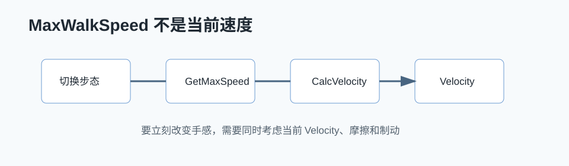

# UE CharacterMovement 源码阅读：MaxWalkSpeed 到底在哪里生效



## 0. 读前地图

这篇文章用一个具体项目问题读 CharacterMovement：为什么改了 `MaxWalkSpeed`，角色当前速度不一定立刻变成目标速度。先给结论：`MaxWalkSpeed` 是速度上限，不是当前速度赋值；当前速度由 `Acceleration`、`Friction`、`Braking`、`MovementMode`、RootMotion 和网络预测共同决定。

源码入口：

```text
UCharacterMovementComponent::TickComponent
UCharacterMovementComponent::PerformMovement
UCharacterMovementComponent::StartNewPhysics
UCharacterMovementComponent::PhysWalking
UCharacterMovementComponent::CalcVelocity
UCharacterMovementComponent::GetMaxSpeed
```

建议断点：

```text
SetGaitType 或项目步态切换函数
UCharacterMovementComponent::GetMaxSpeed
UCharacterMovementComponent::CalcVelocity
UCharacterMovementComponent::ApplyVelocityBraking
UCharacterMovementComponent::UpdateComponentVelocity
```

关键变量：

```text
MaxWalkSpeed：Walking 速度上限
Velocity：当前真实速度
Acceleration：输入或 AI 移动请求产生的加速度
GroundFriction：转向和刹车的重要参数
BrakingDecelerationWalking：停止输入后的减速度
MovementMode：决定 GetMaxSpeed 取哪个速度上限
```

最小验证实验：

```text
角色以 Sprint 速度移动
→ 只把 MaxWalkSpeed 改成 Walk
→ 观察 Velocity 是否立刻降到 Walk
→ 再手动按当前方向修正 Velocity
→ 对比动画状态和实际位移是否一致
```

## 1. 问题背景

在做角色、机甲或 AI 自动跑测时，经常会设置：

```cpp
CharacterMovement->MaxWalkSpeed = 900.f;
```

直觉上它像是“直接把角色速度设成 900”，但源码里它更接近一个速度上限。角色最终速度还会受到输入加速度、摩擦、制动、移动模式、网络预测和 RootMotion 等因素影响。

项目里遇到的实际问题是：同一个角色在 Run、Sprint、Walk 之间切换时，`MaxWalkSpeed` 已经改了，但当前帧速度没有立刻同步到期望值。这个问题在手感调试和 AI 自动跑测里都很明显：AI 切换移动状态后，如果实时速度没有被修正，就会出现短时间“动作状态和实际速度不一致”。

所以这篇文章关注两个问题：

```text
1. MaxWalkSpeed 在 CharacterMovement 源码里到底在哪里被消费？
2. 如果项目希望切换步态时立即改变当前速度，应该只改 MaxWalkSpeed 吗？
```

## 2. 项目场景

项目里的玩家角色基于 `ASGPlayerCharacter`，底层移动组件继承 UE 的 CharacterMovement 思路，并在角色层维护 `ESGGaitType`：

```text
Walk
Run
Sprint
Flight
FlightSprint
NearDeath
```

角色切换步态时会做两类事情：

```text
SetGaitType(NewGait)
→ OnGaitChanged()
→ 修改 MaxWalkSpeed / MaxFlySpeed 的基础值

Server_SetSpeedToGait(NewGait)
→ Multicast_SetSpeedToGait(NewGait)
→ 按当前方向立即修正 Velocity
```

前者解决“之后最多能跑多快”，后者解决“当前这一刻速度要不要马上跟上”。

## 2. 源码入口

```text
Engine/Source/Runtime/Engine/Classes/GameFramework/CharacterMovementComponent.h
Engine/Source/Runtime/Engine/Private/Components/CharacterMovementComponent.cpp
```

重点函数：

```text
UCharacterMovementComponent::TickComponent
UCharacterMovementComponent::PerformMovement
UCharacterMovementComponent::StartNewPhysics
UCharacterMovementComponent::PhysWalking
UCharacterMovementComponent::CalcVelocity
UCharacterMovementComponent::GetMaxSpeed
UCharacterMovementComponent::ApplyVelocityBraking
```

## 4. 调用链

```text
TickComponent
→ PerformMovement
→ StartNewPhysics
→ PhysWalking
→ CalcVelocity
→ GetMaxSpeed
```

更细一点看，Walking 模式下一帧移动大致是：

```text
TickComponent
→ ControlledCharacterMove / SimulatedTick / PerformMovement
→ StartNewPhysics
→ PhysWalking
→ CalcVelocity
   → 处理输入加速度 Acceleration
   → 处理 GroundFriction
   → 处理 BrakingDecelerationWalking
   → 用 GetMaxSpeed 得到速度上限
   → 限制 Velocity 不超过上限
→ MoveAlongFloor / SafeMoveUpdatedComponent
```

这里最关键的是：`MaxWalkSpeed` 不是每帧直接赋值给 `Velocity`。它通常通过 `GetMaxSpeed()` 参与速度限制。

## 5. 核心结论

### 5.1 MaxWalkSpeed 是上限，不是当前速度

`MaxWalkSpeed` 的主要消费点在 `GetMaxSpeed()`。当移动模式是 Walking 或 NavWalking 时，`GetMaxSpeed()` 会返回 `MaxWalkSpeed`，后续 `CalcVelocity()` 用这个值限制速度。

这意味着：

```text
MaxWalkSpeed 改小：
    后续 CalcVelocity 会逐步把速度限制到新上限。

MaxWalkSpeed 改大：
    角色不会自动瞬间变快，还要有输入加速度把 Velocity 推上去。

没有输入或正在制动：
    速度变化更多由摩擦和 BrakingDeceleration 控制。
```

### 5.2 切步态想“立即变速”，需要额外处理 Velocity

如果项目希望 Sprint 切 Run、Aim 切 Walk 时立刻改变当前移动速度，只改 `MaxWalkSpeed` 不够。更直接的做法是：

```text
1. 切 GaitType，刷新 MaxWalkSpeed。
2. 按当前速度方向或角色朝向，重新设置 Velocity。
```

项目里的 `Server_SetSpeedToGait` / `Multicast_SetSpeedToGait` 就是这个目的。它不是 UE 默认必须做的逻辑，而是项目为了“状态切换和当前速度立即一致”加的一层手感修正。

### 5.3 Run / Sprint / Walk 应该统一走同一套速度切换口径

如果 Sprint 用了“改 Gait + 改实时 Velocity”，而 Aim/Handgun 慢走只改 `MaxWalkSpeed`，就会出现行为不一致。正确做法是把 Aim/Handgun 的慢走也纳入同一套步态切换逻辑：

```text
AimShoot / HandgunShoot Tag 生效
→ SetGaitType(Walk)
→ Server_SetSpeedToGait(Walk)

Tag 移除
→ SetGaitType(Run)
→ Server_SetSpeedToGait(Run)
```

## 6. 调试过程

调试 CharacterMovement 时，我会重点看三个值：

```text
CharacterMovement->MaxWalkSpeed
CharacterMovement->Velocity
Acceleration / LastInputVector
```

如果 `MaxWalkSpeed` 已经变了，但 `Velocity.Size2D()` 没有立刻变化，这不是 UE 没生效，而是 CharacterMovement 的设计就是“速度上限参与下一轮物理计算”。想要立即改变当前速度，需要项目层主动改 `Velocity`。

常用断点：

```text
UCharacterMovementComponent::CalcVelocity
UCharacterMovementComponent::GetMaxSpeed
UCharacterMovementComponent::ApplyVelocityBraking
UCharacterMovementComponent::PhysWalking
```

项目层常用断点：

```text
ASGCombatCharacter::SetGaitType
ASGCombatCharacter::OnGaitChanged
ASGPlayerCharacter::Server_SetSpeedToGait
ASGPlayerCharacter::Multicast_SetSpeedToGait
```

## 7. 项目应用

### 7.1 瞄准和手炮慢走

玩家在瞄准或使用手炮时，需要从 Run/Sprint 降到 Walk。这个逻辑不应该只放在动画蓝图里，因为动画只决定表现，不决定真实移动速度。

最终更合理的落点是角色本体：

```text
ASC.OnOwnedTagUpdated
→ 监听 AimShoot / HandgunShoot Tag
→ Tag 添加时切 Walk
→ Tag 移除时恢复 Run
```

这样后续如果再有“负重慢走”“交互慢走”“受伤慢走”，也可以继续通过 Tag 驱动步态变化。

### 7.2 AI 自动跑测

自动跑测里，AI 的移动 Action 会切换 Run、Sprint、Fly 等移动风格。如果只改目标速度上限，不修正实时 Velocity，测试数据会有短暂误差：

```text
行为日志显示已进入 Sprint
实际速度仍然停留在 Run 或 Walk
导致到达时间、卡住检测和超时判断出现偏差
```

所以跑测逻辑里，步态切换和实时速度同步必须保持一致。

## 8. 踩坑

### 8.1 VelocityNormal 的方向要谨慎

项目里实时修正速度时，需要决定速度方向来自哪里：

```text
当前 Velocity 方向
角色 Forward 方向
控制器 Forward 方向
移动输入方向
```

如果方向取错，就会出现切速度瞬间朝错误方向冲一下。对玩家而言，通常使用当前速度方向或输入方向更自然；对 AI 而言，通常使用当前移动目标方向更稳定。

### 8.2 不要把动画状态当成移动状态

`bIsSprint`、`bIsAiming`、`bIsUsingHandgun` 在动画实例里只是表现层变量。真正影响移动速度的应该是 CharacterMovement 或角色步态系统。

动画可以读取状态，但不应该成为速度状态的来源。

### 8.3 网络同步下要区分本地预测和服务端权威

本地角色为了手感可以先切速度，但服务端也要同步同样的 Gait 和 Velocity 修正，否则客户端短时间正确，服务端校正后又被拉回。

## 9. 后续问题

- 网络预测下直接改 Velocity 的误差如何最小化。
- 多个慢走来源同时存在时，是否需要做 Gait Request 栈。
- Flight / FlightSprint 是否也需要类似地统一实时速度修正。

## 10. 源码精读补充：MaxWalkSpeed 的完整生效链

源码位置：

```text
Engine/Source/Runtime/Engine/Classes/GameFramework/CharacterMovementComponent.h
Engine/Source/Runtime/Engine/Private/Components/CharacterMovementComponent.cpp
```

`MaxWalkSpeed` 不是在设置瞬间把角色速度改掉，而是在移动模拟时作为速度上限参与计算。最关键的链路是：

```text
UCharacterMovementComponent::TickComponent
→ PerformMovement
→ StartNewPhysics
→ PhysWalking
→ CalcVelocity
→ GetMaxSpeed
→ 限制 Velocity 大小
→ MoveAlongFloor
→ SafeMoveUpdatedComponent
```

在 `PhysWalking` 里，角色先根据当前输入、摩擦、制动等参数计算速度，再用 `GetMaxSpeed()` 返回的上限 clamp。也就是说，`MaxWalkSpeed` 控制的是“最终速度不能超过多少”，不是“当前速度立刻变成多少”。如果加速度很小，即使 `MaxWalkSpeed` 很大，角色也需要一段时间才能到达上限。

## 11. 源码精读补充：为什么改速度要同时看加速度和制动

源码位置：

```text
Engine/Source/Runtime/Engine/Private/Components/CharacterMovementComponent.cpp
```

`CalcVelocity` 内部会综合这些变量：

```text
Acceleration
Velocity
Friction
BrakingDeceleration
MaxSpeed
DeltaTime
```

简化逻辑：

```text
如果没有输入，按 BrakingDeceleration 和 Friction 减速
→ 如果有输入，按 Acceleration 增加速度
→ 速度方向受摩擦影响
→ 最终速度限制在 MaxSpeed
```

所以项目里从 Run 切到 Walk，如果只改 `MaxWalkSpeed`，当前速度可能还需要靠 braking 慢慢降下来。想让瞄准或手炮状态立即变慢，需要同时考虑是否主动 clamp 当前 `Velocity`，或提高该状态下的制动参数。

## 12. 项目源码对应：SGPlayerCharacter 如何接入

源码位置：

```text
Script/Core/GameLogic/Characters/SGPlayerCharacter.as
Script/Core/GameLogic/Movement/SGCharacterMovementComponent.as
Script/Core/GameLogic/Animation/SGAnimInstance_Locomotion.as
```

项目里的 gait 切换不是直接修改引擎 `MaxWalkSpeed` 字段，而是封装到角色和移动组件自己的状态里。推荐记录链路：

```text
GameplayTag 或玩家状态变化
→ SGPlayerCharacter 判断 Aim / Handgun / Sprint / Flight
→ SGCharacterMovementComponent 更新 GaitType 或 OrientType
→ SGCombatCharacter / Movement 参数集更新速度
→ AnimInstance 读取速度和状态更新 Locomotion
```

调试时要同时看三处：状态是否正确、移动组件速度是否正确、动画是否用同一套状态。否则会出现“实际速度变了，但动画还像在跑”或“动画切了，实际速度没变”。
