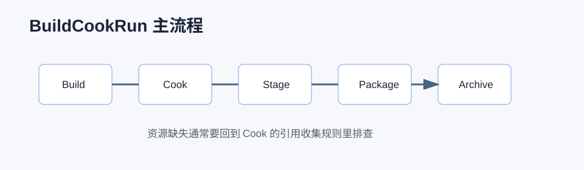

# 如何打包一个项目



## 0. 读前地图

打包文章最容易写成命令集合，但真正难点是资源为什么进包、为什么没进包、为什么编辑器能跑而包体不能跑。阅读本文时先抓住一条线：Build 产出可执行文件，Cook 产出目标平台资源，Stage 汇总运行所需文件，Package 生成可分发包。

优先阅读源码和工具：

```text
RunUAT：自动化打包入口
UnrealBuildTool：C++ 编译和 Target/Module 解析
CookCommandlet：Cook 主流程
AssetManager：PrimaryAsset 和软引用收集
AssetRegistry：Cook 后运行时资源索引
```

建议断点和日志：

```text
UCookCommandlet::Main
UCookOnTheFlyServer::StartCookByTheBook
UAssetManager::ModifyCook
FAssetRegistryGenerator::SaveManifests
LogCook / LogAssetRegistry / LogStreaming
```

关键变量：

```text
CookByTheBookOptions：本次 Cook 的模式和平台
TargetPlatform：目标平台序列化规则
PackagesToCook：最终决定进入 Cook 的 Package 集合
PrimaryAssetId：AssetManager 管理资源的主键
SoftObjectPath：软引用路径，是否进包取决于收集规则
```

最小调试闭环：

```text
命令行 RunUAT BuildCookRun
→ 打开 Cook 日志
→ 搜索缺失资源路径
→ 判断它是硬引用、软引用还是动态拼路径
→ 检查 AssetManager / PrimaryAssetLabel / AlwaysCookDirectories
→ 用打包产物验证运行时加载
```

## 进阶补充：IoStore、Zen Loader、AssetRegistry、DLC、Patch 和 Chunk

源码位置：

```text
Engine/Source/Runtime/CoreUObject/Private/Serialization/AsyncLoading2.cpp
Engine/Source/Runtime/AssetRegistry
Engine/Source/Runtime/Engine/Private/AssetManager.cpp
Engine/Source/Runtime/PakFile
Engine/Source/Runtime/IOStore
Engine/Source/Programs/AutomationTool
```

`IoStore` 是 UE 现代资源打包和加载的重要路径，通常会生成 `.utoc` 和 `.ucas`。它替代传统 Pak 的部分职责，配合异步加载和容器化资源管理。

`Zen Loader` 和 `AsyncLoading2` 关注运行时资源加载链路。包体能启动但进入地图卡顿，往往要从加载事件、依赖、同步加载和 IO 容器里查。

`AssetRegistry` 是运行时查找资源的重要索引。Cook 后的 AssetRegistry 决定运行时能不能发现某些资源路径和资产信息。

`PrimaryAssetLabel` 和 `AssetManager` 是软引用资源进包的关键。只靠字符串路径动态加载资源，很容易编辑器可用、打包丢失。

`DLC / Patch / Hotfix / Chunk` 关注发布后资源分发：

```text
Chunk：把资源分组到不同安装包或下载包。
Patch：基于旧版本生成差异更新。
DLC：额外内容包。
Hotfix：小范围配置或资源修复。
```

排查顺序：

```text
资源没进包：看 AssetManager、PrimaryAsset、Cook 列表。
资源进包但找不到：看 AssetRegistry 和路径。
资源加载慢：看 Loading Insights、AsyncLoading2、同步加载。
包体过大：看 Chunk、引用链和未裁剪编辑器数据。
补丁异常：看版本基线、Chunk 归属和资源重定向。
```

## 1. 问题背景

UE 打包不是简单把工程复制出去。它包含编译、Cook、Stage、Package、Archive 等阶段。很多线上资源缺失、蓝图类找不到、软引用没打进去、平台配置不一致的问题，都出在 Cook 和资源引用关系上。

## 2. 关键概念

```text
Build    编译 C++、生成目标平台二进制
Cook     把 uasset 转成目标平台可加载格式
Stage    把可执行文件、Cook 产物、配置、依赖复制到临时目录
Package  生成 pak / iostore / 平台安装包
Archive  归档到最终输出目录
```

## 3. 源码和工具入口

```text
Engine/Source/Programs/AutomationTool
Engine/Source/Programs/UnrealBuildTool
Engine/Source/Editor/UnrealEd/Private/Commandlets/CookCommandlet.cpp
Engine/Source/Runtime/CoreUObject/Private/Serialization/AsyncLoading2.cpp
Engine/Source/Runtime/Engine/Private/AssetManager.cpp
```

常用工具：

```text
UnrealEditor-Cmd.exe
RunUAT.bat
UnrealBuildTool
CookCommandlet
```

## 4. Cook 做了什么

Cook 的目标是把编辑器资源转换成运行时资源。流程可以理解为：

```text
收集需要 Cook 的 Package
→ 加载资源和依赖
→ 平台相关序列化
→ 压缩、裁剪编辑器数据
→ 保存到 Saved/Cooked
→ 生成 AssetRegistry
```

Cook 会根据地图、PrimaryAsset、硬引用、配置目录、显式 Cook 列表收集资源。

## 5. 硬引用和软引用在 Cook 中的区别

硬引用是资源对象直接引用另一个资源。只要入口资源被 Cook，硬引用链上的依赖通常会被一起收集。

软引用保存的是路径，比如 `TSoftObjectPtr`、`FSoftObjectPath`。软引用不会天然保证资源被 Cook，除非：

```text
被 AssetManager PrimaryAsset 规则收集
在 Project Settings 的 Additional Asset Directories to Cook 中
被 PrimaryAssetLabel 标记
代码或配置显式加入 Cook
地图或资源链间接硬引用
```

所以“编辑器能加载，包里找不到”经常是软引用没有进入 Cook。

## 6. 打包执行流程

编辑器点击 Package，本质上也是调用 UAT：

```text
BuildCookRun
→ Build
→ Cook
→ Stage
→ Pak / IoStore
→ Archive
```

典型命令：

```bat
Engine\Build\BatchFiles\RunUAT.bat BuildCookRun ^
  -project="D:\Project\MyGame\MyGame.uproject" ^
  -noP4 ^
  -platform=Win64 ^
  -clientconfig=Development ^
  -serverconfig=Development ^
  -build ^
  -cook ^
  -stage ^
  -pak ^
  -archive ^
  -archivedirectory="D:\Builds\MyGame"
```

如果是 Dedicated Server：

```bat
Engine\Build\BatchFiles\RunUAT.bat BuildCookRun ^
  -project="D:\Project\MyGame\MyGame.uproject" ^
  -noP4 ^
  -platform=Win64 ^
  -server ^
  -serverconfig=Development ^
  -build ^
  -cook ^
  -stage ^
  -pak ^
  -archive ^
  -archivedirectory="D:\Builds\Server"
```

## 7. 不打开编辑器命令行打包

前提：

```text
引擎路径明确
uproject 路径明确
目标平台 SDK 安装
项目 C++ 能编译
Cook 配置完整
```

流程：

```text
清理旧 Saved/Cooked 和 StagedBuilds
→ RunUAT BuildCookRun
→ 检查 Cook warning/error
→ 检查 pak/utoc/ucas 输出
→ 启动包体 smoke test
```

CI 上建议把命令写成脚本，避免手动参数漂移。

## 8. 常见参数

```text
-project       uproject 路径
-platform      目标平台
-clientconfig  客户端配置
-serverconfig  服务端配置
-build         编译
-cook          Cook 资源
-stage         Stage 文件
-pak           生成 pak
-iostore       使用 IoStore
-archive       归档
-map           指定地图
-cookall       Cook 所有资源，不推荐长期使用
-iterate       增量 Cook
```

## 9. 排查资源缺失

优先检查：

```text
资源是否被硬引用
软引用是否被 AssetManager 收集
PrimaryAssetLabel 是否生效
地图是否在打包列表
AssetRegistry 是否包含目标资源
Cook log 是否有 Can't find file
运行时 LoadObject 路径是否正确
```

不要靠 `cookall` 掩盖依赖问题。它会让包变大，也会隐藏资源管理设计缺陷。

## 10. 结论

打包的核心链路是 Build、Cook、Stage、Package。Cook 决定哪些资源进入包体，硬引用通常自动进入依赖链，软引用需要 AssetManager、Label 或配置显式收集。稳定的项目应该把打包命令脚本化，并把资源缺失问题定位到引用和 Cook 规则。

## 11. 源码精读：BuildCookRun 的阶段

源码位置：

```text
Engine/Source/Programs/AutomationTool/Scripts/BuildCookRun.Automation.cs
Engine/Source/Programs/AutomationTool/AutomationUtils
Engine/Source/Programs/UnrealBuildTool
```

`RunUAT BuildCookRun` 是打包自动化入口。它把多个阶段串起来，而不是一个单一动作。

执行链路：

```text
RunUAT.bat
→ AutomationTool
→ BuildCookRun
→ ProjectParams 解析命令行
→ Build 阶段调用 UBT
→ Cook 阶段调用 CookCommandlet
→ Stage 阶段复制文件
→ Package 阶段生成 pak / iostore
→ Archive 阶段复制到输出目录
```

排查打包失败时，要先判断失败阶段。编译错误看 UBT，资源错误看 Cook，缺文件看 Stage，包体错误看 Pak/IoStore。

## 12. 源码精读：CookCommandlet 如何收集资源

源码位置：

```text
Engine/Source/Editor/UnrealEd/Private/Commandlets/CookCommandlet.cpp
Engine/Source/Runtime/Engine/Private/AssetManager.cpp
Engine/Source/Runtime/AssetRegistry
```

Cook 的关键是确定“哪些 Package 要进入目标平台产物”。入口可能来自地图、配置、AssetManager、PrimaryAssetLabel、命令行、硬引用依赖。

简化链路：

```text
CookCommandlet 启动
→ 读取目标平台和 Cook 参数
→ 收集初始 Package 列表
→ AssetRegistry 查询依赖
→ 加载 Package
→ SaveCookedPackage
→ 写入目标平台 cooked 目录
```

如果某个软引用资源运行时加载失败，通常要回到“初始 Package 列表”和“AssetManager 规则”确认它有没有被收集。

## 13. 源码精读：硬引用为什么自动进入 Cook

源码位置：

```text
Engine/Source/Runtime/AssetRegistry/Public/AssetRegistry/AssetRegistryModule.h
Engine/Source/Runtime/AssetRegistry/Private/AssetRegistry.cpp
Engine/Source/Runtime/CoreUObject/Private/Serialization/ArchiveUObject.cpp
```

硬引用会写入资产依赖图。比如一个蓝图默认属性直接引用一个 Mesh，AssetRegistry 能分析到这个依赖。Cook 收集入口资产后，会沿依赖图继续加入硬引用资产。

流程：

```text
入口地图或 PrimaryAsset 被加入 Cook
→ AssetRegistry 查 Package 依赖
→ 发现硬引用资源
→ 依赖资源加入 Cook 队列
→ 递归收集
```

软引用只是路径，不一定会作为强依赖递归 Cook。它需要 AssetManager 或配置显式告诉 Cook：“这个路径未来运行时会用到”。

## 14. 源码精读：Pak / IoStore 做了什么

源码位置：

```text
Engine/Source/Programs/UnrealPak
Engine/Source/Runtime/IOStore
Engine/Source/Developer/IoStoreUtilities
```

Stage 阶段把 cooked 文件放到临时目录，Package 阶段再把这些文件组织成运行时容器。UE4 常见是 Pak，UE5 项目更多使用 IoStore，生成 `.utoc` 和 `.ucas`。

简化流程：

```text
Stage cooked 文件和二进制
→ 根据 staging manifest 收集文件
→ UnrealPak 或 IoStoreUtilities 打包
→ 生成容器和索引
→ 运行时通过 PakPlatformFile / IoDispatcher 读取
```

包体里缺资源时，不要只看源 Content 目录，要看 cooked 输出和最终容器里是否存在目标资源。
