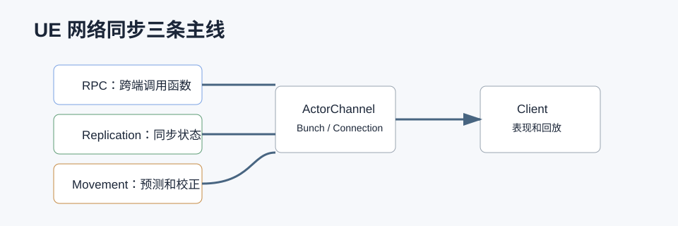

# DS 和 RPC 详解



## 0. 读前地图

这篇文章把 UE 网络拆成三条线：RPC 负责跨端调用函数，Replication 负责同步状态，CharacterMovement 用预测、校正和平滑解决“客户端手感”和“服务端权威”的矛盾。

源码入口：

```text
UNetDriver：网络驱动和连接管理
UNetConnection：单个连接
UActorChannel：Actor 复制通道
RepLayout：属性复制布局
CharacterMovementComponent：移动预测和校正
```

建议断点：

```text
UNetDriver::ServerReplicateActors
UActorChannel::ReplicateActor
UActorChannel::ProcessBunch
UCharacterMovementComponent::ReplicateMoveToServer
UCharacterMovementComponent::ServerMove_PerformMovement
UCharacterMovementComponent::ClientAdjustPosition_Implementation
```

关键变量：

```text
Role / RemoteRole：网络身份
ActorChannel：Actor 在连接上的通道
FOutBunch / FInBunch：网络数据片段
FSavedMove_Character：客户端移动历史
NetworkSmoothingMode：客户端校正后的表现平滑方式
```

## 1. 问题背景

DS 通常指 Dedicated Server。UE 的联机模型是服务器权威：客户端负责输入和表现，服务端负责最终状态。RPC 解决的是“某个对象上的某个函数要跨网络调用”的问题，Replication 解决的是“某个对象状态要同步到其他端”的问题。移动预测、平滑和校正则解决客户端操作手感和服务器权威之间的矛盾。

## 2. 源码入口

网络核心路径：

```text
Engine/Source/Runtime/Engine/Classes/GameFramework/Actor.h
Engine/Source/Runtime/Engine/Private/ActorReplication.cpp
Engine/Source/Runtime/Engine/Classes/Engine/NetDriver.h
Engine/Source/Runtime/Engine/Private/NetDriver.cpp
Engine/Source/Runtime/Engine/Classes/Engine/ActorChannel.h
Engine/Source/Runtime/Engine/Private/DataChannel.cpp
Engine/Source/Runtime/Engine/Classes/Engine/NetConnection.h
Engine/Source/Runtime/Engine/Private/RepLayout.cpp
```

角色移动同步路径：

```text
Engine/Source/Runtime/Engine/Classes/GameFramework/CharacterMovementComponent.h
Engine/Source/Runtime/Engine/Private/Components/CharacterMovementComponent.cpp
Engine/Source/Runtime/Engine/Classes/GameFramework/Character.h
Engine/Source/Runtime/Engine/Private/Character.cpp
```

## 3. RPC 类型

RPC 常见类型：

```text
Server      客户端请求服务端执行
Client      服务端通知指定客户端执行
NetMulticast 服务端广播到相关客户端执行
```

示例：

```cpp
UFUNCTION(Server, Reliable)
void ServerFire();

UFUNCTION(Client, Unreliable)
void ClientPlayHitFeedback();

UFUNCTION(NetMulticast, Unreliable)
void MulticastPlayEffect();
```

RPC 依赖 Actor 的网络通道和对象复制条件。不是任何 UObject 都能随便 RPC，通常要在可网络复制的 Actor 或 ActorComponent 上。

## 4. Reliable 和 Unreliable 差异

`Reliable` 表示可靠到达并保持顺序。它适合低频但必须执行的事件，比如确认购买、任务完成、关键交互。

`Unreliable` 表示可能丢包。它适合高频、可被下一帧覆盖的事件，比如开火表现、脚步声、准星反馈、临时特效。

误区是把所有 RPC 都写成 Reliable。Reliable 队列如果被高频事件塞满，会阻塞后续可靠消息，导致延迟积累。高频表现类事件应该优先 Unreliable 或改成状态复制。

## 5. RPC 调用链

一次 Server RPC 可以简化为：

```text
Client 调用 ServerFire
→ 生成的 RPC wrapper 检查调用端和网络条件
→ UActorChannel 写入 RPC bunch
→ UNetConnection 发送
→ Server NetDriver 收包
→ UActorChannel 找到目标 Actor
→ ProcessEvent 调用 UFunction
→ ServerFire_Implementation 执行业务
```

反射系统在这里提供函数元数据，网络层负责序列化参数和路由。

## 6. Replication 和 RPC 的边界

RPC 是事件，Replication 是状态。

```text
开门按钮被按下：Server RPC
门当前是否打开：Replicated Property
开门音效：Multicast 或 OnRep 播放
玩家血量：Replicated Property + OnRep
玩家输入：ServerMove 这类专门移动 RPC
```

如果一个数据需要 late join 客户端也能看到，就不要只用 RPC，应该复制状态。

## 7. 移动预测

CharacterMovement 的移动同步不是简单服务端每帧复制位置。客户端会先本地预测移动，马上得到手感反馈，再把压缩输入发送给服务端。服务端模拟后如果发现客户端预测偏差太大，就发送校正。

典型调用链：

```text
客户端输入
→ UCharacterMovementComponent::TickComponent
→ ReplicateMoveToServer
→ FSavedMove_Character 保存输入和时间戳
→ ServerMove / ServerMovePacked
→ 服务端 PerformMovement
→ 比较位置和速度
→ ClientAdjustPosition / ClientVeryShortAdjustPosition
→ 客户端回滚、重放未确认输入
```

核心类型：

```text
FSavedMove_Character
FNetworkPredictionData_Client_Character
FNetworkPredictionData_Server_Character
FCharacterNetworkMoveData
FCharacterNetworkMoveDataContainer
```

## 8. 平滑和校正

服务端校正不能直接把客户端角色瞬移到服务端位置，否则画面会抖。UE 会做 Network Smoothing。

常见路径：

```text
Client 收到校正
→ ClientAdjustPosition
→ 更新服务端权威位置
→ SmoothCorrection
→ MeshTranslationOffset / MeshRotationOffset
→ SmoothClientPosition
→ 逐帧把视觉 Mesh 平滑到 Capsule
```

Capsule 是真实碰撞位置，Mesh 可以做视觉平滑。这样既保持物理正确，又减少画面跳变。

## 9. 如何自定义移动同步

如果需要自定义移动状态，比如滑铲、飞行冲刺、攀爬，需要扩展：

```text
FSavedMove_Character
FNetworkPredictionData_Client_Character
GetCompressedFlags
UpdateFromCompressedFlags
CanCombineWith
SetMoveFor
PrepMoveFor
```

流程：

```text
客户端保存自定义输入标记
→ 压缩到 move flags 或自定义 move data
→ ServerMove 传到服务端
→ 服务端还原状态
→ 服务端用同样规则模拟
→ 客户端校正时重放 move
```

核心原则是客户端和服务端必须使用同一套移动计算，否则预测一定会频繁被校正。

## 10. 怎么优化 DS 消耗

DS 成本主要来自：

```text
Actor 数量
Tick 数量
Replication 频率
RPC 数量
物理和寻路
AI 感知和行为树
动画和碰撞
```

优化方向：

```text
降低无关 Actor 的 NetUpdateFrequency
使用 NetCullDistanceSquared 控制相关性
用 Replication Graph 或自定义相关性裁剪
减少 Reliable 高频 RPC
把表现事件改为客户端预测或本地播放
AI 低频 Tick / 分帧更新
远距离怪物关闭复杂感知和物理
按区域休眠 Actor
减少每帧同步大数组和字符串
```

DS 上不需要渲染，但并不代表便宜。AI、物理、网络序列化、寻路都是实际开销。

## 11. 项目排查方法

网络问题排查优先看：

```text
Network Profiler
Unreal Insights Networking Trace
stat net
Net pktlag / pktloss 模拟
ActorChannel 数量
RPC 频率
Replicated 属性大小
Client correction 次数
```

如果移动抖动，先看是否频繁 correction；如果 DS CPU 高，先看 Tick、AI、Replication；如果带宽高，先看高频属性和 Reliable RPC。

## 12. 结论

DS 是服务器权威运行环境，RPC 是跨网络事件调用，Replication 是状态同步。移动同步靠预测、服务端校正和视觉平滑维持手感。优化 DS 的核心是降低无意义的 Tick、复制、RPC、AI 和物理成本。

## 13. 源码精读：Actor 复制从哪里开始

源码位置：

```text
Engine/Source/Runtime/Engine/Private/NetDriver.cpp
Engine/Source/Runtime/Engine/Private/ActorReplication.cpp
Engine/Source/Runtime/Engine/Classes/Engine/ActorChannel.h
Engine/Source/Runtime/Engine/Private/DataChannel.cpp
```

Actor 复制不是每个属性每帧无脑发送。服务端 `UNetDriver` 会按连接遍历相关 Actor，判断 Actor 是否需要复制，找到或创建对应的 `UActorChannel`，再把属性变化和 RPC 写入网络 bunch。

简化调用链：

```text
UNetDriver::ServerReplicateActors
→ 为每个 UNetConnection 收集可相关 Actor
→ 判断 NetCullDistance / Owner / Dormancy / NetUpdateFrequency
→ 找到 UActorChannel
→ UActorChannel::ReplicateActor
→ FObjectReplicator::ReplicateProperties
→ FRepLayout 比较 shadow state
→ 只序列化变化属性
→ 发送 bunch
```

这里有两个重要点。第一，相关性决定“这个连接要不要知道这个 Actor”。第二，属性复制一般会做变化检测，不是所有属性每帧都发。优化 DS 时，降低 Actor 数量、相关性范围、复制频率和属性体积，通常比微调某个 RPC 更有效。

## 14. 源码精读：RPC 如何走到 ProcessEvent

源码位置：

```text
Engine/Source/Runtime/Engine/Private/DataChannel.cpp
Engine/Source/Runtime/Engine/Private/ActorChannel.cpp
Engine/Source/Runtime/CoreUObject/Private/UObject/ScriptCore.cpp
```

RPC 本质是网络序列化后的函数调用。UHT 会给 `UFUNCTION(Server)` 等函数生成必要的 wrapper 和校验信息，运行时网络层通过 ActorChannel 把函数和参数传到对端。

服务端 RPC 简化链路：

```text
客户端调用 ServerFire
→ 生成代码判断当前不是 authority
→ 把 Function 和参数写入 UActorChannel
→ UNetConnection 发包
→ 服务端 NetDriver 收包
→ UActorChannel 找到目标 Actor
→ 反序列化 RPC 参数
→ UObject::ProcessEvent
→ ServerFire_Implementation
```

Reliable 的可靠性在连接和 channel 层维护，它会保证顺序和到达，但也会造成队列阻塞。高频输入、表现和可覆盖事件不要轻易 Reliable。

## 15. 源码精读：CharacterMovement 的预测数据结构

源码位置：

```text
Engine/Source/Runtime/Engine/Classes/GameFramework/CharacterMovementComponent.h
Engine/Source/Runtime/Engine/Private/Components/CharacterMovementComponent.cpp
```

移动预测的关键不是位置复制，而是“客户端保存输入，服务端重演输入”。核心类型包括：

```text
FSavedMove_Character
FNetworkPredictionData_Client_Character
FNetworkPredictionData_Server_Character
FCharacterNetworkMoveData
FCharacterNetworkMoveDataContainer
```

客户端每帧移动时会保存一个 move：

```text
输入向量
时间戳
加速度
压缩 flags
移动模式
自定义状态
```

发送链路：

```text
TickComponent
→ ReplicateMoveToServer
→ AllocateNewMove
→ FSavedMove_Character::SetMoveFor
→ PerformMovement 本地预测
→ CallServerMove / ServerMovePacked
→ 服务端 MoveAutonomous
→ 服务端 PerformMovement
```

如果自定义移动状态没有写入 SavedMove，客户端和服务端会使用不同条件模拟，最后一定频繁校正。

## 16. 源码精读：平滑和校正到底改了什么

源码位置：

```text
Engine/Source/Runtime/Engine/Private/Components/CharacterMovementComponent.cpp
Engine/Source/Runtime/Engine/Classes/GameFramework/Character.h
```

服务端发现客户端位置不可信时，会发校正 RPC。客户端接到后不是简单把 Mesh 瞬移过去，而是把碰撞胶囊校正到权威位置，再通过 Mesh offset 做视觉平滑。

流程：

```text
ClientAdjustPosition
→ 更新客户端权威位置、速度、移动模式
→ 清理已确认 SavedMove
→ 重新模拟未确认 Move
→ SmoothCorrection
→ 设置 MeshTranslationOffset / MeshRotationOffset
→ SmoothClientPosition 每帧衰减 offset
```

所以调试移动抖动时，要分清 Capsule 抖还是 Mesh 抖。Capsule 是物理和碰撞真位置，Mesh 只是视觉平滑层。

## 源码精读补充：从 RPC 到移动校正的调试路径

读前目标：这篇文章要能让读者分清三件事：普通 RPC 怎么发送，属性复制怎么走，CharacterMovement 为什么不是普通 RPC 一句 `SetActorLocation`。

源码位置：

```text
Engine/Source/Runtime/Engine/Private/ActorChannel.cpp
Engine/Source/Runtime/Engine/Private/NetDriver.cpp
Engine/Source/Runtime/Engine/Private/NetConnection.cpp
Engine/Source/Runtime/Engine/Private/Components/CharacterMovementComponent.cpp
Engine/Source/Runtime/Engine/Classes/GameFramework/CharacterMovementComponent.h
```

建议断点：

```text
UNetDriver::ServerReplicateActors
UActorChannel::ReplicateActor
UActorChannel::ProcessBunch
UCharacterMovementComponent::ReplicateMoveToServer
UCharacterMovementComponent::ServerMove_PerformMovement
UCharacterMovementComponent::ClientAdjustPosition_Implementation
```

关键变量：

```text
UNetConnection：一条客户端连接，决定数据发给谁
UActorChannel：Actor 在某条连接上的复制通道
FOutBunch / FInBunch：网络序列化后的数据包片段
Role / RemoteRole：决定对象当前网络身份
FSavedMove_Character：客户端保存的可重放移动输入
NetworkSmoothingMode：决定校正后 Mesh 怎么平滑
```

RPC 数据流：

```text
调用 UFUNCTION(Server / Client / NetMulticast)
→ 检查拥有连接和调用权限
→ 序列化函数参数到 Bunch
→ 经 ActorChannel 发到目标连接
→ 目标端反序列化
→ ProcessEvent 调用对应函数实现
```

移动预测数据流：

```text
客户端本地 PerformMovement
→ 保存 FSavedMove
→ ServerMove 把输入和时间戳发给服务端
→ 服务端按同样输入模拟
→ 误差超过阈值则 ClientAdjustPosition
→ 客户端校正 Capsule
→ 重放未确认 SavedMove
→ Mesh 使用平滑 offset 减少视觉跳变
```

伪代码精读：

```cpp
ClientTick()
{
    PerformMovementLocally();
    SaveMoveForReplay();
    SendServerMove();
}

ServerMove()
{
    PerformMovementAuthoritatively();
    if (PositionErrorTooLarge)
        SendClientCorrection();
}
```

优化 DS 消耗时，优先级应该是减少“不必要复制”，而不是把所有 RPC 改成 Unreliable。先看 Actor 是否需要 AlwaysRelevant，再看 NetUpdateFrequency、Replication Graph、Dormancy、属性变更频率和 RPC 参数体积。

调试验证方法：

1. PIE 开 Dedicated Server 和两个客户端。
2. 打开网络模拟延迟，观察移动校正频率。
3. 用 Network Profiler 或 Unreal Insights Networking 看 RPC 数量和带宽。
4. 在 `ServerMove_PerformMovement` 和 `ClientAdjustPosition_Implementation` 断点，确认抖动是服务端校正还是本地表现层问题。

常见误区：

- Reliable 只保证可靠送达和顺序，不保证“立即到达”，也不适合高频输入。
- Unreliable 不是低质量 RPC，适合可丢弃、下一帧会覆盖的数据。
- DS 优化不是只优化网络包，还要看服务器 Tick、寻路、碰撞和 AI 计算。

## 进阶补充：Iris、Replication Graph、FastArray 和 Network Prediction

源码位置：

```text
Engine/Source/Runtime/Engine/Private/ActorReplication.cpp
Engine/Source/Runtime/Engine/Private/Net/ReplicationGraph.cpp
Engine/Source/Runtime/Net/Core/Classes/Net/Serialization/FastArraySerializer.h
Engine/Plugins/Runtime/NetworkPrediction/Source
Engine/Source/Runtime/Experimental/Iris/Core
```

如果项目网络对象数量开始变大，只理解 RPC 不够，还要补四个方向。

`FastArraySerializer` 适合复制“数组里少量元素变化”的数据，比如背包、Buff 列表、目标列表、技能计数。它避免整个数组每次都全量复制，而是记录元素增删改。

`Replication Graph` 适合大量 Actor 的相关性优化。它把 Actor 按空间、队伍、连接、玩法规则组织起来，减少每个连接每帧遍历所有 Actor 的成本。

`Iris` 是新一代复制框架，重点是 `NetRefHandle`、`ReplicationProtocol`、`Filter` 和 `Prioritizer`。它更适合做大规模对象复制的统一调度，但迁移成本比传统复制高。

`Network Prediction` 插件适合做强预测需求的玩法，比如载具、冲刺、特殊移动。它把输入、模拟、回滚、校正抽象成更明确的模型。

调试顺序建议：

```text
先用 stat net / Network Insights 找高频对象
→ 判断是 RPC 过多、属性复制过多，还是 Actor 相关性过宽
→ 数组类状态先考虑 FastArray
→ 大量 Actor 先考虑 Replication Graph
→ 新系统或大规模同步再评估 Iris
→ 强手感移动再看 Network Prediction
```

不要一开始就把所有系统迁移到 Iris。更稳的做法是先挑低风险系统做对比，例如掉落物、地图事件、远处怪物代理或跑测统计状态。
