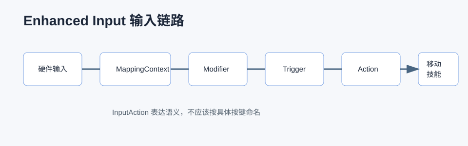

# Enhanced Input 详解



## 0. 读前地图

Enhanced Input 是 UE5 的现代输入系统。它不是简单按键映射，而是把输入拆成 `InputAction`、`MappingContext`、`Trigger`、`Modifier` 和运行时上下文切换。它适合复杂项目里的战斗、驾驶、UI、瞄准、建造、载具等模式切换。

读这篇文章要抓住：

```text
硬件输入
→ MappingContext 映射
→ Modifier 处理输入值
→ Trigger 判断触发时机
→ InputAction 输出语义
→ PlayerController / Pawn / Ability 响应
```

源码入口：

```text
Engine/Plugins/EnhancedInput/Source/EnhancedInput/Public/InputAction.h
Engine/Plugins/EnhancedInput/Source/EnhancedInput/Public/InputMappingContext.h
Engine/Plugins/EnhancedInput/Source/EnhancedInput/Public/EnhancedInputComponent.h
Engine/Plugins/EnhancedInput/Source/EnhancedInput/Public/EnhancedInputSubsystems.h
Engine/Plugins/EnhancedInput/Source/EnhancedInput/Private/EnhancedPlayerInput.cpp
```

建议断点：

```text
UEnhancedInputLocalPlayerSubsystem::AddMappingContext
UEnhancedInputLocalPlayerSubsystem::RemoveMappingContext
UEnhancedPlayerInput::ProcessInputStack
UEnhancedInputComponent::BindAction
UInputTrigger::UpdateState
UInputModifier::ModifyRaw_Implementation
```

关键变量：

```text
UInputAction：输入语义，比如 Move、Look、Fire、Aim
UInputMappingContext：一组映射关系
UInputTrigger：触发条件，比如 Pressed、Hold、Tap
UInputModifier：输入值修正，比如 DeadZone、Scalar、Negate
FInputActionValue：输入值，可以是 bool、float、Vector2D、Vector3D
UEnhancedInputLocalPlayerSubsystem：运行时添加和移除 MappingContext
Priority：多个 Context 同时存在时的优先级
```

## 1. Enhanced Input 解决什么

旧输入系统更像固定按键表：

```text
Action Mapping
Axis Mapping
```

复杂项目会遇到：

```text
战斗和 UI 输入冲突
瞄准状态需要改变鼠标灵敏度
载具、炮台、飞行、步行输入不同
长按、短按、双击、按住蓄力重复实现
手柄死区和曲线处理分散
```

Enhanced Input 把这些做成数据资产和运行时上下文。

## 2. InputAction 是语义，不是按键

`InputAction` 应该表达玩家意图：

```text
Move
Look
Jump
Fire
Aim
Reload
Interact
UseSkill
OpenMap
```

它不应该叫 `WKey` 或 `LeftMouse`。按键属于 MappingContext，Action 属于语义。

这样同一个 `Fire` 可以映射到：

```text
鼠标左键
手柄 RT
触屏按钮
测试机器人输入
```

## 3. MappingContext 和优先级

MappingContext 表达一套输入模式：

```text
DefaultCombat
AimMode
VehicleMode
CannonMode
UIMode
PhotoMode
```

运行时可以添加或移除：

```cpp
Subsystem->AddMappingContext(CombatContext, 0);
Subsystem->AddMappingContext(AimContext, 10);
Subsystem->RemoveMappingContext(AimContext);
```

优先级决定冲突时谁生效。比如打开 UI 后，UI Context 优先级应该高于战斗 Context，避免按键同时触发开火和按钮点击。

## 4. Trigger 和 Modifier

Trigger 决定何时触发：

```text
Pressed
Released
Hold
Tap
Pulse
Chorded Action
```

Modifier 决定输入值怎么变：

```text
DeadZone
Scalar
Negate
Swizzle Axis
Response Curve
```

例如瞄准状态可以：

```text
添加 Aim MappingContext
→ Look 输入使用更低 Scalar
→ Fire 行为切成精准射击
→ 移除 Sprint 或降低优先级
```

## 5. 和 CharacterMovement / GAS / PlayerAction 的关系

如果输入状态需要驱动技能、动画或移动模式，建议和 [GameplayTag 详解](/ue/gameplay-tag/) 里的状态语言一起设计。

推荐分层：

```text
Enhanced Input：把硬件输入转成语义 Action。
PlayerController / Pawn：接收 Action，转成移动、镜头、技能请求。
CharacterMovement：处理真实移动。
GAS：处理技能、冷却、消耗和状态。
PlayerAction：AI 或自动跑测复用同样的语义行为。
```

不要让 InputAction 里直接写复杂战斗逻辑。输入层应该只表达“玩家想做什么”，业务系统决定“现在能不能做”和“怎么做”。

## 6. 自动跑测和输入注入

自动跑测 AI 不一定要模拟键盘鼠标。更稳定的方式是复用语义层：

```text
AI 决策
→ PlayerAction
→ 调用 Move / Look / Fire / Interact / UseSkill 语义接口
→ 底层和玩家输入共用执行链路
```

这样测试机器人不会被具体键位绑定影响，也更容易复现。

如果项目需要完整模拟玩家输入，再考虑从 Enhanced Input 的输入栈或平台输入层注入。

## 7. 调试和验证

调试 Enhanced Input 按这条链走：

```text
1. LocalPlayerSubsystem 是否添加了 MappingContext。
2. Context 优先级是否正确。
3. InputAction 是否绑定。
4. Trigger 状态是否进入 Triggered。
5. Modifier 后的值是否正确。
6. 回调是否进入 PlayerController 或 Pawn。
7. 后续是否转给 Movement / GAS。
```

建议断点：

```text
AddMappingContext
ProcessInputStack
UInputTrigger::UpdateState
UInputModifier::ModifyRaw_Implementation
BindAction 回调函数
```

## 8. 常见误区

```text
误区一：InputAction 按按键命名。
实际：InputAction 应该按语义命名。

误区二：所有输入放一个 MappingContext。
实际：战斗、UI、载具、瞄准应该拆 Context。

误区三：输入层直接做技能逻辑。
实际：输入层只发请求，GAS 或业务系统判断能否执行。

误区四：自动跑测必须模拟键盘。
实际：复用语义接口通常更稳定、更可控。
```

## 9. 项目落地建议

机甲项目可以按模式拆输入：

```text
CombatContext：移动、开火、换弹、技能、交互
AimContext：瞄准灵敏度、锁定、精准射击
FlightContext：飞行、升降、空中冲刺
CannonContext：炮台旋转、开火、退出炮位
UIContext：菜单、地图、确认、返回
```

和 GameplayTag 结合：

```text
State.Aiming 增加
→ Add AimContext
→ 调整移动步态
→ 动画进入瞄准层

State.Aiming 移除
→ Remove AimContext
→ 恢复普通战斗输入
```

这样输入、状态、动画和移动能形成清晰闭环。
