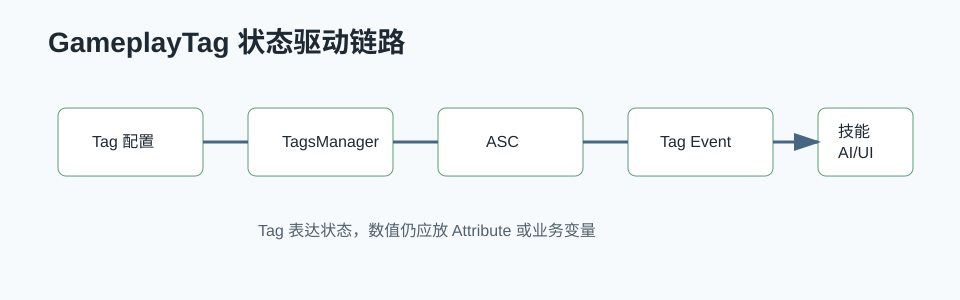

# GameplayTag 详解



## 0. 读前地图

GameplayTag 是 UE 里非常重要的状态语言。它不是简单字符串，而是一套层级化、可查询、可复制、可监听的标签系统。GAS、AI、Animation、UI、输入状态、Buff、技能条件都可以用 Tag 连接。

这篇文章要解决：

```text
1. Tag 怎么注册、存储和查询。
2. OwnedTag、LooseTag、GrantedTag 有什么区别。
3. 为什么项目状态适合用 Tag，而不是无限增加 bool。
4. Tag 滥用会带来什么问题。
```

源码入口：

```text
Engine/Source/Runtime/GameplayTags/Classes/GameplayTagContainer.h
Engine/Source/Runtime/GameplayTags/Private/GameplayTagContainer.cpp
Engine/Source/Runtime/GameplayTags/Classes/GameplayTagsManager.h
Engine/Source/Runtime/GameplayTags/Private/GameplayTagsManager.cpp
Engine/Plugins/Runtime/GameplayAbilities/Source/GameplayAbilities/Private/AbilitySystemComponent.cpp
```

建议断点：

```text
UGameplayTagsManager::InitializeManager
UGameplayTagsManager::RequestGameplayTag
FGameplayTagContainer::HasTag
FGameplayTagContainer::AppendTags
UAbilitySystemComponent::AddLooseGameplayTag
UAbilitySystemComponent::UpdateTagMap
UAbilitySystemComponent::RegisterGameplayTagEvent
```

关键变量：

```text
FGameplayTag：单个标签
FGameplayTagContainer：标签集合
UGameplayTagsManager：全局 Tag 管理器
FGameplayTagNode：标签树节点
LooseGameplayTags：ASC 上手动添加的临时标签
GameplayEffectGrantedTags：GameplayEffect 授予的标签
OwnedTags：ASC 当前拥有的合并标签视图
```

## 1. Tag 为什么比 bool 更适合复杂状态

简单状态可以用 bool：

```text
bIsAiming
bIsReloading
bIsUsingHandgun
```

但状态多起来后会出现：

```text
命名混乱
组合条件复杂
UI、动画、AI 各写一套判断
生命周期难统一
扩展新状态需要改很多代码
```

GameplayTag 可以表达层级和组合：

```text
State.Aiming
State.Reloading
State.Stunned
Weapon.Handgun.Using
Ability.Blocked.Silence
Cooldown.Skill.Missile
AI.Target.Visible
AI.Target.Locked
```

查询时可以按完整 Tag，也可以按父级语义做匹配。

## 2. Tag 的注册和加载

Tag 通常来自配置：

```text
DefaultGameplayTags.ini
GameplayTagTable
插件或模块提供的 Native GameplayTag
```

运行时由 `UGameplayTagsManager` 管理，形成一棵层级树。请求 Tag 时通常走：

```text
RequestGameplayTag("State.Aiming")
→ GameplayTagsManager 查找节点
→ 返回 FGameplayTag
```

如果请求不存在的 Tag，应该尽早暴露问题。项目里不要到处动态拼字符串请求 Tag，否则配置错误会很难查。

## 3. OwnedTag、LooseTag、GrantedTag

在 GAS 里要分清来源：

```text
LooseTag：代码直接加到 ASC 上，适合输入状态、临时状态。
GrantedTag：GameplayEffect 授予，适合 Buff、Debuff、冷却、禁用。
OwnedTag：ASC 当前拥有的最终标签集合。
```

例子：

```text
瞄准中：可以用 LooseTag State.Aiming
眩晕：用 GameplayEffect 授予 State.Stunned
冷却：用 Cooldown GE 授予 Cooldown.Skill.Rocket
```

如果一个状态应该随着 Effect 结束自动清理，就不要用 LooseTag 手动加减。否则很容易漏删。

## 4. Tag 事件监听

ASC 支持监听 Tag 变化：

```text
ASC->RegisterGameplayTagEvent(Tag)
ASC->OnOwnedTagUpdated
```

这适合做状态驱动逻辑：

```text
Tag State.Aiming 增加
→ 切换 Walk 步态
→ 动画进入瞄准层
→ UI 显示准星

Tag State.Aiming 移除
→ 恢复 Run
→ 动画退出瞄准层
→ UI 隐藏准星
```

项目里你已经用 Tag 变化驱动瞄准和手炮步态，这是比 Tick 里轮询状态更清晰的方向。

## 5. Tag 和 AI / BT / StateTree

Tag 很适合做 AI 条件：

```text
目标是否可攻击：Target.State.Alive && !Target.State.Invincible
自己是否能施法：!State.Stunned && !Cooldown.Skill.X
是否进入战斗：AI.Target.Visible || AI.Enmity.High
```

BehaviorTree Decorator、StateTree Condition、Utility 评分都可以读 Tag。这样状态来源统一，不需要每个系统维护一份 bool。

## 6. 调试和验证

调试 Tag 的核心是查来源和生命周期：

```text
1. Tag 是否注册。
2. Tag 是 Loose 还是 GameplayEffect 授予。
3. 谁添加的。
4. 谁移除的。
5. 监听事件是否触发。
6. 网络端是否复制到目标客户端。
```

建议断点：

```text
RequestGameplayTag
AddLooseGameplayTag
RemoveLooseGameplayTag
ApplyGameplayEffectSpecToSelf
UpdateTagMap
OnOwnedTagUpdated
```

## 7. 常见误区

```text
误区一：Tag 越多越灵活。
实际：Tag 没有命名规范会变成字符串地狱。

误区二：所有状态都用 LooseTag。
实际：Buff、冷却、禁用更适合 GameplayEffect GrantedTag。

误区三：Tag 可以代替所有数据。
实际：Tag 表达状态，不适合表达数值。数值应该放 Attribute 或普通变量。

误区四：Tag 字符串随手拼。
实际：应该集中定义 Native Tag 或配置，避免运行时拼错。
```

## 8. 项目命名建议

建议按领域分层：

```text
State.Aiming
State.Reloading
State.Stunned
Weapon.Handgun.Using
Ability.Blocked.*
Cooldown.*
AI.Target.*
UI.Mode.*
Movement.Gait.*
```

命名原则：

```text
父级表达领域
中间层表达系统
末级表达具体状态
不要让同一个状态有两个 Tag
不要用 Tag 表达临时数值
```

这样 GAS、AI、动画、UI 和 PlayerAction 都可以围绕同一套状态语言协作。
