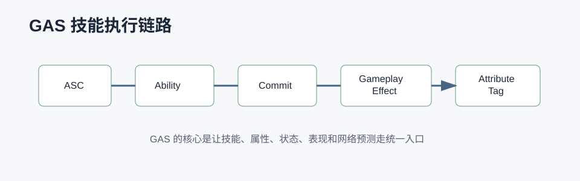

# GAS 详解



## 0. 读前地图

GAS，全称 Gameplay Ability System，是 UE 用来组织技能、属性、Buff、Tag、冷却、消耗、预测和网络同步的框架。它不是“技能类库”，而是一套把战斗规则拆成 Ability、Effect、Attribute、Tag、Cue 和 Task 的架构。

读 GAS 源码先抓住：

```text
AbilitySystemComponent 是中心
→ GameplayAbility 表达可激活行为
→ GameplayEffect 修改属性和 Tag
→ AttributeSet 保存属性
→ GameplayTag 表达状态
→ GameplayCue 表现效果
→ AbilityTask 处理异步等待
```

源码入口：

```text
Engine/Plugins/Runtime/GameplayAbilities/Source/GameplayAbilities/Public/AbilitySystemComponent.h
Engine/Plugins/Runtime/GameplayAbilities/Source/GameplayAbilities/Private/AbilitySystemComponent.cpp
Engine/Plugins/Runtime/GameplayAbilities/Source/GameplayAbilities/Public/Abilities/GameplayAbility.h
Engine/Plugins/Runtime/GameplayAbilities/Source/GameplayAbilities/Public/GameplayEffect.h
Engine/Plugins/Runtime/GameplayAbilities/Source/GameplayAbilities/Public/AttributeSet.h
Engine/Plugins/Runtime/GameplayAbilities/Source/GameplayAbilities/Public/AbilitySystemInterface.h
```

建议断点：

```text
UAbilitySystemComponent::GiveAbility
UAbilitySystemComponent::TryActivateAbility
UGameplayAbility::CanActivateAbility
UGameplayAbility::ActivateAbility
UAbilitySystemComponent::ApplyGameplayEffectSpecToSelf
UAbilitySystemComponent::ExecuteGameplayEffect
UAbilityTask::Activate
UGameplayAbility::EndAbility
```

关键变量：

```text
AbilitySystemComponent：技能系统中心组件
FGameplayAbilitySpec：授予给 ASC 的技能实例描述
FGameplayAbilityActorInfo：Owner、Avatar、Controller 等运行上下文
FGameplayAbilityActivationInfo：激活模式、预测信息
FGameplayEffectSpec：一次 Effect 应用的具体参数
FGameplayAttribute：属性定位
FGameplayTagContainer：状态和条件集合
PredictionKey：客户端预测和服务端确认的关键字段
```

## 1. GAS 解决什么问题

不用 GAS 也能写技能，但复杂战斗系统会逐渐遇到：

```text
技能逻辑散落在 Character、Weapon、Buff、AnimNotify 中
属性修改没有统一来源
冷却、消耗、禁用条件重复实现
Buff 叠加和移除规则混乱
客户端表现和服务端权威难同步
技能状态很难被 AI、UI、动画共同读取
```

GAS 把这些拆成几类明确职责：

```text
Ability：我能做什么。
Effect：对属性和状态产生什么影响。
Attribute：有哪些数值。
Tag：现在处于什么状态。
Cue：表现层播放什么。
Task：技能中等待什么异步事件。
```

## 2. ASC 是中心

`UAbilitySystemComponent` 通常挂在 PlayerState 或 Character 上。多人项目里玩家属性需要跨死亡复活保留时，ASC 放 PlayerState 更常见；怪物或简单单位可以放 Character。

ASC 负责：

```text
持有技能列表
激活和结束技能
应用 GameplayEffect
维护 AttributeSet
维护 GameplayTag
处理预测和复制
广播属性和 Tag 变化
```

最小使用链：

```text
角色实现 IAbilitySystemInterface
→ 创建或获取 ASC
→ 初始化 ActorInfo
→ GiveAbility
→ TryActivateAbility
→ Ability 内 ApplyGameplayEffect
→ 属性和 Tag 改变
```

## 3. GameplayAbility 生命周期

典型技能调用链：

```text
输入或 AI 决策
→ ASC::TryActivateAbility
→ CanActivateAbility 检查 Tag、冷却、消耗、阻塞状态
→ CommitAbility 扣资源和进入冷却
→ ActivateAbility 执行业务
→ AbilityTask 等待动画、目标、事件、延迟
→ ApplyGameplayEffect
→ EndAbility
```

伪代码：

```cpp
ActivateAbility()
{
    if (!CommitAbility())
        return;

    PlayMontageTask();
    WaitTargetDataTask();
    ApplyDamageEffect();
    EndAbility();
}
```

`CommitAbility` 很关键。它通常处理冷却和消耗。如果项目绕过它自己扣资源，就会让 UI、Tag、预测和冷却系统失去统一入口。

## 4. GameplayEffect 和 Attribute

`GameplayEffect` 表达“对目标产生什么规则影响”：

```text
即时伤害
持续回血
增加移速
添加眩晕 Tag
移除 Buff
周期性伤害
```

属性一般放在 `AttributeSet`：

```text
Health
MaxHealth
Shield
Ammo
MoveSpeed
AttackPower
Defense
```

应用链：

```text
创建 GameplayEffectSpec
→ 设置 Level、SetByCaller、Source / Target
→ ApplyGameplayEffectSpecToSelf / Target
→ Modifier 修改 Attribute
→ PreAttributeChange / PostGameplayEffectExecute
→ 属性变化广播
```

## 5. GameplayTag 在 GAS 里的作用

更完整的 Tag 机制可以先读 [GameplayTag 详解](/ue/gameplay-tag/)。

Tag 是 GAS 的状态语言：

```text
State.Aiming
State.Reloading
State.Stunned
Weapon.Handgun.Using
Ability.Blocked.Silence
Cooldown.Skill.Missile
```

常见用途：

```text
Ability 激活条件
Ability 阻塞条件
GameplayEffect 授予状态
动画状态读取
UI 显示冷却或禁用
AI 判断目标状态
```

项目里用 Tag 控制瞄准、手炮、战斗步态是合理方向。它比多个 bool 更适合扩展，但前提是命名层级清晰、生命周期统一。

## 6. 网络预测

GAS 的复杂度很大一部分来自网络预测。玩家按下技能后，如果等服务端确认再播放表现，手感会差。所以客户端会先预测执行，服务端再确认或回滚。

简化链路：

```text
客户端 TryActivateAbility
→ 生成 PredictionKey
→ 本地预测播放表现和临时状态
→ RPC 到服务端
→ 服务端验证 CanActivate / Commit
→ 成功则确认，失败则回滚
```

不是所有技能都需要预测。即时表现、位移、开火这类强手感技能更需要；纯服务端判定、低频策略技能可以走服务端权威。

## 7. AbilityTask 为什么存在

技能经常不是一帧完成，而是等待：

```text
Montage 播放到某个节点
目标选择完成
输入释放
延迟结束
GameplayEvent 到达
碰撞命中
```

AbilityTask 把这些异步等待封装进 Ability：

```text
ActivateAbility
→ 创建 AbilityTask
→ Task 绑定事件
→ 事件触发后回调 Ability
→ Ability 决定继续或结束
```

这样技能逻辑不会散落到 Character、AnimNotify 和 Timer 里。

## 8. 项目落地建议

机甲项目里适合用 GAS 管理：

```text
主动技能
被动技能
锁定目标状态
瞄准状态
手炮状态
冷却和消耗
Buff / Debuff
属性变化
技能计数和条件
```

建议边界：

```text
战斗规则放 GAS
纯输入和镜头不要塞进 GAS
移动底层仍由 CharacterMovement 管
动画表现通过 Montage / GameplayCue / Tag 连接
AI 决策可以读 Tag 和 Ability 可用性，但不要直接改内部状态
```

## 9. 调试和验证

GAS 调试要按 ASC 中心链路走：

```text
1. ASC 是否初始化 ActorInfo。
2. Ability 是否 Give 成功。
3. CanActivate 为什么失败。
4. Commit 是否扣资源和加冷却。
5. GameplayEffect 是否应用到目标 ASC。
6. Attribute 是否变化。
7. Tag 是否授予和移除。
8. Ability 是否 End。
```

建议断点：

```text
TryActivateAbility
CanActivateAbility
CommitAbility
ApplyGameplayEffectSpecToSelf
PostGameplayEffectExecute
OnGameplayEffectTagCountChanged
EndAbility
```

常见误区：

```text
把所有逻辑都塞进 Ability，导致 Ability 变成上帝类。
绕过 GameplayEffect 直接改属性，破坏统一链路。
Tag 生命周期混乱，导致状态无法恢复。
客户端预测技能没有服务端校验，产生不同步。
技能结束时没有清理 Task、Tag 或绑定事件。
```
