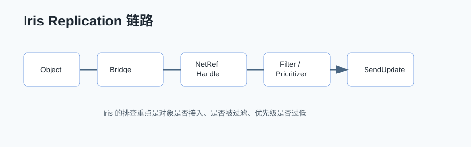

# Iris Replication 详解



## 0. 读前地图

Iris 是 UE 新一代复制系统。传统 Replication 更围绕 ActorChannel、RepLayout、属性条件和 NetDeltaSerialize；Iris 更强调复制对象、状态描述、过滤、优先级和统一的 Replication System。

读这篇文章不要先背术语，先看它解决的问题：

```text
大量对象复制如何过滤
不同连接如何决定相关性和优先级
属性状态如何高效序列化
复制逻辑如何从 ActorChannel 细节里抽出来
```

源码入口：

```text
Engine/Source/Runtime/Experimental/Iris/Core/Private/Iris
Engine/Source/Runtime/Experimental/Iris/Core/Public/Iris
Engine/Source/Runtime/Engine/Private/Net
Engine/Source/Runtime/Engine/Private/ActorReplication.cpp
Engine/Source/Runtime/Engine/Private/NetDriver.cpp
```

建议断点：

```text
UNetDriver::InitIris
UReplicationSystem::Init
UReplicationBridge::BeginReplication
UReplicationSystem::CreateNetRefHandle
UReplicationSystem::PreSendUpdate
UReplicationSystem::SendUpdate
```

关键变量：

```text
NetRefHandle：Iris 里复制对象的网络句柄
ReplicationSystem：复制系统主体
ReplicationBridge：引擎对象和 Iris 复制系统之间的桥
ReplicationProtocol：描述对象有哪些可复制状态
NetBlob：网络上传输的逻辑数据块
Filter / Prioritizer：决定发给谁、先发谁
```

## 1. 为什么需要 Iris

传统 Actor 复制在中小规模项目里很好用，但复杂项目会遇到：

```text
大量 Actor 相关性判断成本高
复制优先级策略分散
属性状态和 RPC 逻辑混在 ActorChannel 体系里
大规模对象和非 Actor 对象扩展困难
```

Iris 的目标是把“复制对象”和“底层传输”拆得更清楚，让系统更容易做过滤、优先级、批处理和扩展。

## 2. 传统 Replication 和 Iris 的区别

简化理解：

```text
传统复制：
Actor
→ ActorChannel
→ RepLayout / Property
→ Bunch
→ Connection

Iris：
Object
→ NetRefHandle
→ ReplicationProtocol
→ ReplicationSystem
→ Filter / Prioritizer
→ Connection
```

传统系统更容易从 Actor 视角理解。Iris 更像一个独立复制框架，Actor 通过 Bridge 接入。

## 3. 核心调用链

初始化链：

```text
NetDriver 初始化
→ InitIris
→ 创建 ReplicationSystem
→ 创建 ReplicationBridge
→ 注册复制协议和过滤器
```

对象复制链：

```text
Actor 或对象开始复制
→ ReplicationBridge 创建 NetRefHandle
→ 生成或获取 ReplicationProtocol
→ 每帧 PreSendUpdate 收集状态
→ Filter 判断连接可见性
→ Prioritizer 决定发送顺序
→ 序列化状态
→ 发送给目标连接
```

## 4. Filter 和 Prioritizer

网络优化的核心不是“所有对象少发一点”，而是：

```text
不该发的对象不发
该发的对象按重要性发
重要状态优先到达
低优先级对象允许延迟
```

Filter 负责决定对象是否发给某个连接。例如距离过滤、队伍过滤、视野过滤、关卡流送过滤。

Prioritizer 负责决定对象在带宽有限时的发送优先级。例如玩家附近单位、正在战斗对象、被玩家瞄准对象优先级更高。

## 5. 和 Replication Graph 的关系

Replication Graph 也是为了解决大规模 Actor 复制问题，核心是把 Actor 按空间、相关性和规则组织起来，减少每连接遍历成本。

可以这样理解：

```text
Replication Graph：传统复制体系里的相关性组织和加速。
Iris：更底层的新复制系统，提供对象状态复制、过滤和优先级框架。
```

具体项目是否使用 Iris，要看引擎版本、平台稳定性、团队熟悉度和已有网络框架。不能因为 Iris 新就盲目迁移。

## 6. 调试和验证

调试 Iris 按这条链走：

```text
1. 对象有没有创建 NetRefHandle。
2. ReplicationProtocol 是否生成。
3. 连接是否被 Filter 过滤。
4. Prioritizer 是否给了过低优先级。
5. 状态是否真的变化。
6. 客户端是否收到并应用。
```

建议对比传统工具：

```text
Net PktLag / PktLoss
Network Insights
stat net
Net Relevancy 调试
Replication 日志
```

常见问题：

```text
对象不复制：没有接入 Bridge 或没创建 NetRefHandle。
只对部分客户端复制：Filter 条件不满足。
更新很慢：Prioritizer 或带宽预算导致延迟。
迁移成本高：项目大量自定义 NetSerialize / FastArray 需要重新验证。
```

## 7. 项目落地建议

如果项目当前传统 DS/RPC 跑得稳定，不建议为了“新技术”立刻迁移。更合理的文章和实践路径是：

```text
先把传统 Actor 复制、RPC、FastArray、Dormancy、Replication Graph 讲清楚。
再写 Iris 作为进阶。
最后用一个具体系统做对比：大量怪物、投射物、掉落物或战场状态。
```

机甲 PVE 项目可以选择一个低风险系统实验：

```text
大量非核心战场状态
远处怪物代理
地图事件状态
自动跑测统计数据
```

核心玩家移动、技能释放、战斗伤害链路不适合第一批迁移。
