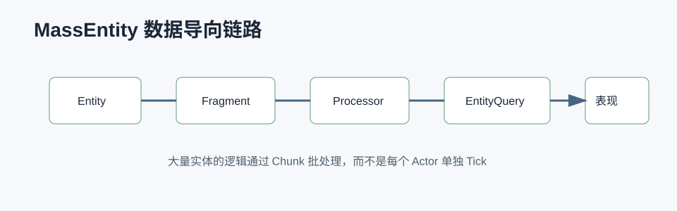

# MassEntity / MassAI 详解



## 0. 读前地图

MassEntity 是 UE5 面向大量实体的 Data-Oriented Gameplay 框架。它不是 Actor 的替代品，而是给“大量同构、轻量、批处理”的对象准备的计算模型。Actor 适合复杂对象、组件和编辑器工作流；Mass 适合大量单位、群众、交通、简单 AI、感知代理和低成本表现。

读这篇文章要抓住一条主线：

```text
Entity 只是 ID
→ Fragment 保存数据
→ Processor 批量查询 Fragment
→ Subsystem 管理运行上下文
→ Representation 把 Mass 数据表现成 Actor / ISM / Niagara
```

源码入口：

```text
Engine/Plugins/Runtime/MassEntity/Source/MassEntity/Public/MassEntityManager.h
Engine/Plugins/Runtime/MassEntity/Source/MassEntity/Public/MassEntityTypes.h
Engine/Plugins/Runtime/MassEntity/Source/MassEntity/Public/MassProcessor.h
Engine/Plugins/Runtime/MassEntity/Source/MassEntity/Public/MassEntityQuery.h
Engine/Plugins/AI/MassAI/Source
Engine/Plugins/AI/MassNavigation/Source
Engine/Plugins/Runtime/MassGameplay/Source
Engine/Plugins/Runtime/MassRepresentation/Source
```

建议断点：

```text
UMassEntitySubsystem::Initialize
FMassEntityManager::CreateEntity
FMassEntityManager::BatchCreateEntities
UMassProcessor::ConfigureQueries
UMassProcessor::Execute
FMassEntityQuery::ForEachEntityChunk
UMassRepresentationProcessor::Execute
```

关键变量：

```text
FMassEntityHandle：Entity 的轻量 ID
FMassFragment：实体数据，类似 ECS 里的 Component Data
FMassTag：只表达分类，不带数据
FMassArchetypeHandle：相同 Fragment 组合的实体集合
FMassExecutionContext：Processor 执行时访问 Fragment 的上下文
FMassEntityQuery：声明 Processor 需要读写哪些 Fragment
UMassProcessor：批量处理逻辑
```

## 1. Mass 解决什么问题

Actor 模型的优势是强表达能力：组件、蓝图、复制、碰撞、生命周期、编辑器都成熟。但大量 Actor 会带来 Tick、组件注册、Transform 更新、复制、碰撞和 UObject 管理成本。

Mass 的思路是把对象拆成数据和处理器：

```text
Actor：对象自己带数据、函数、组件和 Tick
Mass：Entity 是 ID，数据放 Fragment，逻辑放 Processor
```

这适合以下场景：

```text
大量远景单位
城市行人
交通车辆
大规模怪物代理
战场感知点
低成本可视化对象
```

不适合以下场景：

```text
复杂 Boss
需要大量蓝图事件的对象
强依赖组件生命周期的对象
每个对象行为差异很大的系统
需要完整 Actor 复制和交互的核心角色
```

## 2. 核心数据结构

`FMassEntityHandle` 本质上是实体 ID。它不保存行为，也不保存 UObject 生命周期。

`FMassFragment` 是数据载体。比如位置、速度、目标点、状态、LOD、表现句柄都可以是 Fragment。

示意：

```cpp
struct FMoveTargetFragment : public FMassFragment
{
    FVector TargetLocation;
    float AcceptanceRadius;
};

struct FCombatStateFragment : public FMassFragment
{
    bool bHasTarget;
    float LastAttackTime;
};
```

`UMassProcessor` 是逻辑载体。Processor 在 `ConfigureQueries` 里声明要访问哪些 Fragment，在 `Execute` 里批量处理。

伪代码：

```cpp
void UMoveProcessor::ConfigureQueries()
{
    EntityQuery.AddRequirement<FTransformFragment>(ReadWrite);
    EntityQuery.AddRequirement<FMoveTargetFragment>(ReadOnly);
}

void UMoveProcessor::Execute(Context)
{
    EntityQuery.ForEachEntityChunk(Context, [](Context)
    {
        for (Entity in Chunk)
        {
            Transform += DirectionToTarget * Speed * DeltaTime;
        }
    });
}
```

重点是 `ForEachEntityChunk`。Mass 不是一个实体一个实体虚函数调用，而是按 Archetype 和 Chunk 批量访问连续数据。

## 3. 完整调用链

Mass 的运行链可以简化为：

```text
World 初始化
→ UMassEntitySubsystem 创建 EntityManager
→ Spawner 或代码创建 Entity
→ EntityTemplate 指定 Fragment / Tag / SharedFragment
→ Processor 按阶段执行
→ EntityQuery 找到匹配 Archetype
→ ForEachEntityChunk 批量读写 Fragment
→ Representation Processor 更新 Actor / ISM 表现
```

MassAI 在这条链上补了 AI 相关能力：

```text
MassStateTree
MassNavigation
MassMovement
MassCrowd
MassLOD
MassRepresentation
```

如果读源码，建议先从 `UMassProcessor::Execute` 和 `FMassEntityQuery::ForEachEntityChunk` 读起。不要一开始就追所有插件，否则会被模板和宏淹没。

## 4. MassAI 怎么组织行为

MassAI 常见模式是：

```text
StateTree 决策
→ Fragment 保存状态
→ Processor 批量推进
→ Navigation / Movement 更新位置
→ Representation 显示到世界
```

传统 AIController + BehaviorTree 通常是一个 Actor 一个脑子。MassAI 更像是：

```text
一组 Processor 处理一批实体
每个实体只保存必要状态
不同状态由 Fragment 和 Tag 组合表达
```

这带来两个结果：

```text
好处：大量实体成本低，缓存友好，批量处理容易优化。
代价：单个实体的调试和复杂行为表达不如 Actor 直观。
```

## 5. 和 Actor 怎么协作

项目里最实用的方式不是全 Mass，也不是全 Actor，而是分层：

```text
近处核心单位：Actor
远处大量单位：Mass Entity
需要交互时：Mass 提升为 Actor 或绑定 Representation Actor
只需要表现时：ISM / Niagara / 简化代理
```

例如大型 PVE 战场：

```text
Boss、精英怪、玩家：Actor
远处虫群代理：Mass
近距离进入战斗的虫子：Actor
远景巡逻和感知点：Mass
```

这样既保留 Gameplay 表达能力，也能控制大量实体成本。

## 6. 调试和验证

调试 Mass 不要只看单个对象，要看 Chunk 和 Processor：

```text
1. 确认 Entity 是否创建。
2. 确认它属于哪个 Archetype。
3. 确认需要的 Fragment 是否存在。
4. 确认 Processor 的 Query 是否匹配。
5. 确认 Processor 执行阶段和顺序。
6. 确认 Representation 是否更新。
```

建议断点：

```text
FMassEntityManager::CreateEntity
UMassProcessor::ConfigureQueries
UMassProcessor::Execute
FMassEntityQuery::CacheArchetypes
FMassEntityQuery::ForEachEntityChunk
```

常见问题：

```text
Processor 不执行：通常是没有注册、阶段不对或 Query 匹配不到 Archetype。
Entity 没表现：数据存在，但 Representation 配置或 LOD 规则没生效。
性能没变好：仍然把大量实体提升成 Actor，Mass 优势被抵消。
行为难调试：Fragment 太散，缺少调试显示和状态快照。
```

## 7. 项目落地建议

如果机甲 PVE 项目要用 Mass，不建议一开始重写核心怪物。更稳的路径是：

```text
第一步：用 Mass 做远处低成本虫群代理。
第二步：用 Mass 做地图上的 AI 感知/兴趣点采样。
第三步：接入 StateTree 管理简单行为。
第四步：靠近玩家或进入战斗时转成 Actor。
第五步：用 Insights 对比 Actor 数量、GameThread、Tick 和移动成本。
```

Mass 的价值不是“更先进”，而是用数据导向方式降低大量实体的运行成本。核心复杂对象仍然应该保留 Actor 模型。
