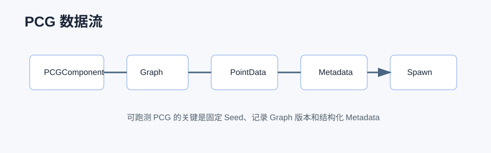

# PCG 详解



## 0. 读前地图

PCG 是 UE5 的程序化内容生成框架。它的核心不是“随机摆东西”，而是把生成过程变成可视化数据流：输入空间数据，生成点，修改属性，过滤，采样，生成 Actor、StaticMesh 或其他结果。

阅读 PCG 源码先抓住：

```text
PCGComponent 触发生成
→ PCGGraph 描述节点图
→ PCGContext 保存执行状态
→ PCGElement 执行节点逻辑
→ PCGData / PointData 在节点之间流动
→ 输出 Spawn Actor / Mesh / Attribute
```

源码入口：

```text
Engine/Plugins/PCG/Source/PCG/Public/PCGComponent.h
Engine/Plugins/PCG/Source/PCG/Public/PCGGraph.h
Engine/Plugins/PCG/Source/PCG/Public/PCGContext.h
Engine/Plugins/PCG/Source/PCG/Public/Elements/PCGPointProcessingElementBase.h
Engine/Plugins/PCG/Source/PCG/Public/Data/PCGPointData.h
Engine/Plugins/PCG/Source/PCG/Public/Data/PCGSpatialData.h
Engine/Plugins/PCG/Source/PCG/Private
```

建议断点：

```text
UPCGComponent::Generate
UPCGSubsystem::ScheduleGraph
FPCGGraphExecutor::Execute
IPCGElement::Execute
FPCGContext::InputData
UPCGPointData::GetPoints
```

关键变量：

```text
UPCGGraph：节点图资源
UPCGComponent：场景中的生成入口
FPCGContext：一次节点执行上下文
FPCGDataCollection：节点输入输出数据集合
UPCGPointData：点数据
FPCGPoint：位置、旋转、缩放、密度、Seed、MetadataEntry
UPCGMetadata：点上的属性表
```

## 1. PCG 解决什么

传统关卡制作常见问题：

```text
大量手摆内容重复劳动
地图 Seed 不可复现
规则散落在蓝图里
生成结果难调试
运行时生成和编辑器生成不统一
```

PCG 的价值是把规则显式化：

```text
采样地形
→ 生成点
→ 按坡度、距离、Tag、密度过滤
→ 写属性
→ 根据属性生成对象
→ Debug 每一步数据
```

## 2. PCG 的数据模型

PCG 里最重要的数据是点。

`FPCGPoint` 通常包含：

```text
Transform
Bounds
Density
Steepness
Seed
Color
MetadataEntry
```

Metadata 用来存自定义属性，例如：

```text
Biome = Desert
EnemyLevel = 3
POIType = Nest
SpawnWeight = 0.8
```

这意味着 PCG 图不只是摆 StaticMesh，也可以给 Gameplay 系统生产结构化数据。

## 3. 执行链路

编辑器或运行时触发生成：

```text
UPCGComponent::Generate
→ UPCGSubsystem::ScheduleGraph
→ FPCGGraphExecutor 创建任务
→ 按依赖顺序执行节点
→ 每个节点创建 FPCGContext
→ IPCGElement::Execute 处理输入数据
→ 输出 FPCGDataCollection
→ Spawn / Apply / Save 结果
```

伪代码：

```cpp
ExecuteNode(Context)
{
    Inputs = Context.InputData;
    Points = ReadPointData(Inputs);

    for (Point in Points)
    {
        if (PassFilter(Point))
            Output.Add(TransformPoint(Point));
    }

    Context.OutputData = Output;
}
```

读源码时重点看 `FPCGContext` 和 `FPCGDataCollection`，它们决定节点怎么拿输入、怎么给下游传数据。

## 4. PCG 和 Gameplay 的连接

PCG 最容易被低估的地方是它能给 Gameplay 提供数据，而不是只生成美术物件。

PVE 项目里可以这样用：

```text
生成 POI 点
→ 写入 POI 类型和难度
→ 生成虫穴、补给点、撤离区域
→ 输出给 AI 自动跑测系统
→ 根据 Seed 复现失败地图
```

这样跑测失败时，可以记录：

```text
Seed
PCG Graph 版本
POI 分布
补给点数量
敌人密度
撤离点位置
```

这比“随机地图偶现失败”更容易定位。

## 5. Runtime Generation

运行时生成要考虑三件事：

```text
生成时机：什么时候触发 Generate。
生成范围：玩家附近、关卡加载时、还是全图。
生成成本：是否会阻塞 GameThread，是否需要分帧。
```

不要把编辑器里能生成的复杂图直接搬到运行时。运行时 PCG 应该控制节点复杂度，减少大量碰撞查询、Actor Spawn 和同步加载。

## 6. 调试和验证

PCG 调试的核心是“每个节点的输入输出是否符合预期”：

```text
1. 看 Debug 点是否存在。
2. 看点数量是否符合预期。
3. 看 Density 和 Metadata 是否正确。
4. 看过滤节点是否过度过滤。
5. 看 Spawn 结果是否和点数据一致。
6. 看同一个 Seed 是否能复现结果。
```

建议断点：

```text
UPCGComponent::Generate
FPCGGraphExecutor::Execute
IPCGElement::Execute
UPCGPointData::GetMutablePoints
```

常见问题：

```text
生成结果不稳定：Seed 没固定，或者使用了运行时非确定性输入。
性能差：节点里做了大量 Trace、SpawnActor 或同步加载。
结果不可控：没有把关键参数暴露成 Metadata。
跑测难复现：没有记录 Graph 版本和 Seed。
```

## 7. 项目落地建议

机甲 PVE 的 PCG 文章可以重点写“可跑测 PCG”：

```text
地图生成不是只看好不好看，还要看能不能完成任务闭环。
POI 分布要保证路径可达。
补给点要和战斗强度匹配。
撤离点要能被 AI 寻路到。
敌人密度要能按 Seed 复现。
```

建议沉淀一套 PCG 质量指标：

```text
最短主线距离
补给点到战斗点平均距离
POI 可达率
撤离点可达率
高难区域密度
自动跑测成功率
```
