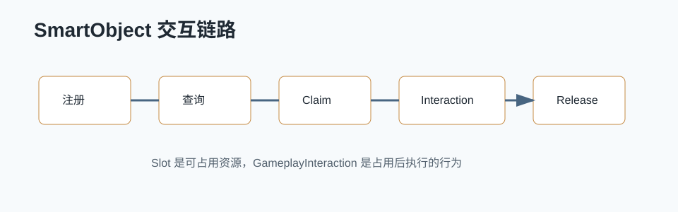

# SmartObject / GameplayInteraction 详解



## 0. 读前地图

SmartObject 解决的是“世界里有一批可交互机会，AI 或玩家如何发现、占用、执行、释放”的问题。它不是简单的交互组件，而是把交互点抽象成可查询、可声明行为、可被占用的资源。

读这篇文章先抓住一条链：

```text
场景放置 SmartObject
→ 注册到 SmartObjectSubsystem
→ AI 查询可用 Slot
→ Claim 占用
→ GameplayInteraction / StateTree 执行交互
→ Release 释放
```

源码入口：

```text
Engine/Plugins/Runtime/SmartObjects/Source/SmartObjectsModule/Public/SmartObjectSubsystem.h
Engine/Plugins/Runtime/SmartObjects/Source/SmartObjectsModule/Public/SmartObjectComponent.h
Engine/Plugins/Runtime/SmartObjects/Source/SmartObjectsModule/Public/SmartObjectDefinition.h
Engine/Plugins/Runtime/SmartObjects/Source/SmartObjectsModule/Public/SmartObjectTypes.h
Engine/Plugins/Runtime/GameplayInteractions/Source/GameplayInteractionsModule
```

建议断点：

```text
USmartObjectComponent::OnRegister
USmartObjectSubsystem::RegisterSmartObject
USmartObjectSubsystem::FindSmartObjects
USmartObjectSubsystem::Claim
USmartObjectSubsystem::Use
USmartObjectSubsystem::Release
```

关键变量：

```text
FSmartObjectHandle：注册到系统后的 SmartObject 标识
FSmartObjectSlotHandle：具体可使用的 Slot
FSmartObjectRequest：查询请求
FSmartObjectClaimHandle：占用凭证
USmartObjectDefinition：交互点定义和 Slot 数据
SmartObjectBehaviorDefinition：Slot 对应的行为数据
```

## 1. SmartObject 解决什么

传统交互经常写成：

```text
AI 找最近 Actor
→ 判断距离和状态
→ 直接调用 Actor 上的 Use
→ 交互结束后自己清状态
```

问题是当交互点多、角色多、可用条件复杂时，会出现：

```text
多人抢同一个点
AI 不知道哪个点可用
交互行为和场景对象耦合
交互状态散落在各个 Actor 里
```

SmartObject 把交互机会变成系统资源：

```text
查询：谁能用
占用：谁正在用
行为：怎么用
释放：什么时候恢复可用
```

## 2. 核心概念

`SmartObjectComponent` 放在场景 Actor 上，负责把这个对象注册给系统。

`SmartObjectDefinition` 描述它有哪些 Slot、条件和行为。

`Slot` 表示一个可被占用的位置或交互机会。一个炮台可以有一个 Slot，一个长椅可以有多个 Slot，一个补给站也可以同时支持多个玩家或 AI。

典型数据流：

```text
SmartObjectComponent 注册
→ Subsystem 保存可查询数据
→ AI 发起 FSmartObjectRequest
→ 系统返回候选 Slot
→ AI Claim 得到 ClaimHandle
→ 执行行为
→ Release
```

## 3. GameplayInteraction 的作用

SmartObject 解决“找到并占用交互点”。GameplayInteraction 更关注“占用后执行什么行为”。在 UE5 的体系里，它经常和 StateTree 配合：

```text
SmartObject Slot
→ BehaviorDefinition
→ GameplayInteraction
→ StateTree Task
→ 移动到交互点、播放动画、触发 Gameplay 逻辑
```

这比把逻辑写死在交互 Actor 里更可扩展。比如同一个补给点：

```text
玩家：打开 UI 或直接补给
AI：走到 Slot，播放补给动作，恢复弹药
测试机器人：跳过表现，只触发补给逻辑
```

## 4. 完整调用链

注册链：

```text
Actor 注册组件
→ USmartObjectComponent::OnRegister
→ USmartObjectSubsystem::RegisterSmartObject
→ 生成 SmartObjectHandle
→ 保存 Definition、Transform、Slot 数据
```

使用链：

```text
AI 生成查询条件
→ USmartObjectSubsystem::FindSmartObjects
→ 过滤距离、Tag、状态、可用 Slot
→ 返回候选结果
→ USmartObjectSubsystem::Claim
→ 得到 ClaimHandle
→ Use / GameplayInteraction
→ Release
```

## 5. 项目设计建议

机甲 PVE 里适合抽象成 SmartObject 的对象：

```text
补给点
撤离登机点
炮台操作位
任务交互机关
防守圈站位
AI 掩体点
可占用战舰炮位
```

不要把所有交互都做成 SmartObject。简单一次性拾取物、纯碰撞触发器、小范围特效开关，用普通 Actor 交互就够了。

推荐边界：

```text
需要被 AI 查询：适合 SmartObject
需要多人占用互斥：适合 SmartObject
需要 Slot 和行为数据：适合 SmartObject
只被玩家手动按一次：普通交互即可
```

## 6. 调试和验证

调试 SmartObject 时按资源生命周期看：

```text
1. 场景对象是否注册成功。
2. SmartObjectDefinition 是否有效。
3. Slot Transform 是否正确。
4. 查询条件是否过滤掉目标。
5. Claim 是否成功。
6. Release 是否执行。
```

建议断点：

```text
RegisterSmartObject
FindSmartObjects
Claim
Use
Release
```

常见问题：

```text
AI 找不到点：查询半径、Tag、可用状态或注册时机错误。
多人抢点：没有 Claim 或 Release 逻辑不完整。
交互后不可再用：ClaimHandle 没释放。
行为执行错：Slot 对应的 BehaviorDefinition 配错。
```

## 7. 和现有 AI 系统的关系

BehaviorTree、StateTree、Utility AI 都可以使用 SmartObject。它们的职责不同：

```text
Utility AI：决定当前最值得做什么。
BehaviorTree / StateTree：组织执行流程。
SmartObject：提供可查询、可占用的世界交互资源。
GameplayInteraction：定义占用后的行为。
```

对自动跑测 AI 来说，SmartObject 可以让“补给、撤离、炮台、机关”变成统一查询对象，减少每种交互单独写一套寻找和占用逻辑。
