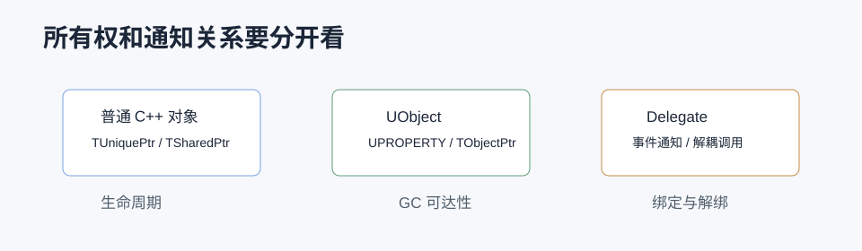

# 智能指针和 Delegate 详解



## 0. 读前地图

这篇文章解决两个容易混在一起的问题：普通 C++ 对象怎么管理生命周期，UObject 怎么跟 GC 协作，对象之间怎么用 Delegate 解耦通信。先记住一句话：智能指针解决所有权，Delegate 解决通知关系，它们不是同一个问题。

优先阅读源码：

```text
SharedPointer.h：TSharedPtr / TWeakPtr 的引用计数实现
UniquePtr.h：TUniquePtr 的独占所有权
ObjectPtr.h：TObjectPtr 和 UObject 引用包装
WeakObjectPtr.h：TWeakObjectPtr 的弱引用校验
Delegate.h / DelegateInstancesImpl.h：Delegate 绑定和执行
MulticastDelegateBase.h：多播 Delegate 的 InvocationList
```

建议断点：

```text
TSharedPtr 构造和析构
TWeakPtr::Pin
TWeakObjectPtr::Get
TBaseDelegate::Execute
TMulticastDelegate::Broadcast
```

关键变量：

```text
SharedReferenceCount：共享引用计数控制块
WeakReferenceCount：弱引用计数
ObjectIndex / ObjectSerialNumber：TWeakObjectPtr 判断 UObject 是否仍有效
InvocationList：多播 Delegate 保存的绑定列表
DelegateHandle：解除绑定的句柄
```

最小调试闭环：

```text
普通 C++ 对象用 TSharedPtr 创建
→ 复制一次看引用计数增加
→ TWeakPtr::Pin 看对象是否还活着
→ UObject 字段改用 UPROPERTY TObjectPtr
→ Delegate 绑定后保存 FDelegateHandle
→ 对象销毁前 Remove，确认不会回调悬空对象
```

## 1. 问题背景

UE 里既有 UObject 的 GC，又有普通 C++ 对象的 RAII 和引用计数，还有事件系统 Delegate。很多崩溃都来自两个误区：把 UObject 当普通 C++ 对象用智能指针管理，或者把 Delegate 绑定后不解除导致回调到已经销毁的对象。

智能指针解决“对象所有权和生命周期”问题，Delegate 解决“对象之间解耦通信”问题。

## 2. 智能指针分类

UE 常用智能指针：

```text
TUniquePtr   独占所有权，不能复制，只能移动
TSharedPtr   共享所有权，引用计数归零时销毁
TSharedRef   非空共享引用
TWeakPtr     不增加引用计数，解决循环引用
TObjectPtr   UObject 成员引用包装，配合 UPROPERTY
TWeakObjectPtr UObject 弱引用
TSoftObjectPtr 资源路径引用，可延迟加载
```

源码入口：

```text
Engine/Source/Runtime/Core/Public/Templates/UniquePtr.h
Engine/Source/Runtime/Core/Public/Templates/SharedPointer.h
Engine/Source/Runtime/CoreUObject/Public/UObject/ObjectPtr.h
Engine/Source/Runtime/CoreUObject/Public/UObject/WeakObjectPtr.h
Engine/Source/Runtime/CoreUObject/Public/UObject/SoftObjectPtr.h
```

## 3. 各自解决什么问题

`TUniquePtr` 适合明确唯一拥有者的普通 C++ 对象，比如策略对象、临时构建器、非 UObject 数据结构。

`TSharedPtr` 适合多个系统共享普通 C++ 对象，比如 Slate 数据模型、编辑器工具对象、异步任务状态。

`TWeakPtr` 用来打破 `TSharedPtr` 循环引用。

`TObjectPtr` 用于 UObject 成员字段，配合 `UPROPERTY` 让 GC 和编辑器识别。

`TWeakObjectPtr` 用于不阻止对象销毁的引用，比如异步回调、UI 缓存、目标对象缓存。

`TSoftObjectPtr` 用于资源引用，保存路径而不强制加载资源，常用于降低 Cook 和加载成本。

## 4. UObject 为什么不用 TSharedPtr

UObject 的生命周期由 GC 和 UObject 系统管理。`TSharedPtr` 的引用计数不会被 GC 扫描，也不能替代 `UPROPERTY`。如果用 `TSharedPtr<UObject>`，可能出现 GC 已经销毁对象而 shared pointer 仍持有无效地址的问题。

正确写法：

```cpp
UPROPERTY()
TObjectPtr<UObject> StrongRef;

TWeakObjectPtr<AActor> WeakActor;

UPROPERTY(EditDefaultsOnly)
TSoftObjectPtr<UTexture2D> Icon;
```

## 5. Delegate 分类

Delegate 是 UE 的回调系统。常见类型：

```text
单播 Delegate         一个回调
多播 Delegate         多个回调
动态 Delegate         可反射，可蓝图绑定，可序列化部分信息
非动态 Delegate       C++ 性能更好，不走反射
Event                 对多播 Delegate 的封装，限制外部 Broadcast
```

源码入口：

```text
Engine/Source/Runtime/Core/Public/Delegates/Delegate.h
Engine/Source/Runtime/Core/Public/Delegates/MulticastDelegateBase.h
Engine/Source/Runtime/Core/Public/Delegates/DelegateInstancesImpl.h
Engine/Source/Runtime/CoreUObject/Public/UObject/ScriptDelegates.h
```

## 6. Delegate 绑定方式

常见绑定方式：

```text
BindRaw       绑定普通 C++ 指针，不管理生命周期
BindSP        绑定 TSharedPtr 对象，弱检查
BindUObject   绑定 UObject，调用前检查对象有效性
BindLambda    绑定 Lambda
AddUObject    多播绑定 UObject
AddDynamic    动态多播，反射调用
```

选择原则：

```text
UObject 成员函数：优先 AddUObject / BindUObject
蓝图事件：使用 Dynamic Delegate
普通 C++ 对象：BindSP 或手动解除 BindRaw
Lambda 捕获 UObject：优先捕获 TWeakObjectPtr
```

## 7. Delegate 调用链

非动态 Delegate 大致流程：

```text
DECLARE_DELEGATE
→ 生成 TDelegate 类型
→ BindXXX 创建 DelegateInstance
→ Execute / ExecuteIfBound
→ 调用绑定函数
```

多播 Delegate：

```text
DECLARE_MULTICAST_DELEGATE
→ AddXXX 添加 InvocationList
→ Broadcast
→ 遍历所有 DelegateInstance
→ 调用有效回调
```

动态 Delegate：

```text
DECLARE_DYNAMIC_MULTICAST_DELEGATE
→ AddDynamic 记录 UObject + FunctionName
→ Broadcast
→ ProcessEvent
→ 通过 UFunction 反射调用
```

动态 Delegate 更灵活，但成本更高。

## 8. 常见风险

`BindRaw` 不检查对象生命周期，绑定对象销毁后再回调容易崩溃。

Lambda 捕获裸 `this` 很危险，尤其是 Timer、Async、Delay、HTTP 回调、资源加载回调。

多播 Delegate 如果不解除绑定，可能造成重复回调或对象生命周期问题。UObject 绑定通常有有效性检查，但仍建议在明确生命周期边界解除。

## 9. 项目应用

Gameplay 代码里可以按这个规则：

```text
Actor 组件之间长期引用：UPROPERTY TObjectPtr
临时目标缓存：TWeakObjectPtr
配置资源：TSoftObjectPtr
异步回调：TWeakObjectPtr + IsValid 检查
组件事件：DECLARE_MULTICAST_DELEGATE 或 Dynamic Multicast
蓝图可绑定事件：Dynamic Multicast
纯 C++ 高频事件：非动态 Delegate
```

## 10. 结论

智能指针负责生命周期和所有权，Delegate 负责解耦通信。UObject 世界优先使用 `UPROPERTY`、`TObjectPtr`、`TWeakObjectPtr`、`TSoftObjectPtr`；普通 C++ 世界再使用 `TUniquePtr`、`TSharedPtr`、`TWeakPtr`。Delegate 绑定时必须把生命周期放在第一位。

## 11. 源码精读：TSharedPtr 的引用计数

源码位置：

```text
Engine/Source/Runtime/Core/Public/Templates/SharedPointer.h
Engine/Source/Runtime/Core/Public/Templates/SharedPointerInternals.h
```

`TSharedPtr` 由两部分组成：对象指针和引用控制块。控制块里有强引用计数和弱引用计数。复制 `TSharedPtr` 会增加强引用计数，析构时减少强引用计数；强引用归零后销毁对象，弱引用归零后释放控制块。

流程：

```text
MakeShared / MakeShareable
→ 创建对象和控制块
→ TSharedPtr 持有对象指针和控制块指针
→ 拷贝时强引用 +1
→ TWeakPtr 只增加弱引用
→ 强引用归零，调用删除器销毁对象
→ 弱引用也归零，释放控制块
```

这套机制适合普通 C++ 对象，不适合 UObject，因为 UObject 的销毁入口是 GC 的 `BeginDestroy / FinishDestroy`，不是 shared pointer 删除器。

## 12. 源码精读：TWeakObjectPtr 为什么安全

源码位置：

```text
Engine/Source/Runtime/CoreUObject/Public/UObject/WeakObjectPtr.h
Engine/Source/Runtime/CoreUObject/Private/UObject/WeakObjectPtr.cpp
Engine/Source/Runtime/CoreUObject/Public/UObject/UObjectArray.h
```

`TWeakObjectPtr` 不直接只保存裸地址，而是保存对象在全局对象数组里的索引和序列号。对象销毁后，对象槽位可能复用，但序列号会变化。弱指针检查时会比对索引和序列号，避免旧地址误判为新对象。

检查链路：

```text
TWeakObjectPtr::IsValid
→ FWeakObjectPtr::Get
→ 根据 ObjectIndex 找 FUObjectItem
→ 比较 SerialNumber
→ 检查对象是否 PendingKill / Unreachable
→ 返回 UObject 或 nullptr
```

这就是为什么异步回调里捕获 `TWeakObjectPtr` 比捕获裸 `this` 安全。

## 13. 源码精读：Delegate 调用实例

源码位置：

```text
Engine/Source/Runtime/Core/Public/Delegates/Delegate.h
Engine/Source/Runtime/Core/Public/Delegates/DelegateInstancesImpl.h
Engine/Source/Runtime/Core/Public/Delegates/MulticastDelegateBase.h
Engine/Source/Runtime/CoreUObject/Public/UObject/ScriptDelegates.h
```

非动态 Delegate 会生成具体的 `TDelegate` 类型，绑定时创建不同的 DelegateInstance。比如 `BindRaw`、`BindSP`、`BindUObject` 对应不同实例类型，它们的生命周期检查也不同。

调用链：

```text
DECLARE_DELEGATE 定义类型
→ BindUObject / BindLambda / BindSP
→ 创建 DelegateInstance
→ ExecuteIfBound
→ 检查 Instance 是否有效
→ 调用 Execute
→ 最终调用目标函数或 Lambda
```

多播 Delegate 则是维护一个调用列表：

```text
AddUObject
→ InvocationList 增加一项
→ Broadcast
→ 遍历 InvocationList
→ 跳过无效绑定
→ 执行每个回调
```

动态 Delegate 不直接保存 C++ 函数指针，而是保存 UObject 和函数名，调用时走 `ProcessEvent`。这让它能被蓝图和序列化系统识别，但性能低于普通 C++ Delegate。
