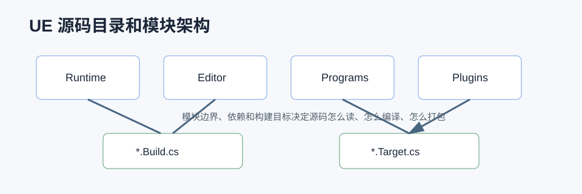

# UE 源码目录和模块架构详解



## 0. 读前地图

读 UE 源码之前，先要知道源码不是按“功能文章”组织的，而是按模块、插件、运行时、编辑器、程序工具组织的。很多人读源码卡住，不是因为 C++ 看不懂，而是不知道一个功能到底在 `Runtime`、`Editor`、`Developer`、`Programs` 还是 `Plugins` 里。

这篇文章解决三个问题：

```text
1. UE 源码目录怎么分层。
2. Module、Plugin、Target、Build.cs 分别负责什么。
3. 遇到一个功能时，应该从哪里找源码入口。
```

源码入口：

```text
Engine/Source/Runtime
Engine/Source/Editor
Engine/Source/Developer
Engine/Source/Programs
Engine/Plugins
Engine/Source/Programs/UnrealBuildTool
Engine/Source/Programs/AutomationTool
```

建议断点：

```text
UnrealBuildTool.Main
RulesAssembly.CreateTargetRules
UEBuildTarget.Create
UEBuildModuleCPP.Compile
FModuleManager::LoadModule
FModuleManager::GetModule
```

关键变量：

```text
Target.cs：决定构建 Editor、Game、Server、Client 哪种目标
Build.cs：决定一个模块依赖哪些模块、暴露哪些 include 路径
uplugin：插件描述文件，决定插件模块和启用条件
ModuleRules：UBT 解析后的模块规则
FModuleManager：运行时模块加载和查询入口
PublicDependencyModuleNames：对外可见依赖
PrivateDependencyModuleNames：模块内部依赖
```

## 1. 源码目录怎么读

常见目录含义：

```text
Runtime      运行时模块，游戏包体里可能会用到
Editor       编辑器模块，只在编辑器里用
Developer    开发者工具和分析工具
Programs     独立程序，比如 UBT、UHT、AutomationTool
Plugins      插件，可能包含 Runtime、Editor、Developer 模块
```

举例：

```text
反射运行时：Runtime/CoreUObject
UHT：Programs/UnrealHeaderTool
CharacterMovement：Runtime/Engine
BehaviorTree：Runtime/AIModule
GAS：Plugins/Runtime/GameplayAbilities
PCG：Plugins/PCG
Mass：Plugins/Runtime/MassEntity
Insights：Developer/TraceInsights
```

读源码时先判断这个功能属于哪类：

```text
游戏运行时要用：优先 Runtime 或 Runtime 插件
编辑器工具：优先 Editor
构建打包：Programs / AutomationTool / UBT
性能分析：Developer / Trace
新功能实验：Plugins
```

## 2. Module 是 UE 的编译边界

UE 的 C++ 不是一个巨大工程直接编译，而是按 Module 拆开。每个模块通常有：

```text
Public
Private
*.Build.cs
```

`Public` 放对其他模块暴露的头文件，`Private` 放模块内部实现。`Build.cs` 决定模块依赖。

典型 Build.cs：

```csharp
PublicDependencyModuleNames.AddRange(new[]
{
    "Core",
    "CoreUObject",
    "Engine"
});

PrivateDependencyModuleNames.AddRange(new[]
{
    "AIModule",
    "GameplayTags"
});
```

如果 A 模块的 Public 头文件里引用了 B 模块类型，通常 B 要放到 `PublicDependencyModuleNames`。如果只在 cpp 里用，放 `PrivateDependencyModuleNames` 更合适。

## 3. Plugin 和 Module 的关系

Plugin 是功能包，Module 是编译单元。一个插件可以包含多个模块：

```text
MyPlugin
→ MyPluginRuntime
→ MyPluginEditor
→ MyPluginDeveloper
```

`.uplugin` 描述插件：

```json
{
  "Modules": [
    { "Name": "MyPluginRuntime", "Type": "Runtime" },
    { "Name": "MyPluginEditor", "Type": "Editor" }
  ]
}
```

这样运行时包体不会带上 Editor 模块，避免打包失败或体积污染。

## 4. Target.cs 和 Build.cs 的区别

`Target.cs` 决定“我要构建什么类型的程序”：

```text
Game
Editor
Server
Client
Program
```

`Build.cs` 决定“这个模块依赖什么”。

常见错误：

```text
把 Editor 模块依赖写进 Runtime 模块，导致打包失败。
Public 头文件引用了私有依赖模块的类型，导致其他模块编译失败。
插件 Runtime 模块依赖 UnrealEd，导致 Shipping 构建失败。
```

## 5. 如何从一个功能找源码

推荐路径：

```text
先搜类名或函数名
→ 看它属于哪个模块
→ 看 Build.cs 依赖
→ 看 Public 头文件确定对外 API
→ 看 Private cpp 追实现
→ 看调用方模块理解上下游
```

例如想读 AI Perception：

```text
搜 UAIPerceptionComponent
→ Runtime/AIModule
→ Public/Perception 是 API
→ Private/Perception 是实现
→ AIController、BehaviorTree、Gameplay 代码是调用方
```

例如想读 PCG：

```text
搜 UPCGComponent
→ Plugins/PCG
→ Public/PCGComponent.h 看入口
→ Private/PCGComponent.cpp 看 Generate
→ GraphExecutor 看节点执行
```

## 6. 调试和验证

验证模块依赖最直接的方法：

```text
1. 在 cpp 里 include 某个模块 Public 头文件。
2. 如果编译失败，检查 Build.cs 是否缺依赖。
3. 如果打包失败，检查 Runtime 模块是否依赖 Editor 模块。
4. 如果运行时找不到功能，检查插件是否启用、模块是否加载。
5. 如果热重载异常，尝试完整重新生成工程文件和编译。
```

建议工具：

```text
rg 类名 Engine/Source Engine/Plugins
查看 *.Build.cs
查看 *.uplugin
查看模块启动函数 StartupModule
查看 FModuleManager 日志
```

## 7. 常见误区

```text
误区一：Runtime 代码一定在 Engine/Source/Runtime。
实际：很多运行时功能在 Plugins/Runtime 或普通 Plugins 里。

误区二：include 成功就说明依赖正确。
实际：本机偶然能找到头文件，不代表模块依赖和打包正确。

误区三：Editor 工具代码可以直接给运行时用。
实际：Editor 模块不能进入 Shipping 包体。

误区四：Build.cs 只是编译配置。
实际：它决定模块边界、链接关系、头文件可见性和包体合法性。
```

## 8. 和其他文章的关系

后续读任何源码文章，都可以先回到这篇确认模块位置：

```text
反射：CoreUObject + UnrealHeaderTool
GC：CoreUObject
GAS：GameplayAbilities 插件
PCG：PCG 插件
Mass：MassEntity / MassAI 插件
Cook：AutomationTool + UnrealEd Commandlet
Insights：TraceLog + TraceInsights
```

理解模块结构后，读源码时会更容易判断“这是运行时主链路，还是编辑器辅助工具，还是构建时程序”。
