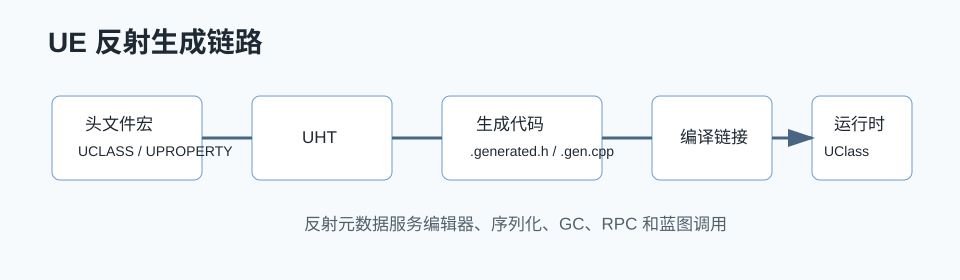

# UE 反射详解



## 0. 读前地图

这篇文章要解决的是：C++ 本身没有完整运行时反射，UE 为什么还能做到编辑器属性、蓝图调用、序列化、GC 引用发现和 RPC。读源码时先抓住一条链：宏只是标记，UHT 负责解析和生成代码，运行时注册成 `UClass`、`FProperty`、`UFunction`。

源码入口：

```text
UnrealHeaderTool：解析 UCLASS / UPROPERTY / UFUNCTION
ObjectMacros.h：宏和标记定义
Class.h / Class.cpp：UClass、UStruct、UFunction、FProperty
UObjectGlobals.cpp：对象创建和注册入口
PropertyTag.cpp：属性序列化
```

建议断点：

```text
StaticClass
StaticAllocateObject
UClass::CreateDefaultObject
UObject::Serialize
FProperty::SerializeItem
```

关键变量：

```text
UClass：类的运行时元数据
FProperty：字段描述和偏移
UFunction：可反射调用的函数描述
ClassDefaultObject：默认值来源
PropertyFlags：决定属性参与哪些系统
```

## 1. 问题背景

UE 的反射系统解决的是 C++ 原生语言缺失运行时类型信息、属性遍历、序列化、编辑器暴露、蓝图调用、网络复制、GC 引用发现等能力的问题。普通 C++ 的类在编译后基本只剩机器码，运行时无法直接知道一个对象有哪些属性、某个函数能不能被名字调用、某个属性是否应该保存到磁盘。UE 通过 UHT 和 generated 代码，在 C++ 编译前生成一套元数据，把类型信息保存到 `UClass`、`FProperty`、`UFunction` 等对象里。

## 2. 核心概念

反射系统的核心对象：

```text
UObject    所有可反射对象的基类
UClass     记录一个 UObject 类的元信息
UStruct    记录结构体或类的字段、函数、继承关系
FProperty  记录属性类型、偏移、标记、序列化规则
UFunction  记录函数参数、返回值、调用方式
UPackage   组织反射对象和资源对象
```

常见宏的作用：

```text
UCLASS     标记类需要进入反射系统
USTRUCT    标记结构体需要反射
UENUM      标记枚举需要反射
UPROPERTY  标记字段需要元数据、序列化、GC、编辑器或网络处理
UFUNCTION  标记函数需要反射调用、RPC、蓝图或编辑器处理
GENERATED_BODY 插入 UHT 生成的 glue code
```

## 3. 源码入口

主要源码路径：

```text
Engine/Source/Runtime/CoreUObject/Public/UObject/Object.h
Engine/Source/Runtime/CoreUObject/Public/UObject/Class.h
Engine/Source/Runtime/CoreUObject/Public/UObject/UObjectGlobals.h
Engine/Source/Runtime/CoreUObject/Private/UObject/Class.cpp
Engine/Source/Runtime/CoreUObject/Private/UObject/UObjectGlobals.cpp
Engine/Source/Runtime/CoreUObject/Private/UObject/Obj.cpp
Engine/Source/Programs/UnrealHeaderTool/
```

UHT 相关路径：

```text
Engine/Source/Programs/UnrealHeaderTool/Private
Engine/Source/Programs/UnrealHeaderTool/Private/ParserClass.cpp
Engine/Source/Programs/UnrealHeaderTool/Private/UhtHeaderFileParser.cpp
Engine/Source/Programs/UnrealHeaderTool/Private/CodeGenerator.cpp
```

不同引擎版本文件名会变化，但模块边界基本稳定：运行时反射在 `CoreUObject`，代码生成在 `UnrealHeaderTool`。

## 4. UHT 是什么

UHT，全称 Unreal Header Tool，是 UE 编译链里的头文件扫描和代码生成工具。它不是 C++ 编译器，而是 UE 自己的预处理工具。它读取带有 `UCLASS`、`UPROPERTY`、`UFUNCTION` 等宏的头文件，解析出 UE 关心的类型和元数据，然后生成 `.generated.h` 和 `.gen.cpp`。

典型构建链：

```text
UBT 读取 Target.cs / Build.cs
→ 判断哪些模块需要运行 UHT
→ UHT 扫描头文件里的 UCLASS / USTRUCT / UENUM / UFUNCTION / UPROPERTY
→ 生成 *.generated.h 和 *.gen.cpp
→ C++ 编译器编译原始 cpp + 生成 cpp
→ 模块加载时注册 UClass / FProperty / UFunction
```

## 5. `.generated.h` 的作用

`.generated.h` 是 UHT 生成的头文件，通常必须放在用户头文件 include 的最后。它会插入：

```text
类声明辅助代码
StaticClass 声明
反射注册声明
序列化声明
RPC wrapper 声明
构造器辅助宏
属性偏移和访问辅助
```

例如你写：

```cpp
UCLASS()
class AMyActor : public AActor
{
    GENERATED_BODY()

    UPROPERTY(EditAnywhere)
    int32 Health;
};
```

UHT 会生成一批和 `AMyActor` 相关的注册代码，把 `Health` 变成一个 `FIntProperty`，并记录它在对象内存里的偏移、编辑器标记、序列化标记等。

## 6. `.gen.cpp` 做了什么

`.gen.cpp` 会生成真正用于注册反射对象的代码。核心是构造类似这样的数据：

```text
类名
父类
ClassFlags
属性数组
函数数组
元数据 key-value
构造函数指针
依赖对象
```

模块加载时，这些注册函数会把类型信息注册到全局对象系统。之后 `StaticClass()`、`FindObject<UClass>()`、蓝图调用、属性面板、序列化、复制系统都能通过这些元数据工作。

## 7. 反射对象如何被创建

运行时对象创建入口常见是：

```text
NewObject<T>
→ StaticConstructObject_Internal
→ StaticAllocateObject
→ UObject 构造
→ FObjectInitializer 初始化默认子对象和属性
→ PostInitProperties
```

类对象本身也会被注册：

```text
Z_Construct_UClass_AMyActor
→ UECodeGen_Private::ConstructUClass
→ 构造 UClass
→ 绑定属性和函数
→ 链接父类、接口、元数据
```

## 8. 序列化是什么

序列化是把对象状态转换成可存储或可传输的数据，再反向恢复。UE 里的序列化不仅用于保存资源，也用于加载资源、复制、Undo、Cook、热重载和编辑器事务。

核心接口是：

```text
UObject::Serialize(FArchive& Ar)
FProperty::SerializeItem
FArchive
FStructuredArchive
```

调用链可以理解为：

```text
加载 Package
→ 创建 UObject
→ UObject::Serialize
→ 遍历反射属性
→ FProperty 根据类型读写数据
→ 修复对象引用
→ PostLoad
```

反射让序列化不需要每个类都手写全部字段。只要字段有 `UPROPERTY`，引擎就知道这个字段的位置、类型和标记，能自动参与保存、加载、复制和 GC 引用收集。

## 9. 反射和 GC 的关系

GC 需要知道一个 UObject 引用了哪些 UObject。普通 C++ 指针引擎看不到，但 `UPROPERTY()` 标记的 UObject 指针会生成 `FObjectProperty`，GC 可以通过 `UClass` 的属性链遍历引用。

这也是为什么 UObject 成员引用通常要写：

```cpp
UPROPERTY()
UObject* Target;
```

而不是裸指针长期持有。裸指针可以临时用，但不会自动参与 GC 引用追踪。

## 10. 反射和蓝图、RPC 的关系

蓝图调用依赖 `UFunction` 元数据。RPC 也依赖 `UFUNCTION(Server)`、`UFUNCTION(Client)`、`UFUNCTION(NetMulticast)` 生成的 wrapper。UHT 会为 RPC 生成参数结构和调用 thunk，网络层收到 RPC 后通过函数索引和反射数据调用目标函数。

## 11. 踩坑

不要把 UE 宏当普通 C++ 宏理解。`UCLASS` 本身不是全部，真正关键是 UHT 扫描到这些宏后生成的代码。

不要在 `.generated.h` 后继续 include 其他头文件。它通常要求放在当前头文件最后，避免生成宏依赖被破坏。

不要以为所有 C++ 字段都会序列化、复制或被 GC 扫描。只有被反射系统知道的字段，才能进入这些通用流程。

## 12. 结论

UE 反射系统的本质是“编译期生成运行时元数据”。UHT 负责把宏标记的 C++ 声明转成生成代码；`.generated.h` 和 `.gen.cpp` 把类型、属性、函数注册到对象系统；运行时的序列化、蓝图、GC、复制、编辑器都基于这套元数据工作。

## 13. 源码精读：从 UCLASS 到 UClass

源码位置：

```text
Engine/Source/Programs/UnrealHeaderTool/
Engine/Source/Runtime/CoreUObject/Public/UObject/Class.h
Engine/Source/Runtime/CoreUObject/Private/UObject/Class.cpp
Engine/Source/Runtime/CoreUObject/Public/UObject/ObjectMacros.h
```

入口不是 `UCLASS` 宏本身，而是 UBT 调用 UHT 的过程。`UCLASS`、`UPROPERTY`、`UFUNCTION` 这些宏在普通 C++ 预处理里大多不会直接生成完整元数据，它们更像给 UHT 的标记。UHT 扫描头文件后，会把类、属性、函数解析成内部描述，再输出生成代码。

完整链路可以这样理解：

```text
Build Target
→ UBT 分析模块和头文件
→ UHT 扫描包含反射宏的头文件
→ 解析 UCLASS / USTRUCT / UENUM / UPROPERTY / UFUNCTION
→ 生成 *.generated.h
→ 生成 *.gen.cpp
→ C++ 编译器编译用户代码和生成代码
→ 模块加载
→ Z_Construct_UClass_XXX
→ ConstructUClass
→ UClass 挂接 FProperty / UFunction / 元数据
```

这里最关键的是 `.gen.cpp`。它会生成 `Z_Construct_UClass_XXX` 一类函数，函数内部描述类名、父类、属性数组、函数数组、元数据、对象构造方式。运行时第一次访问 `StaticClass()` 或模块注册时，这些生成函数会把 C++ 类型注册成 `UClass` 对象。之后编辑器属性面板、蓝图节点、序列化、GC、网络复制看到的都是这个 `UClass` 和它下面的 `FProperty`、`UFunction`。

## 14. 源码精读：FProperty 为什么知道字段位置

源码位置：

```text
Engine/Source/Runtime/CoreUObject/Public/UObject/UnrealType.h
Engine/Source/Runtime/CoreUObject/Private/UObject/PropertyBaseObject.cpp
Engine/Source/Runtime/CoreUObject/Private/UObject/Class.cpp
```

`UPROPERTY` 字段会被 UHT 解析成具体的 `FProperty` 子类，比如 `FIntProperty`、`FFloatProperty`、`FObjectProperty`、`FStructProperty`。每个属性不只是保存名字，还保存属性在对象内存里的偏移。运行时拿到一个 UObject 指针后，`FProperty` 可以通过偏移找到字段地址。

抽象流程：

```text
UHT 解析字段类型和标记
→ 生成 FPropertyParams
→ ConstructUClass 时构造 FProperty
→ FProperty 链接到 UStruct::ChildProperties
→ 运行时遍历属性链
→ ContainerPtrToValuePtr 找到字段地址
→ Serialize / GC / Details Panel / Replication 使用这个地址
```

这就是为什么反射字段可以被通用系统处理。序列化不需要知道你的类 C++ 代码怎么写，只要遍历 `UClass` 的属性链，就能知道字段名、类型、数组维度、偏移和标记。

## 15. 源码精读：UFunction 如何调用 C++ 函数

源码位置：

```text
Engine/Source/Runtime/CoreUObject/Public/UObject/Class.h
Engine/Source/Runtime/CoreUObject/Private/UObject/ScriptCore.cpp
Engine/Source/Runtime/CoreUObject/Private/UObject/UObjectGlobals.cpp
```

`UFUNCTION` 会生成函数反射数据和 thunk。蓝图、RPC、控制台命令、编辑器按钮最终都可能通过 `ProcessEvent` 进入函数调用。

调用链可以简化为：

```text
外部系统拿到 UObject 和 UFunction
→ UObject::ProcessEvent
→ 检查函数 flags 和参数内存
→ 如果是 native 函数，调用生成的 exec thunk
→ thunk 从参数栈读取参数
→ 调用真正的 C++ 函数
→ 写回返回值和 out 参数
```

RPC 也是这个逻辑的网络版本。网络层收到 RPC 后，通过 ActorChannel 找到对象和函数，再走 `ProcessEvent` 调用。区别只是参数来自网络包，而不是蓝图虚拟机或本地调用。

## 16. 源码精读：序列化如何借助反射

源码位置：

```text
Engine/Source/Runtime/CoreUObject/Public/UObject/Object.h
Engine/Source/Runtime/CoreUObject/Private/UObject/Obj.cpp
Engine/Source/Runtime/CoreUObject/Public/UObject/UnrealType.h
Engine/Source/Runtime/CoreUObject/Private/UObject/PropertyTag.cpp
```

序列化的核心不是“把内存直接写到磁盘”，而是按照属性描述逐项保存。UE 会保存属性名、类型、数据和版本信息，这样资源结构变化后仍有机会做兼容。

典型流程：

```text
加载 Package
→ 创建 UObject 空实例
→ UObject::Serialize
→ 遍历 UClass 属性链
→ FProperty::SerializeItem
→ 根据属性类型读取或写入数据
→ 修复 UObject 引用
→ PostLoad
```

如果一个字段没有 `UPROPERTY`，默认通用序列化不会知道它存在。你可以手写 `Serialize` 处理它，但那就变成这个类自己的特殊逻辑，无法自动获得编辑器、复制、GC 等通用能力。

## 源码精读补充：按断点把反射跑通

读前目标：这篇文章最后要能回答三个问题：`UCLASS` 怎么变成运行时 `UClass`，`.generated.h` 解决了什么问题，属性系统为什么能同时服务编辑器、序列化、GC 和网络复制。

源码位置：

```text
Engine/Source/Programs/UnrealHeaderTool/Private
Engine/Source/Runtime/CoreUObject/Public/UObject/ObjectMacros.h
Engine/Source/Runtime/CoreUObject/Public/UObject/Class.h
Engine/Source/Runtime/CoreUObject/Private/UObject/Class.cpp
Engine/Source/Runtime/CoreUObject/Private/UObject/UObjectGlobals.cpp
```

建议断点：

```text
UHT 侧：FHeaderParser::ParseClassDeclaration
运行时：UClass::StaticClass
运行时：StaticAllocateObject
运行时：UObject::Serialize
属性侧：FProperty::SerializeItem
```

关键变量：

```text
UClass：运行时类型对象，保存父类、函数链、属性链和 ClassFlags
FProperty：字段描述，不是字段值本身
UFunction：函数的反射描述，RPC 和蓝图调用都会用到
EClassFlags / EPropertyFlags：决定类和属性能参与哪些系统
ClassDefaultObject：类默认对象，构造默认值和对象初始化都会依赖它
```

完整数据流可以这样理解：

```text
.h 里的 UCLASS / UPROPERTY / UFUNCTION
→ UHT 解析宏标记和 C++ 声明
→ 生成 .generated.h / .gen.cpp
→ 编译期把注册代码编进模块
→ 模块加载时注册 UClass / UFunction / FProperty
→ 运行时系统通过 UClass 找属性、函数和元数据
```

伪代码精读：

```cpp
// 不是 UE 原始源码，只保留关键意图
RegisterClass()
{
    UClass* Class = ConstructUClass(...);
    Class->LinkChildProperties();
    Class->CreateDefaultObject();
    AddClassToGlobalObjectArray(Class);
}
```

这里最重要的是 `LinkChildProperties` 和 `CreateDefaultObject`。前者让属性链可以被遍历，后者让 UE 有一份稳定的默认值来源。很多“为什么改了构造函数默认值资源里没变”的问题，本质都和 CDO、序列化覆盖、蓝图生成类的默认值层级有关。

调试验证方法：

1. 新建一个带 `UPROPERTY(EditAnywhere)` 的 Actor。
2. 编译后打开生成目录，查看对应 `.generated.h` 里生成了哪些声明。
3. 在 `StaticAllocateObject` 断点，看 Actor 创建时传入的 `UClass`。
4. 在 `UObject::Serialize` 断点，看属性保存和加载是否通过 `FProperty` 链路进入。

常见误区：

- `.generated.h` 不是可选文件，它把 UHT 看到的信息接回 C++ 编译体系。
- `UPROPERTY` 不是只给蓝图用，它同时影响 GC、序列化、复制、编辑器显示和资产引用分析。
- 反射描述的是“类型和字段结构”，对象里的实际值仍然存放在 UObject 实例内存里。
