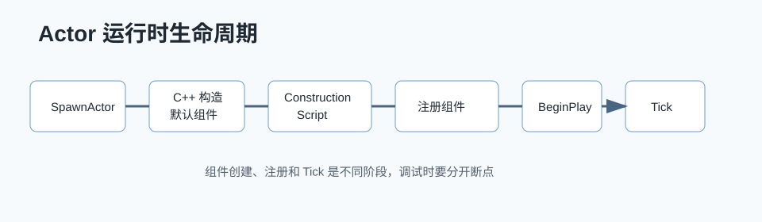

# UE 运行时问题解答



## 0. 读前地图

这篇是运行时生命周期速查。读源码时不要把 Actor 创建、组件创建、Construction Script、组件注册、BeginPlay、Tick 混成一件事。它们发生在不同阶段，也服务不同系统。

建议先记住这条主线：

```text
SpawnActor
→ StaticConstructObject_Internal
→ C++ 构造 / 默认子对象
→ PostSpawnInitialize
→ ExecuteConstruction / Construction Script
→ RegisterAllComponents
→ BeginPlay
→ Tick
→ EndPlay / Destroyed
```

优先阅读源码：

```text
Engine/Source/Runtime/Engine/Private/LevelActor.cpp
Engine/Source/Runtime/Engine/Private/Actor.cpp
Engine/Source/Runtime/Engine/Private/Components/ActorComponent.cpp
Engine/Source/Runtime/Engine/Private/Components/SceneComponent.cpp
Engine/Source/Runtime/Engine/Private/LevelTick.cpp
Engine/Source/Runtime/Core/Private/Async/TaskGraph.cpp
```

建议断点：

```text
UWorld::SpawnActor
StaticConstructObject_Internal
AActor::PostSpawnInitialize
AActor::ExecuteConstruction
AActor::RegisterAllComponents
UActorComponent::RegisterComponentWithWorld
AActor::Tick
UActorComponent::TickComponent
```

关键变量：

```text
CreationMethod：组件来自 Native、SCS 还是 Instance
bHasBeenCreated / bRegistered / bHasBegunPlay：组件生命周期状态
PrimaryActorTick：Actor Tick 配置
PrimaryComponentTick：Component Tick 配置
TickGroup：本 Tick 运行在哪个阶段
Prerequisites：Tick 依赖顺序
```

## 1. Actor 是什么时候创建组件的？

Actor 组件来源有三类：

```text
C++ 构造函数里 CreateDefaultSubobject 创建默认组件
蓝图 SCS 节点创建组件模板
运行时 NewObject 创建动态组件
```

C++ 默认组件通常在类默认对象和实例构造阶段创建。蓝图组件来自 Simple Construction Script，会在 Actor 生成和构造脚本阶段实例化。运行时组件则由业务代码主动创建。

典型创建链：

```text
UWorld::SpawnActor
→ StaticConstructObject_Internal
→ AActor 构造
→ C++ CreateDefaultSubobject 默认组件
→ PostSpawnInitialize
→ ExecuteConstruction
→ 蓝图 SCS / Construction Script
→ RegisterAllComponents
```

## 2. Construction Script 什么时候执行？

Construction Script 在 Actor 构造阶段执行，编辑器里移动或修改属性也可能反复执行。运行时 SpawnActor 时也会执行。

典型链路：

```text
AActor::PostSpawnInitialize
→ AActor::FinishSpawning
→ AActor::ExecuteConstruction
→ UserConstructionScript
```

注意：Construction Script 不是 BeginPlay。它适合根据配置搭建组件、设置默认状态，不适合写依赖运行时世界状态的复杂 Gameplay。

## 3. 组件什么时候注册进世界？

组件注册通常发生在 Actor 完成构造后：

```text
AActor::RegisterAllComponents
→ UActorComponent::RegisterComponent
→ UActorComponent::OnRegister
→ UActorComponent::CreateRenderState / CreatePhysicsState
```

组件注册后才真正进入世界，渲染、物理、Tick 等系统才能识别它。

运行时动态组件流程：

```cpp
UActorComponent* Comp = NewObject<UActorComponent>(Owner);
Comp->RegisterComponent();
Owner->AddInstanceComponent(Comp);
```

## 4. Actor 生命周期简化链

```text
构造函数
→ PostInitProperties
→ PostLoad 或 PostActorCreated
→ OnConstruction / Construction Script
→ RegisterAllComponents
→ PreInitializeComponents
→ InitializeComponent
→ PostInitializeComponents
→ BeginPlay
→ Tick
→ EndPlay
→ Destroyed
```

不同路径会有差异：关卡加载、SpawnActor、蓝图编辑器预览、PIE、网络复制生成 Actor 不完全一样。

## 5. TickGroup 是什么？

TickGroup 用来控制 Tick 在一帧中的执行阶段。常见组：

```text
TG_PrePhysics
TG_StartPhysics
TG_DuringPhysics
TG_EndPhysics
TG_PostPhysics
TG_PostUpdateWork
```

比如移动通常要在物理前后有明确顺序，摄像机或表现更新可能放在物理后。

## 6. Actor Tick 和 Component Tick 顺序如何？

Actor 和 Component 都通过 TickFunction 进入 Tick 调度系统。顺序受这些因素影响：

```text
TickGroup
Prerequisite
注册顺序
是否并行 Tick
是否启用 Tick
Tick Interval
```

不能简单假设“Actor 一定先于所有 Component”或“Component 一定按数组顺序”。如果有严格依赖，应该使用：

```cpp
PrimaryActorTick.AddPrerequisite(...)
PrimaryComponentTick.AddPrerequisite(...)
```

## 7. TaskGraph 是什么？

TaskGraph 是 UE 的任务调度系统，用来把可并行工作拆到工作线程执行。动画评估、渲染准备、异步计算、资源处理等都会用到任务系统。

核心概念：

```text
Task
Prerequisite
Named Thread
Worker Thread
Graph Event
```

源码入口：

```text
Engine/Source/Runtime/Core/Public/Async/TaskGraphInterfaces.h
Engine/Source/Runtime/Core/Private/Async/TaskGraph.cpp
```

## 8. Async / 多线程怎么使用？

常见方式：

```cpp
Async(EAsyncExecution::ThreadPool, []()
{
    // 后台线程计算
});
```

如果要回到 GameThread：

```cpp
AsyncTask(ENamedThreads::GameThread, []()
{
    // 操作 UObject / Actor / Component
});
```

原则：

```text
后台线程不要直接读写不安全的 UObject 状态
不要在工作线程 SpawnActor
不要在工作线程操作组件注册、世界、渲染状态
重计算可以后台做，结果应用回 GameThread
```

## 9. 多线程常见风险

```text
UObject 被 GC 或销毁
GameThread 状态被后台线程读写
容器并发修改
Lambda 捕获裸 this
异步回调晚于对象生命周期
锁粒度太大导致卡顿
```

推荐使用 `TWeakObjectPtr` 捕获 UObject，然后回 GameThread 后再 `IsValid` 检查。

## 10. 结论

Actor 组件可能来自 C++、蓝图 SCS 或运行时动态创建；Construction Script 在构造阶段执行；组件注册后才进入世界；Tick 顺序由 TickGroup 和依赖决定；TaskGraph 和 Async 适合拆后台计算，但 UObject 和世界状态修改应回到 GameThread。

## 11. 源码精读：SpawnActor 到 BeginPlay

源码位置：

```text
Engine/Source/Runtime/Engine/Private/LevelActor.cpp
Engine/Source/Runtime/Engine/Private/Actor.cpp
Engine/Source/Runtime/Engine/Private/World.cpp
```

Actor 运行时创建的主入口是 `UWorld::SpawnActor`。它会分配对象、初始化 Transform、执行 Construction、注册组件，并在合适时机 BeginPlay。

调用链：

```text
UWorld::SpawnActor
→ UWorld::SpawnActorInternal
→ StaticConstructObject_Internal
→ AActor::PostSpawnInitialize
→ AActor::FinishSpawning
→ AActor::ExecuteConstruction
→ AActor::RegisterAllComponents
→ AActor::PostActorConstruction
→ DispatchBeginPlay
→ BeginPlay
```

Deferred Spawn 会把流程拆开：先创建 Actor，再由 `FinishSpawning` 继续 Construction 和注册。这适合在 Construction 前设置初始化参数。

## 12. 源码精读：组件注册到底做了什么

源码位置：

```text
Engine/Source/Runtime/Engine/Private/Components/ActorComponent.cpp
Engine/Source/Runtime/Engine/Private/Components/SceneComponent.cpp
Engine/Source/Runtime/Engine/Private/Components/PrimitiveComponent.cpp
```

组件注册不是简单把数组加到 Actor 上。注册后组件会进入世界、创建渲染状态、创建物理状态、注册 Tick。

流程：

```text
UActorComponent::RegisterComponent
→ RegisterComponentWithWorld
→ OnRegister
→ 如果是 SceneComponent，处理 Attach 和 Transform
→ 如果是 PrimitiveComponent，CreateRenderState_Concurrent
→ CreatePhysicsState
→ RegisterComponentTickFunctions
```

所以动态创建组件后，如果没有 `RegisterComponent`，它可能存在于内存里，但不会渲染、不会碰撞、不会 Tick。

## 13. 源码精读：Construction Script 为什么会反复执行

源码位置：

```text
Engine/Source/Runtime/Engine/Private/ActorConstruction.cpp
Engine/Source/Runtime/Engine/Private/Actor.cpp
```

编辑器中修改属性、移动 Actor、编译蓝图，都可能触发 Construction Script 重新运行。引擎会重新执行 SCS 和用户 Construction，以便编辑器视图实时反映配置变化。

流程：

```text
RerunConstructionScripts
→ 清理 Construction 创建的组件
→ ExecuteConstruction
→ 执行蓝图 SCS 节点
→ UserConstructionScript
→ 重新注册或更新组件
```

因此不要在 Construction Script 里做不可逆操作，比如生成永久存档数据、注册全局事件、启动复杂异步任务。

## 14. 源码精读：Tick 调度和 TickGroup

源码位置：

```text
Engine/Source/Runtime/Engine/Private/TickTaskManager.cpp
Engine/Source/Runtime/Engine/Public/Tickable.h
Engine/Source/Runtime/Engine/Classes/Engine/EngineBaseTypes.h
```

Actor Tick 和 Component Tick 都会包装成 TickFunction，交给 TickTaskManager 按 TickGroup 和依赖执行。

流程：

```text
RegisterActorTickFunctions / RegisterComponentTickFunctions
→ TickFunction 注册到 TickTaskManager
→ 每帧按 TickGroup 分批
→ 处理 Prerequisite
→ 可并行执行 TickFunction
→ 调用 Actor::Tick 或 Component::TickComponent
```

如果两个对象有严格顺序，不要依赖注册顺序，要显式 AddPrerequisite。

## 15. 源码精读：Async 回 GameThread 的必要性

源码位置：

```text
Engine/Source/Runtime/Core/Public/Async/Async.h
Engine/Source/Runtime/Core/Public/Async/TaskGraphInterfaces.h
Engine/Source/Runtime/Core/Private/Async/TaskGraph.cpp
```

`Async` 可以把计算丢到线程池，但 UObject 和 World 大多数 API 不是线程安全的。安全模式是后台只做纯计算，结果回 GameThread 应用。

流程：

```text
Async(ThreadPool)
→ 后台线程计算纯数据
→ 捕获 TWeakObjectPtr
→ AsyncTask(GameThread)
→ IsValid 检查对象
→ 修改 Actor / Component / UObject 状态
```

如果后台线程直接 SpawnActor、RegisterComponent 或改 Actor Transform，就可能和 GameThread 的世界更新、GC、复制、渲染状态同步冲突。
