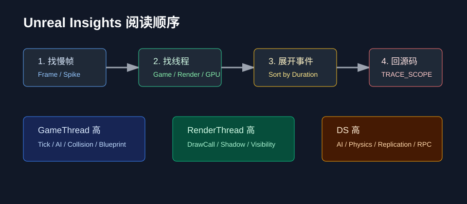

# Unreal Insights 如何 Profile

## 0. 读前地图

Insights 不是“打开看看哪个条最长”就结束。优秀的 Profile 流程应该是：先提出假设，再采集对应 Trace，再在 Timeline 里定位线程、任务、资源或网络瓶颈，最后回到源码验证。

优先掌握的视图：

```text
Timing Insights：CPU 线程、任务和函数耗时
Loading Insights：资源加载和 Package 事件
Networking Insights：包、RPC、属性复制、连接流量
Memory Insights：分配、释放和内存增长
Bookmarks：业务埋点和关键阶段定位
```

建议源码入口：

```text
Engine/Source/Runtime/TraceLog
Engine/Source/Runtime/Core/Public/ProfilingDebugging/CpuProfilerTrace.h
Engine/Source/Developer/TraceInsights
Engine/Source/Runtime/Engine/Private/NetDriver.cpp
```

关键观察项：

```text
GameThread 是否超帧
RenderThread 是否等待
TaskGraph 是否堆积
AsyncLoading 是否长时间阻塞
RPC / Property Replication 是否异常高频
同一函数是否在多个帧里稳定占用
```

关键变量：

```text
Frame Time：一帧总耗时，先判断是否超预算
GameThread Time：Gameplay、AI、动画等主线程压力
RenderThread Time：渲染线程准备和提交压力
Task Duration：异步任务执行时间和排队位置
Load Time Event：资源加载和 Package 处理耗时
Net Packet / RPC Count：网络包量、RPC 频率和复制压力
Bookmark：项目自定义阶段标记
```

最小调试闭环：

```text
用 -trace=cpu,frame,bookmark,loadtime,file,net 启动
→ 复现卡顿或带宽问题
→ 在 Timing 里选中问题帧
→ 从 GameThread / TaskGraph / Loading / Net 分别排除
→ 回到对应源码或业务函数加更细 TRACE_CPUPROFILER_EVENT_SCOPE
→ 再采集一次确认耗时下降
```

## 进阶补充：Gameplay、Memory、Networking、Loading Insights 和自定义 Trace

源码位置：

```text
Engine/Source/Runtime/TraceLog
Engine/Source/Runtime/Core/Public/ProfilingDebugging/CpuProfilerTrace.h
Engine/Source/Developer/TraceInsights
Engine/Source/Runtime/Engine/Private/NetDriver.cpp
Engine/Source/Runtime/CoreUObject/Private/Serialization/AsyncLoading2.cpp
```

`Timing Insights` 适合看 CPU 时间线，但深入项目时还要补几个视图。

`Gameplay Insights` 适合看 Gameplay 事件、Actor、组件、动画、Ability 或项目自定义事件的时间关系。它能把“哪段业务逻辑导致卡顿”从纯函数耗时提升到玩法上下文。

`Memory Insights` 适合查内存增长、峰值、泄漏嫌疑和分配热点。它比只看任务管理器更能定位到分配调用栈。

`Networking Insights` 适合查 RPC、属性复制、包大小、连接带宽和突增流量。网络问题不要只看 `stat net`，要结合具体对象和事件。

`Loading Insights` 适合查地图切换、资源加载、同步加载和包处理。进入地图卡顿、打开 UI 卡顿、第一次播放特效卡顿，都应该看这里。

自定义 Trace 是把业务阶段写进时间线：

```cpp
TRACE_CPUPROFILER_EVENT_SCOPE(MySystem_UpdateTargets);
```

建议项目里给这些阶段加埋点：

```text
AI 上下文采样
Utility 评分
目标选择
技能释放
PCG 生成
资源预加载
撤离流程
```

排查闭环：

```text
先用 stat unit 确认 CPU / GPU / Draw 哪个方向
→ 用 Insights 选中问题帧
→ 用 Bookmark 找业务阶段
→ 用具体视图定位线程、加载、网络或内存
→ 加更细 Trace
→ 修复后重新采集对比
```

## 1. 问题背景

Unreal Insights 是 UE 的性能分析工具，可以查看 CPU、线程、任务、加载、网络、内存等 Trace 数据。它比简单 `stat unit` 更适合定位“哪一段代码慢、哪个线程卡、哪个任务排队、哪个资源加载耗时”。



## 2. 工具入口

常见入口：

```text
Engine/Binaries/Win64/UnrealInsights.exe
Trace 运行时模块
Insights Session Browser
Timing Insights
Memory Insights
Networking Insights
Loading Insights
```

源码路径：

```text
Engine/Source/Developer/TraceInsights
Engine/Source/Runtime/TraceLog
Engine/Source/Runtime/Core/Public/ProfilingDebugging
```

## 3. 如何采集

编辑器或游戏启动参数：

```bat
MyGame.exe -trace=cpu,frame,bookmark,loadtime,file,net -statnamedevents
```

常用频道：

```text
cpu        CPU 事件
frame      帧事件
bookmark   书签
loadtime   加载耗时
file       文件 IO
net        网络
memory     内存
gpu        GPU，取决于平台和配置
```

如果要分析 C++ 自定义代码，可以加：

```cpp
TRACE_CPUPROFILER_EVENT_SCOPE(MySystem_Update);
```

## 4. Timing Insights 看什么

主要看：

```text
GameThread
RenderThread
RHIThread
TaskGraph Workers
Frame Time
CPU Event
Wait
Async Loading
```

阅读顺序：

```text
先看帧尖峰
→ 找最慢线程
→ 展开该线程最长事件
→ 看是否等待其他线程
→ 看 TaskGraph 是否排队
→ 回到源码定位函数
```

## 5. 常见性能参数

```text
Frame Time       总帧耗时
Game Thread      玩法线程耗时
Render Thread    渲染线程耗时
RHI Thread       RHI 提交耗时
GPU Time         GPU 耗时
Task Wait        等待任务完成
Load Time        资源加载耗时
File IO          文件读取耗时
Net Send/Recv    网络收发
Memory Alloc     内存分配
```

如果 GameThread 高，优先看 Gameplay Tick、AI、动画更新、蓝图、碰撞查询。RenderThread 高，优先看 draw call、阴影、可见性、后处理。GPU 高，需要结合 RenderDoc、ProfileGPU 或 GPU Visualizer。

## 6. 典型分析流程

```text
打开 trace
→ 找到问题帧
→ 框选一段慢帧
→ Sort by Duration
→ 找最大事件
→ 展开调用层级
→ 搜索函数名
→ 回到源码加更细 TRACE_SCOPE
→ 复测
```

性能优化不要只看平均值。尖峰、P95、P99 更影响玩家感受。

## 7. 加 Bookmark

可以在关键流程加书签：

```cpp
TRACE_BOOKMARK(TEXT("Start Spawn Wave"));
```

这样在 Insights 时间线上能快速定位“刷怪开始”“关卡切换”“技能释放”“战斗爆发”等业务事件。

## 8. DS 分析

Dedicated Server 不渲染，但可以看：

```text
GameThread Tick
AI Tick
BehaviorTree
Navigation
Physics
Replication
RPC
Net Serialize
Actor Channel
```

DS 优化时要重点看网络和 AI，而不是渲染。

## 9. 踩坑

`stat unit` 只能告诉你哪个大线程慢，Insights 才能告诉你慢在哪里。

没有 `-statnamedevents` 时，很多事件名不够清晰。

Trace 本身有开销，正式环境采集要控制频道和时长。

## 10. 结论

Unreal Insights 的核心用法是从慢帧出发，定位线程，再定位事件，再回到源码。项目里应该给关键系统加 `TRACE_CPUPROFILER_EVENT_SCOPE` 和 Bookmark，把性能问题从感觉变成可追踪证据。

## 11. 源码精读：Trace 事件如何写入

源码位置：

```text
Engine/Source/Runtime/TraceLog/Public/Trace/Trace.h
Engine/Source/Runtime/TraceLog/Private/Trace
Engine/Source/Runtime/Core/Public/ProfilingDebugging/CpuProfilerTrace.h
```

`TRACE_CPUPROFILER_EVENT_SCOPE` 会在作用域开始和结束时写入 Trace 事件。Insights 看到的不是采样猜测，而是运行时主动记录的事件区间。

简化流程：

```text
TRACE_CPUPROFILER_EVENT_SCOPE(Name)
→ 构造作用域对象
→ 写入 Begin 事件和时间戳
→ 作用域结束析构
→ 写入 End 事件和时间戳
→ Trace 缓冲发送到 Insights
→ Timing View 还原事件区间
```

所以自定义系统想在 Insights 里可读，应该在关键入口加 scope，比如 AI 决策、刷怪、投射物批处理、自动跑测评估等。

## 12. 源码精读：GameThread 慢帧怎么回到源码

源码位置：

```text
Engine/Source/Runtime/Engine/Private/LevelTick.cpp
Engine/Source/Runtime/Engine/Private/World.cpp
Engine/Source/Runtime/Engine/Private/Actor.cpp
Engine/Source/Runtime/Engine/Private/Components/ActorComponent.cpp
```

GameThread 慢帧通常来自世界 Tick、Actor Tick、Component Tick、Timer、AI、碰撞查询、蓝图逻辑。

分析路径：

```text
Timing View 选中慢帧
→ 看 GameThread 最长事件
→ 如果是 World Tick，展开到 ActorComponent Tick
→ 找具体类名或自定义 Trace 名
→ 回到对应 Tick 函数
→ 加更细粒度 TRACE_SCOPE
→ 复测确认热点
```

不要只看一个最大函数。有时最大函数只是容器，比如 `UWorld::Tick`，真正热点在它下面某个 Actor Tick 或 Delegate Broadcast。

## 13. 源码精读：Loading Insights 看什么

源码位置：

```text
Engine/Source/Runtime/CoreUObject/Private/Serialization/AsyncLoading2.cpp
Engine/Source/Runtime/CoreUObject/Private/Serialization/AsyncPackageLoader.cpp
Engine/Source/Runtime/Engine/Private/StreamableManager.cpp
```

加载卡顿常见在异步包加载、对象创建、PostLoad、组件注册和 BeginPlay。Loading Insights 可以看到 Package 加载阶段。

阅读顺序：

```text
找加载尖峰
→ 看哪个 Package 耗时
→ 展开 Export 创建和 Serialize
→ 看 PostLoad 是否重
→ 对应资源或蓝图
→ 优化资源依赖或延迟初始化
```

如果一个地图切换时卡，不要只看 IO，也要看加载后的对象初始化。很多 Gameplay 初始化发生在资源加载之后。

## 14. 源码精读：Networking Insights 看什么

源码位置：

```text
Engine/Source/Runtime/Engine/Private/NetDriver.cpp
Engine/Source/Runtime/Engine/Private/ActorReplication.cpp
Engine/Source/Runtime/Engine/Private/DataChannel.cpp
```

网络视图可以帮助定位带宽和 RPC 问题。重点看：

```text
每连接发送字节
ActorChannel 数量
属性复制大小
RPC 频率
Reliable 队列
Packet loss 下的重传
```

如果 DS 带宽高，先按 Actor 类型聚合，再看哪个属性或 RPC 最高频。优化通常不是压缩一个字段，而是降低复制频率、相关性范围和不必要的 ActorChannel。
