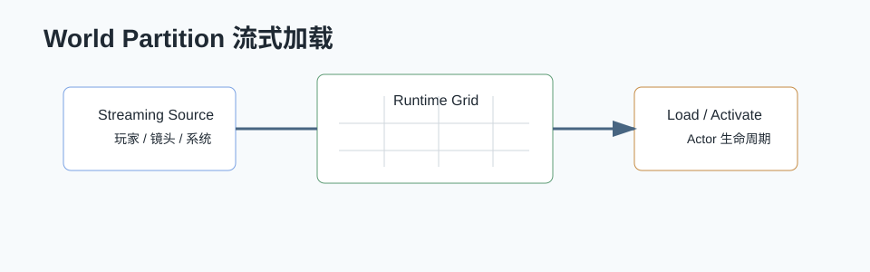

# World Partition 详解



## 0. 读前地图

World Partition 的核心不是“把地图切格子”，而是运行时根据 Streaming Source 决定哪些 Runtime Cell 应该存在。阅读时先区分编辑器生成数据、运行时流送决策、Actor 生命周期三层。

优先阅读源码：

```text
UWorldPartition：世界分区系统入口
UWorldPartitionRuntimeCell：运行时 Cell
FWorldPartitionStreamingSource：加载源
WorldPartitionStreamingGeneration：编辑器生成运行时数据
LevelStreamingDynamic / Package 加载：Cell 实际加载
DataLayerSubsystem：数据层开关影响加载规则
```

建议断点：

```text
UWorldPartition::Tick
UWorldPartition::UpdateStreamingState
UWorldPartitionRuntimeCell::Load
UWorldPartitionRuntimeCell::Unload
UWorldPartitionSubsystem::RegisterStreamingSourceProvider
```

关键变量：

```text
RuntimeGrid：运行时网格配置
RuntimeCell：最小流送单元
StreamingSource：玩家、镜头或系统注册的加载源
TargetState：Loaded 或 Activated
DataLayerInstance：控制一批 Actor 是否参与流送
HLODLayer：远景替代资源配置
```

最小调试闭环：

```text
打开 World Partition 调试显示
→ 移动玩家或 Streaming Source
→ 观察 Runtime Cell 状态变化
→ 断到 UpdateStreamingState
→ 看某个 Cell 为什么被 Load / Activate / Unload
→ 检查对应 Actor 的 BeginPlay / EndPlay 是否符合预期
```

## 1. 问题背景

World Partition 用于大世界流式加载。传统关卡需要手动拆子关卡，World Partition 把世界按网格划分，根据玩家位置、Streaming Source、Data Layer 等规则自动加载和卸载 Actor。

## 2. 源码入口

```text
Engine/Source/Runtime/Engine/Public/WorldPartition/WorldPartition.h
Engine/Source/Runtime/Engine/Private/WorldPartition/WorldPartition.cpp
Engine/Source/Runtime/Engine/Public/WorldPartition/WorldPartitionRuntimeCell.h
Engine/Source/Runtime/Engine/Private/WorldPartition/WorldPartitionRuntimeCell.cpp
Engine/Source/Runtime/Engine/Public/WorldPartition/WorldPartitionStreamingSource.h
Engine/Source/Runtime/Engine/Private/WorldPartition/WorldPartitionStreamingGeneration.cpp
```

## 3. 核心概念

```text
World Partition      大世界分区系统
Runtime Grid         运行时网格
Runtime Cell         网格单元
Streaming Source     流式加载源
Data Layer           数据层
HLOD                 层级细节替代
One File Per Actor   每个 Actor 独立文件
```

## 4. Actor 怎么加载卸载

编辑器里 Actor 会被转换成 World Partition 管理的数据。运行时根据 Streaming Source 判断哪些 Cell 应该加载。

流程：

```text
玩家或系统注册 Streaming Source
→ WorldPartition 每帧收集 Source
→ 计算覆盖到的 Runtime Cell
→ 需要的 Cell 进入加载队列
→ Cell 内 Actor Package 异步加载
→ Actor 创建、注册组件、BeginPlay
→ 离开范围的 Cell 卸载
→ Actor EndPlay、组件反注册、对象释放
```

## 5. Streaming Source

Streaming Source 描述“从哪里开始加载世界”。玩家通常是一个 Source，远程镜头、载具、任务目标也可以是 Source。

Source 关键数据：

```text
位置
旋转
加载半径
目标 Grid
优先级
形状
是否启用
```

## 6. Data Layer

Data Layer 用于控制一组 Actor 是否参与加载。它适合：

```text
剧情阶段
昼夜变化
任务状态
活动区域
编辑器组织
```

Data Layer 不是简单隐藏，它会影响 Actor 是否加载到世界。

## 7. HLOD

HLOD 用于远距离显示简化版本，减少远处大量 Actor 的渲染和加载成本。

流程：

```text
多个 Actor 聚合
→ 构建 HLOD Actor
→ 远距离加载 HLOD
→ 近距离卸载 HLOD，加载真实 Actor
```

## 8. 大世界性能关注点

```text
Cell 大小
加载半径
Streaming Source 数量
Actor 数量
组件数量
BeginPlay 成本
异步加载峰值
HLOD 构建质量
Data Layer 切换成本
```

不要只关注加载半径。Actor 的 BeginPlay、组件注册、碰撞创建、AI 初始化都可能造成卡顿。

## 9. 项目实践

大世界项目建议：

```text
用 Streaming Source 明确玩家和重要镜头加载范围
重 Actor 拆分或延迟初始化
远距离禁用 AI、碰撞、Tick
HLOD 和真实 Actor 切换要验证视觉一致性
任务相关对象用 Data Layer 管理
关键 POI 提前预加载
```

## 10. 调试

```text
World Partition Editor
wp.Runtime.ToggleDrawRuntimeHash2D
wp.Runtime.ToggleDrawRuntimeHash3D
stat streaming
stat levels
Unreal Insights LoadTime
```

排查加载问题时看：Actor 属于哪个 Cell、Cell 是否被 Source 覆盖、Data Layer 是否激活、Package 是否加载成功。

## 11. 结论

World Partition 的核心是把世界拆成 Runtime Cell，并由 Streaming Source 和 Data Layer 控制加载。大世界优化不只是流式距离，还包括 Actor 初始化成本、HLOD、AI 休眠和异步加载峰值管理。

## 12. 源码精读：RuntimeHash 如何决定加载 Cell

源码位置：

```text
Engine/Source/Runtime/Engine/Public/WorldPartition/WorldPartition.h
Engine/Source/Runtime/Engine/Private/WorldPartition/WorldPartition.cpp
Engine/Source/Runtime/Engine/Private/WorldPartition/WorldPartitionRuntimeHash.cpp
Engine/Source/Runtime/Engine/Private/WorldPartition/RuntimeHashSet/WorldPartitionRuntimeHashSet.cpp
```

World Partition 运行时不会逐个 Actor 判断是否加载，而是通过 RuntimeHash 计算 Streaming Source 覆盖到哪些 Cell。

流程：

```text
UWorldPartition::Tick
→ 收集 IWorldPartitionStreamingSourceProvider
→ 生成 FWorldPartitionStreamingSource
→ RuntimeHash 根据 Source 查询 Cell
→ 标记 Cell 目标状态 Loaded / Activated
→ Streaming Policy 执行加载或卸载
```

Loaded 和 Activated 有区别。Loaded 表示资源进入内存，Activated 表示 Actor 进入世界并参与运行。远处预加载可以只 Loaded，接近后再 Activated。

## 13. 源码精读：Actor Descriptor 是什么

源码位置：

```text
Engine/Source/Runtime/Engine/Public/WorldPartition/WorldPartitionActorDesc.h
Engine/Source/Runtime/Engine/Private/WorldPartition/WorldPartitionActorDesc.cpp
Engine/Source/Runtime/Engine/Private/WorldPartition/WorldPartitionActorDescArchive.cpp
```

World Partition 不需要加载完整 Actor 才知道它在哪、属于哪个 DataLayer、包路径是什么。它会保存 Actor Descriptor，记录 Actor 的轻量元数据。

Descriptor 包含：

```text
Actor Guid
Actor Class
Package 路径
Bounds
Runtime Grid
Data Layers
References
HLOD Layer
```

构建 Runtime Cell 时，系统使用这些 Descriptor 分配 Actor，而不是把所有 Actor 全部加载到内存。

## 14. 源码精读：Cell 加载后 Actor 生命周期

源码位置：

```text
Engine/Source/Runtime/Engine/Public/WorldPartition/WorldPartitionRuntimeCell.h
Engine/Source/Runtime/Engine/Private/WorldPartition/WorldPartitionRuntimeCell.cpp
Engine/Source/Runtime/Engine/Private/LevelStreaming.cpp
```

当 Cell 被要求加载时，它会触发对应 Package / Level Instance 的流式加载。Actor 真正进世界后，仍然走普通 Actor 生命周期。

链路：

```text
Cell 状态变为 ShouldBeLoaded
→ 请求异步加载 Cell Package
→ Package 加载完成
→ Cell 状态 Loaded
→ ShouldBeActivated
→ Actor 注册到 World
→ RegisterAllComponents
→ BeginPlay
```

卸载时则反向执行：

```text
Cell 不再被 Source 覆盖
→ Deactivate
→ Actor EndPlay
→ UnregisterComponent
→ 卸载 Package
```

所以大世界卡顿往往不只在 IO，Actor 激活阶段的组件注册和 BeginPlay 也很重。

## 15. 源码精读：Streaming Source 怎么接入项目

源码位置：

```text
Engine/Source/Runtime/Engine/Public/WorldPartition/WorldPartitionStreamingSource.h
Engine/Source/Runtime/Engine/Private/WorldPartition/WorldPartitionSubsystem.cpp
```

玩家、摄像机、载具、飞船、远程观察点都可以作为 Streaming Source。项目里可以实现 Provider 或使用组件注册 Source。

关键字段：

```text
Name
Location
Rotation
TargetGrid
TargetState
Shapes
Priority
bEnabled
```

优化时可以给高速载具更大的加载范围，给普通玩家较小范围，给剧情镜头临时 Source。Source 数量越多，Cell 查询和加载压力越大，要控制生命周期。
